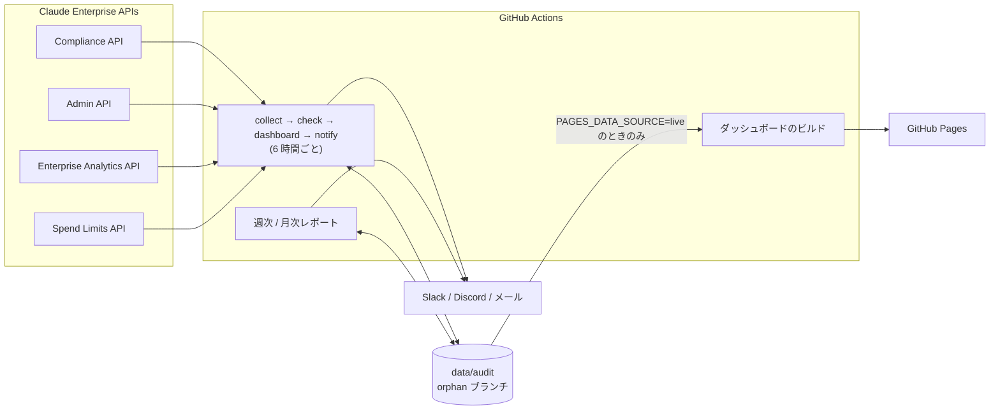

[English](README.md) | [日本語](README.ja.md)

---

# claude-audit-dashboard

[](https://github.com/sun-flat-yamada/claude-audit-dashboard/actions/workflows/ci.yml)
[](https://www.typescriptlang.org/)
[](https://reactjs.org/)
[](https://tailwindcss.com/)
[](LICENSE)
[](docs/BLUEPRINT.md)
[](https://docs.anthropic.com)
[-emerald?style=flat-square>)](https://pages.github.com)

[](https://buymeacoffee.com/sun.flat.yamada)

**Claude Enterprise** テナント向けの監査・コンプライアンス・分析ツールキットです。GitHub Actions が Activity Feed、ディレクトリ、実効設定、キー台帳、利用量・コスト、利用上限を収集し、30 の組み込みルールで評価し、結果を GitHub Pages のダッシュボード、週次・月次レポート、Slack / Discord / メール通知で届けます。サーバーは不要です。

> [!IMPORTANT]
> **開発状況: Phase A 実装済み、実テナントでの検証 (Phase B) 待ち**
> 同梱の合成テナント (`pnpm demo`) で全処理がエンドツーエンドに動作します。定期実行はリポジトリ変数 `ENABLE_SCHEDULED_JOBS` による opt-in のため、API キーを設定する前に動くことはありません。[変更計画](docs/CHANGE-PLAN.md)と[ブループリント](docs/BLUEPRINT.md)を参照してください。

---

## 主な特徴

### 取りこぼしの無い最小権限の収集

- **Compliance API** — Activity Feed を時間窓 + ID 重複排除で取得 (欠落・重複なし)。リンク組織、実効設定、API キー台帳。
- **Admin API (ユーザー管理)** — メンバー、保留中の招待、RBAC グループ。
- **Enterprise Analytics API** — 利用者別の最終活動、DAU / WAU / MAU、プロダクト・モデル・RBAC グループ別の日次利用量とコスト。
- **Spend Limits API** — メンバー別の実効上限と当期支出。
- Enterprise キー (`sk-ant-api01-...`) 1 本、**読み取りスコープのみ**。会話本文は取得しません。

### 「データが無い」を「準拠」と誤判定しないルール

- アクセス制御、API キー、利用、ガバナンス、運用、設定ベースライン、アクティビティ監視にわたる 30 ルール。
- ルールは必要なデータセットを宣言します。取得できなかった場合は**理由付きで skipped** とし、`OP-002` が欠落を報告します。スコアは常に評価範囲と一緒に表示されます (例: `95/100 (2 of 30 rules assessed)`)。
- 設定ベースライン (`CF-xxx`) とアクティビティ監視 (`AM-xxx`) はコード不要で `config/custom-rules.json` に追加でき、閾値は `config/default.json` で調整できます。

### ダッシュボード・レポート・通知

- **ダッシュボード** (React 19、Recharts 3、Tailwind CSS 4) — スコアと KPI、対処法・証跡付きで絞り込めるルール結果、表形式に切り替えられるコスト・トークン・採用状況の推移、プロダクト / モデル / グループ別の支出、注目イベント、データ取得状況。ライト / ダーク、モバイル対応。
- **レポート** — コンプライアンス、週次ダイジェスト、月次コストレポートを Markdown / HTML / CSV / JSON で出力。
- **通知** — Slack、Discord、メール (SMTP)、コンソール。状態・重大度で絞り込み、冷却時間で重複を抑止。

### 継続的な変化に強い構造 (Clean Architecture)

- `@claude-audit/core` がドメインとユースケース (純粋な TypeScript)、`@claude-audit/collector` がアダプタと CLI、`@claude-audit/dashboard` が UI を担い、UI は公開契約 `DashboardView` だけを読みます。
- ルール、データセット、分析、レポート、出力形式、通知チャネルは**実装を 1 つ登録するだけ**で追加でき、API の変更はアダプタのスキーマと写像に閉じます。関数の複雑度と大きさは lint で上限を設けています。

### Fork-Safe と漏えい対策

- ライブデータは orphan ブランチ `data/audit` にのみ保存し、`main` にはコードと `pnpm demo` が生成する合成サンプルだけを置きます。
- `pnpm fork:verify`、`pnpm secret-scan`、gitleaks、Dependabot、`pnpm audit` がデータ・シークレットの混入と脆弱な依存を防ぎます。

---

## アーキテクチャ



詳細: [ARCHITECTURE.md](docs/ARCHITECTURE.md) (レイヤーと拡張手順)、[API-MAPPING.md](docs/API-MAPPING.md) (エンドポイント、ページング、項目の写像)。

---

## ディレクトリ構成

```text
claude-audit-dashboard/
├── .agents/                   # AI コーディングエージェント向けの規約・スキル・エージェント定義 (change-dev, fork-sync)
├── .devs/changes/             # change-dev の計画・タスク・walkthrough 成果物 (変更ごとに 1 フォルダ)
├── .github/
│   ├── actions/setup/         # 共通セットアップ (pnpm、Node 22、install、任意のビルド)
│   ├── scripts/data-branch.sh # data/audit ブランチの restore / save
│   └── workflows/             # ci, collect-audit, weekly-report, monthly-report, deploy-pages, secret-scan
├── config/
│   ├── default.json           # データソース、ルール引数、通知、保持期間
│   └── custom-rules.json      # 設定ベースラインとアクティビティ監視 (コード不要)
├── data/sample/               # 合成テナントの出力 (`pnpm demo` が生成)
├── docs/                      # ブループリント、変更計画、アーキテクチャ、API 写像、セットアップ、デプロイ
├── packages/
│   ├── core/                  # ドメイン、ユースケース、ダッシュボードの公開契約 (純粋な TS)
│   ├── collector/             # Anthropic アダプタ、保存、レンダラ、通知、CLI
│   └── dashboard/             # React SPA
└── scripts/                   # fork-verify, secret-scan, worktree-manage
```

---

## 組み込みコンプライアンスルール

| ID     | カテゴリ           | ルール                                 | 既定の判定                                               | 重大度   |
| :----- | :----------------- | :------------------------------------- | :------------------------------------------------------- | :------- |
| AC-001 | アクセス制御       | Inactive Members                       | 90 日間活動の記録が無い                                  | Medium   |
| AC-002 | アクセス制御       | Excessive Administrative Roles         | 管理系ロールが組織メンバーの 20% 超                      | High     |
| AC-003 | アクセス制御       | Single Primary Owner                   | 組織ごとに primary owner がちょうど 1 名                 | Critical |
| AC-004 | アクセス制御       | Stale Pending Invites                  | 30 日を超えて保留中の招待                                | Low      |
| AK-001 | API キー           | Unused API Keys                        | Compliance スコープのキーが 30 日 API 呼び出しに現れない | Medium   |
| AK-002 | API キー           | Over-privileged API Keys               | 書き込み・削除スコープを持つ有効キー                     | High     |
| AK-003 | API キー           | API Key Age                            | 作成から 180 日を超えた有効キー                          | Medium   |
| UA-001 | 利用               | Usage Spike Detection                  | 直近日が過去 7 日平均の 3 倍超                           | High     |
| UA-002 | 利用               | Cost Budget Threshold                  | 当月コストが予算超過 (月末予測の超過は要確認)            | Critical |
| UA-003 | 利用               | Members Without Spend Limit            | すべての期間で実効上限が無制限                           | Medium   |
| UA-004 | 利用               | Spend Limit Nearly Exhausted           | 当期支出が上限の 90% 以上 (要確認)                       | Low      |
| DG-001 | データガバナンス   | Empty Groups                           | メンバー 0 の直接作成 RBAC グループ                      | Low      |
| OP-001 | 運用               | Collection Freshness                   | 評価したスナップショットが 24 時間より古い               | High     |
| OP-002 | 運用               | Data Source Coverage                   | 取得できなかったデータセットがある                       | High     |
| CF-001 | 設定               | SSO Enforced for claude.ai             | `sso_claude_ai_enforced = true`                          | High     |
| CF-002 | 設定               | SCIM Provisioning                      | `sso_provisioning_mode` が SCIM 系                       | Medium   |
| CF-003 | 設定               | IP Allowlist Enabled                   | `ip_allowlist_enabled = true`                            | Medium   |
| CF-004 | 設定               | Session Duration Limited               | `account_session_duration_seconds <= 604800`             | Low      |
| CF-005 | 設定               | Finite Data Retention                  | `data_retention_periods <= 365 日`                       | Medium   |
| CF-006 | 設定               | Public Projects Disabled               | `public_projects_enabled = false`                        | Medium   |
| CF-007 | 設定               | Code Execution Egress Restricted       | `code_execution_network_egress_enabled = false`          | Medium   |
| CF-008 | 設定               | Claude Code Permission Bypass Disabled | `claude_code_desktop_bypass_permissions_enabled = false` | High     |
| CF-009 | 設定               | Invite Domains Restricted              | `allowed_invite_domains` が空でない                      | Low      |
| AM-001 | アクティビティ監視 | Privileged Role Changes                | オーナー移譲、ロール・権限の付与                         | High     |
| AM-002 | アクティビティ監視 | Identity Provider Changes              | SSO、プロビジョニング、ディレクトリ同期の変更            | High     |
| AM-003 | アクティビティ監視 | Network Restriction Changes            | IP 制限の作成・更新・削除                                | Medium   |
| AM-004 | アクティビティ監視 | API Key Lifecycle                      | キーの作成・更新・削除、API 機能設定の変更               | Medium   |
| AM-005 | アクティビティ監視 | Data Export Events                     | データ・メンバー・監査ログのエクスポート                 | Medium   |
| AM-006 | アクティビティ監視 | Authentication Failure Burst           | 1 回の収集でログイン失敗が 20 件以上                     | Medium   |
| AM-007 | アクティビティ監視 | Data Protection Changes                | ゼロデータ保持、データ所在地、推論データ保持の変更       | High     |

スコア = 100 − Σ fail の重大度の重み (Critical 10、High 5、Medium 3、Low 1)。skipped は合格として数えません。完全な仕様: [BLUEPRINT §7](docs/BLUEPRINT.md#7-コンプライアンス監査ルール)。

---

## クイックスタート

1. このリポジトリを自組織に **Fork** します (Private または Internal のまま運用)。
2. **Pages**: Settings → Pages → Source を **GitHub Actions** に設定します。ライブデータを明示的に有効化するまでは合成サンプルが表示されます。
3. **API キー**: claude.ai の **Organization settings → API** で primary owner が `read:compliance_activities`、`read:compliance_org_data`、`read:members`、`read:rbac_groups`、`read:analytics`、`read:spend_limits` を付けたキーを作成し、シークレット `ANTHROPIC_ENTERPRISE_API_KEY` に保存します。
4. **任意のシークレット**: `SLACK_WEBHOOK_URL`、`DISCORD_WEBHOOK_URL`、`SMTP_HOST` / `SMTP_PORT` / `SMTP_USER` / `SMTP_PASS` / `ALERT_EMAIL_FROM` / `ALERT_EMAIL_TO`。
5. **Collect Audit Data** を手動で 1 回実行し、Data coverage を確認してからリポジトリ変数 `ENABLE_SCHEDULED_JOBS=true` を設定します。
6. 任意の変数: `DASHBOARD_URL` (通知に載せるリンク)、`PAGES_DATA_SOURCE=live` (ライブデータを公開。組織内に限定された Pages のときだけ)、`PAGES_DETAIL_DATA=true` (個人単位の詳細データも公開。Private Pages のときだけ、既定オフ)。

手順の詳細: [docs/SETUP.md](docs/SETUP.md)。ホスティングの選択肢: [docs/DEPLOYMENT.md](docs/DEPLOYMENT.md)。

---

## ローカル開発

API キーは不要です。合成テナントですべてを動かせます。

```bash
pnpm install
pnpm demo          # 合成テナントで全処理を実行し data/sample/ を再生成
pnpm dev           # ダッシュボード: http://localhost:5173/claude-audit-dashboard/

# 品質ゲート (CI でも実行)
pnpm fork:verify && pnpm typecheck && pnpm test && pnpm secret-scan && pnpm build
pnpm lint && pnpm format:check && pnpm audit:deps
```

`.env` にキーを設定すると (`.env.example` 参照) `pnpm pipeline`、`pnpm notify`、`pnpm report:weekly`、`pnpm report:monthly --month 2026-09`、`pnpm archive` を実テナントに対して実行できます。

---

## コントリビューションとサポート

コントリビューションを歓迎します。このツールが役に立った場合は、開発の支援をご検討ください。

[](https://buymeacoffee.com/sun.flat.yamada)

- [コントリビューションガイド (CONTRIBUTING.md)](CONTRIBUTING.md)
- [行動規範 (CODE_OF_CONDUCT.md)](CODE_OF_CONDUCT.md)
- [セキュリティポリシー (SECURITY.md)](SECURITY.md)
- [サポート (SUPPORT.md)](SUPPORT.md)

---

## ライセンス

本プロジェクトは [MIT License](LICENSE) で公開しています。
Copyright (c) 2026 @sun-flat-yamada (Youhei Yamada)
