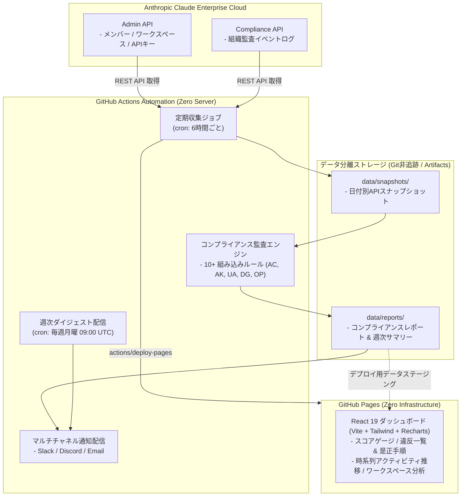

[English](README.md) | [日本語](README.ja.md)

---

# claude-audit-dashboard (2026.09 LTS)

[](https://github.com/sun-flat-yamada/claude-audit-dashboard/actions/workflows/ci.yml)
[](https://www.typescriptlang.org/)
[](https://reactjs.org/)
[](https://tailwindcss.com/)
[](LICENSE)
[](docs/BLUEPRINT.md)
[](https://docs.anthropic.com)
[-emerald?style=flat-square>)](https://pages.github.com)

[](https://buymeacoffee.com/sun.flat.yamada)

2026年9月時点の最新Anthropic仕様（Compliance API, Admin API, Workspace Hygiene, Token Cost Monitoring）に完全準拠した、エンタープライズ品質の **Claude Enterprise 監査ログ収集・コンプライアンス自動監査・分析基盤** です。

Anthropic Organization の監査アクティビティを定期収集し、5つのセキュリティ領域にわたる10+の組み込みルールで継続的にコンプライアンス検証を実施。リアルタイム通知（Slack, Discord, Email）とともに、自動更新される **GitHub Pages** ダッシュボードとして美しく可視化します。

> [!IMPORTANT]
> **開発状況: Phase 1（基盤）完了 — 実装進行中**
> 仕様書（[BLUEPRINT](docs/BLUEPRINT.md)）、共通型定義、CI/CD ワークフロー、Fork-Safe なデータ構成、合成サンプルデータは整備済みです。
> Collector（Phase 2）、本格的なダッシュボード（Phase 3）、通知（Phase 4）は**未実装**で、ダッシュボードは現在サンプルデータを表示するプレビューページのみです。
> 定期実行ワークフローはリポジトリ変数 `ENABLE_SCHEDULED_JOBS` による opt-in 方式のため、API シークレット設定前に失敗し続けることはありません。詳細は[ロードマップ](docs/BLUEPRINT.md#17-development-roadmap)を参照してください。

---

## 🌟 主な特徴 (Key Features)

### 1. 監査ログ自動収集 & イベントストリーム追跡

- **Anthropic Compliance API**: カーソル型ページネーションとHTTP 429レートリミット自動制御を備えた監査イベント（`/v1/compliance/activities`）の定期自動収集。
- **Anthropic Admin API**: 組織メンバー、ワークスペース、APIキー一覧、権限マッピングを完全同期。

### 2. 10+ 組み込みコンプライアンスルール & ポスチャースコアリング

- **5つのセキュリティドメイン**: アクセス制御 (`AC-*`)、APIキー管理 (`AK-*`)、使用量異常 (`UA-*`)、データガバナンス (`DG-*`)、運用健全性 (`OP-*`) にわたる継続的監査。
- 組織全体の総合コンプライアンススコア（0〜100点）およびカテゴリ別スコアを算出し、重要度（`critical`, `high`, `medium`, `low`, `info`）ごとにリスクを即時トリアージ。

### 3. 使用量異常検知 & コスト予算モニタリング

- トークン消費急増（直近7日間平均の3倍超過）を検出し、月次コスト予算に対する警告・超過アラートを発報。
- 組織全体およびワークスペースごとの日次・月次アクティビティ推移を集計。

### 4. インタラクティブな GitHub Pages ダッシュボード (React 19 + Tailwind + Recharts)

- GitHub Actions により自動デプロイされる完全サーバーレスの静的シングルページアプリケーション（SPA）。
- コンプライアンススコアゲージ、時系列アクティビティ推移グラフ、ワークスペース別内訳テーブル、ダークモード/ライトモード対応。

### 5. マルチチャネル通知 & 週次エグゼクティブダイジェスト

- **Slack**: 重要度別のカラーバンド、スコア推移、対応手順リンクを含む Block Kit リッチメッセージ。
- **Discord**: カラーコード化された埋め込みカード。
- **Email**: Nodemailer によるレスポンシブな HTML エグゼクティブレポート配信。
- **週次エグゼクティブダイジェスト**: 毎週月曜朝に直近7日間のコンプライアンス動向とリスク改善状況を自動配信。

### 6. 多層防御 (Defense-in-Depth) シークレット & PII 流出防止機構

- **OWASP / GitGuardian 準拠の `.gitignore`**: 秘密鍵、`.env*`、生スナップショットを Git 管理から徹底除外。
- **AI Agent ガードレール (`.agents/rules/`, `GEMINI.md`, `AGENTS.md`)**: AI エージェントによるトークンや個人情報のコード混入を常時抑止。
- **エージェント監査スキル (`.agents/skills/secret-guard/`) & スキャナー (`npm run secret-scan`)**: コミット前の自律セルフチェック。
- **CI/CD 自動検査 (`.github/workflows/secret-scan.yml`)**: Gitleaks と独自スキャナーによる PR/Push 時の二重遮断ゲート。

### 7. Fork非競合ストレージアーキテクチャ & 運用保守基盤 (Fork-Safe Storage & Ops)

- メインブランチ（`main`）に監査本番データをコミットせず、スナップショットとレポートを完全分離・gitignored化。
- Upstream（本家）との `Sync Fork` や Pull Request においてマージ競合が一切発生しません。
- **Fork健全性診断ツール (`npm run fork:verify`)** および本家同期専用スキル（`.agents/skills/fork-sync-ops/`）を完備。

### 8. Worktree分離によるマルチエージェント開発ライフサイクル

- 複数AIエージェントの並行実行時における衝突やファイルロックを防ぐ Sibling Git Worktree 方式（`../claude-audit-dashboard-worktrees/<branch>`）をサポート。
- ワークツリー管理スクリプト（`npm run worktree:add`, `npm run worktree:list`, `npm run worktree:clean`）および運用スキル（`.agents/skills/change-workflow/`）を完備。

---

## 🏛️ システムアーキテクチャ



---

## 📁 ディレクトリ構成

```text
claude-audit-dashboard/
├── .agents/                   # AI エージェント定義 & 行動規範
│   ├── rules/                 # 常時適用ルール (開発ワークフロー, 漏洩防止, ストレージ, ルール同期)
│   ├── skills/                # 運用スキル (audit-collector, billing-report, change-workflow,
│   │                          #   compliance-checker, fork-sync-ops, model-usage-analysis,
│   │                          #   report-generator, secret-guard)
│   └── *-agent.md             # エージェントの役割定義
├── .github/
│   ├── ISSUE_TEMPLATE/        # Issue テンプレート (バグ報告, 機能要望, 設定)
│   ├── workflows/             # CI, Pages デプロイ, 監査収集, 週次/月次レポート, シークレット走査
│   ├── CODEOWNERS
│   ├── dependabot.yml         # 依存関係自動更新設定 (npm & Actions)
│   └── PULL_REQUEST_TEMPLATE.md
├── config/
│   ├── default.json           # 収集・コンプライアンス・通知・ダッシュボードの既定設定
│   └── custom-rules.json      # ユーザー定義コンプライアンスルール
├── data/
│   └── sample/                # 公開用の合成モックデータ (デモ・ローカル開発用に Git 管理)
│                              # 実行時データ (snapshots/, reports/, dashboard.json) は .gitignore 対象で
│                              # orphan ブランチ `data/audit` に保存
├── docs/
│   ├── BLUEPRINT.md           # システム全体ブループリント & アーキテクチャ仕様 (正)
│   ├── DASHBOARD-FEATURES.md  # ダッシュボード機能要求仕様 (F-001 〜 F-015)
│   ├── DEPLOYMENT.md          # Private / Internal 環境向けデプロイ方法
│   ├── PLUGIN-ARCHITECTURE.md # ルール / アラート / 通知のプラグイン設計
│   └── SETUP.md               # セットアップ & 認証情報ガイド
├── packages/                  # pnpm ワークスペース
│   ├── shared/                # 共通 TypeScript 型定義・定数・ユーティリティ
│   ├── collector/             # API 収集・ルール監査エンジン・通知配信 (Phase 2)
│   └── dashboard/             # React 19 SPA — Vite + Tailwind CSS 4 (Phase 3)
├── scripts/
│   ├── secret-scan.ts         # シークレット & PII スキャナー       (pnpm secret-scan)
│   ├── fork-verify.ts         # Fork 安全性・データ分離チェック     (pnpm fork:verify)
│   └── worktree-manage.ts     # Sibling Git Worktree 管理ツール     (pnpm worktree:add|list|clean)
├── AGENTS.md / GEMINI.md      # AI コーディングエージェント向けガイドライン
├── CHANGELOG.md
├── CODE_OF_CONDUCT.md         # 行動規範 (Contributor Covenant 2.1)
├── CONTRIBUTING.md            # コントリビューション手順
├── LICENSE                    # MIT ライセンス
├── README.md / README.ja.md
├── SECURITY.md                # セキュリティポリシー & 脆弱性報告手順
└── SUPPORT.md                 # サポートチャンネル & FAQ
```

---

## 🔍 組み込みコンプライアンスルール

| ルールID   | 分野         | ルール名                     | デフォルトしきい値                 | 重要度   |
| :--------- | :----------- | :--------------------------- | :--------------------------------- | :------- |
| **AC-001** | アクセス制御 | 長期未利用メンバーの検出     | 90日以上ログインなし               | Medium   |
| **AC-002** | アクセス制御 | Admin権限保持率の過多        | 全メンバー中 20% 超過              | High     |
| **AC-003** | アクセス制御 | プライマリオーナーの稼働検証 | 有効かつアクティブであること       | Critical |
| **AK-001** | APIキー管理  | 未使用APIキーの検出          | 30日以上リクエストなし             | Medium   |
| **AK-002** | APIキー管理  | スコープ無制限APIキーの検出  | ワークスペース制限なし             | High     |
| **AK-003** | APIキー管理  | APIキー経過日数              | 作成から180日以上経過              | Medium   |
| **UA-001** | 使用量異常   | トークン消費急増の検知       | 直近7日平均の 3倍 超過             | High     |
| **UA-002** | 使用量異常   | 月次コスト予算しきい値       | 月次上限予算の 100% 超過           | Critical |
| **DG-001** | ガバナンス   | 空ワークスペースの検出       | メンバー0名 または プロジェクト0件 | Low      |
| **OP-001** | 運用健全性   | データ収集の鮮度確認         | 最終収集から 24時間 超過           | High     |

---

## 🤖 対応モデル & 監査スコープ

本基盤は**特定モデルに依存しません**。Anthropic Admin API が返すモデル ID 単位で利用量・コスト・アクティビティを集計するため、新しい Claude モデルが提供されてもコード変更なしで反映されます。

- **データソース**: Anthropic Admin API（メンバー、ワークスペース、API キー、利用量・コストレポート）および Compliance API（Organization 監査アクティビティ）
- `data/sample/` 内のモデル ID は説明用のダミー値です。

---

## 🚀 クイックスタート & セットアップ

4ステップで GitHub Pages へ自動更新ダッシュボードを展開できます:

### ステップ 1: リポジトリの Fork

- 本リポジトリ右上の **Fork** をクリックし、社内 Organization へコピーします。

### ステップ 2: GitHub Pages の有効化

1. リポジトリの **Settings** > **Pages** に移動します。
2. **Build and deployment** > **Source** で **"GitHub Actions"** を選択します。

### ステップ 3: Actions 実行権限の付与

1. **Settings** > **Actions** > **General** に移動します。
2. **Workflow permissions** で **"Read and write permissions"** を選択し、**"Allow GitHub Actions to create and approve pull requests"** をチェックします。

### ステップ 4: 認証情報の登録 (Secrets)

**Settings** > **Secrets and variables** > **Actions** に必要なキーを登録します:

- **Secrets**:
  - `ANTHROPIC_ADMIN_API_KEY`: 組織 Admin API キー (`sk-ant-admin...`).
  - `ANTHROPIC_COMPLIANCE_API_KEY`: 組織 Compliance Access キー (`sk-ant-api...`).
  - `SLACK_WEBHOOK_URL`: _(任意)_ Slack アラート通知用 Incoming Webhook URL.
  - `DISCORD_WEBHOOK_URL`: _(任意)_ Discord 通知用 Webhook URL.
  - `SMTP_HOST` / `SMTP_PORT` / `SMTP_USER` / `SMTP_PASS` / `ALERT_EMAIL_TO`: _(任意)_ メール通知用 SMTP 設定.

> [!NOTE]
> ルールのしきい値カスタマイズ（`config/default.json`）、GitHub Pages プライベート公開設定、詳細な権限設定については、**[🚀 詳細セットアップガイド (docs/SETUP.md)](docs/SETUP.md)** を参照してください。

---

## 💻 ローカル開発 & テスト

Anthropic API の実キーがなくても、組み込みの合成サンプルデータを使用してローカルで完全な検証が可能です:

```bash
# 1. 依存関係のインストール
pnpm install

# 2. Fork 健全性 & データ分離検証
npm run fork:verify

# 3. モノレポ全体の TypeScript 型チェック
pnpm typecheck

# 4. 単体テスト & 結合テストの実行
pnpm test

# 5. シークレット & PII 漏洩監査スキャン
npm run secret-scan

# 6. サンプルデータによるコンプライアンスチェック実行
pnpm check:compliance

# 7. ダッシュボード開発サーバー起動 (HMR対応)
pnpm dev
# -> http://localhost:5173/claude-audit-dashboard/ でインタラクティブに確認

# 8. プロダクションビルド検証
pnpm build
```

---

## 🤝 コントリビューション & サポート

改善のコントリビューションを心より歓迎します！このプロジェクトが役立ちましたら、ぜひサポートをご検討ください。

[](https://buymeacoffee.com/sun.flat.yamada)

Pull Request および Issue をいつでもお待ちしています！
参加前にコミュニティガイドラインをご確認ください:

- [コントリビューションガイド (CONTRIBUTING.md)](CONTRIBUTING.md)
- [行動規範 (CODE_OF_CONDUCT.md)](CODE_OF_CONDUCT.md)
- [セキュリティポリシー (SECURITY.md)](SECURITY.md)
- [サポートガイド (SUPPORT.md)](SUPPORT.md)

---

## 📄 ライセンス

本プロジェクトは [MIT License](LICENSE) のもとで公開されています。  
Copyright (c) 2026 @sun-flat-yamada (Youhei Yamada)
