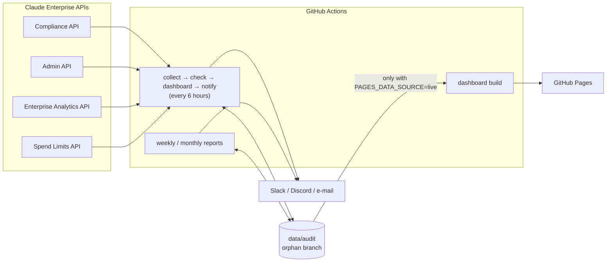

[English](README.md) | [日本語](README.ja.md)

---

# claude-audit-dashboard

[](https://github.com/sun-flat-yamada/claude-audit-dashboard/actions/workflows/ci.yml)
[](https://www.typescriptlang.org/)
[](https://reactjs.org/)
[](https://tailwindcss.com/)
[](LICENSE)
[](docs/BLUEPRINT.md)
[](https://docs.anthropic.com)
[-emerald?style=flat-square>)](https://pages.github.com)

[](https://buymeacoffee.com/sun.flat.yamada)

An audit, compliance and analytics toolkit for **Claude Enterprise** tenants. GitHub Actions collects the Activity Feed, directory, effective settings, key inventory, usage, cost and spend limits; 30 built-in rules evaluate them; results reach you as a GitHub Pages dashboard, weekly and monthly reports, and Slack / Discord / e-mail alerts. No servers.

> [!IMPORTANT]
> **Status: Phase A implemented, awaiting validation against a live tenant (Phase B).**
> Everything runs end to end on the bundled synthetic tenant (`pnpm demo`). Scheduled workflows are opt-in (`ENABLE_SCHEDULED_JOBS`) so nothing runs before the API key is configured. See the [change plan](docs/CHANGE-PLAN.md) and the [blueprint](docs/BLUEPRINT.md).

---

## Key features

### Complete, least-privilege collection

- **Compliance API** — Activity Feed polled by time window with ID de-duplication (no gaps, no duplicates), linked organizations, effective settings and the API key inventory.
- **Admin API (user management)** — members, pending invites, RBAC groups.
- **Enterprise Analytics API** — per-user last activity, DAU / WAU / MAU, daily usage and cost by product, model and RBAC group.
- **Spend Limits API** — effective per-member limits and period-to-date spend.
- One Enterprise key (`sk-ant-api01-...`) with **read-only scopes**. Conversation content is never requested.

### Rules that never confuse "no data" with "compliant"

- 30 rules across access control, API keys, usage, governance, operations, configuration baselines and activity monitoring.
- Every rule declares the datasets it needs. If one could not be collected, the rule is **skipped with the reason**, and `OP-002` reports the gap. The score always travels with its coverage, e.g. `95/100 (2 of 30 rules assessed)`.
- Add configuration baselines (`CF-xxx`) and activity watches (`AM-xxx`) without code in `config/custom-rules.json`; tune thresholds in `config/default.json`.

### Dashboard, reports and alerts

- **Dashboard** (React 19, Recharts 3, Tailwind CSS 4) — score and KPIs, filterable rule results with remediation and evidence, cost / token / adoption trends with table views, spend by product, model and group, notable events, data coverage. Light and dark, mobile friendly.
- **Reports** — compliance, weekly digest and monthly cost report, rendered as Markdown, HTML, CSV and JSON.
- **Alerts** — Slack, Discord, e-mail (SMTP) and console, filtered by status and severity with a cooldown.

### Built for continuous change (Clean Architecture)

- `@claude-audit/core` holds the domain and use cases (pure TypeScript), `@claude-audit/collector` the adapters and CLI, `@claude-audit/dashboard` the UI, which reads only the published `DashboardView` contract.
- New rules, datasets, analyzers, reports, output formats and channels are added by **registering one implementation**; API changes stay inside the adapter's schema and mapper. Lint rules cap function complexity and size.

### Fork-safe and leak-resistant

- Live data lives only on the orphan branch `data/audit`; `main` holds code and a synthetic sample generated by `pnpm demo`.
- `pnpm fork:verify`, `pnpm secret-scan`, gitleaks, Dependabot and `pnpm audit` guard against leaked data, secrets and vulnerable dependencies.

---

## Architecture



Details: [ARCHITECTURE.md](docs/ARCHITECTURE.md) (layers and extension recipes) and [API-MAPPING.md](docs/API-MAPPING.md) (endpoints, pagination, field mapping).

---

## Directory structure

```text
claude-audit-dashboard/
├── .agents/                   # Rules and skills for AI coding agents
├── .github/
│   ├── actions/setup/         # Shared setup (pnpm, Node 22, install, optional build)
│   ├── scripts/data-branch.sh # restore / save of the data/audit branch
│   └── workflows/             # ci, collect-audit, weekly-report, monthly-report, deploy-pages, secret-scan
├── config/
│   ├── default.json           # Sources, rule parameters, notifications, retention
│   └── custom-rules.json      # Configuration baselines and activity watches (no code)
├── data/sample/               # Synthetic tenant output (generated by `pnpm demo`)
├── docs/                      # Blueprint, change plan, architecture, API mapping, setup, deployment
├── packages/
│   ├── core/                  # Domain, use cases and the published dashboard contract (pure TS)
│   ├── collector/             # Anthropic adapters, storage, renderers, notifiers, CLI
│   └── dashboard/             # React SPA
└── scripts/                   # fork-verify, secret-scan, worktree-manage
```

---

## Built-in compliance rules

| ID     | Category            | Rule                                   | Default check                                                       | Severity |
| :----- | :------------------ | :------------------------------------- | :------------------------------------------------------------------ | :------- |
| AC-001 | Access control      | Inactive Members                       | No counted activity for 90 days                                     | Medium   |
| AC-002 | Access control      | Excessive Administrative Roles         | Admin roles above 20% of an organization's members                  | High     |
| AC-003 | Access control      | Single Primary Owner                   | Exactly one primary owner per organization                          | Critical |
| AC-004 | Access control      | Stale Pending Invites                  | Invites pending for more than 30 days                               | Low      |
| AK-001 | API keys            | Unused API Keys                        | Compliance-scoped key not seen calling the API for 30 days          | Medium   |
| AK-002 | API keys            | Over-privileged API Keys               | Active key holding write or delete scopes                           | High     |
| AK-003 | API keys            | API Key Age                            | Active key older than 180 days                                      | Medium   |
| UA-001 | Usage               | Usage Spike Detection                  | Latest day above 3x the trailing 7-day average                      | High     |
| UA-002 | Usage               | Cost Budget Threshold                  | Month-to-date cost over budget (forecast over budget: review)       | Critical |
| UA-003 | Usage               | Members Without Spend Limit            | Unlimited effective spend limit in every period                     | Medium   |
| UA-004 | Usage               | Spend Limit Nearly Exhausted           | Period spend at 90% of the limit (review)                           | Low      |
| DG-001 | Data governance     | Empty Groups                           | Directly created RBAC group without members                         | Low      |
| OP-001 | Operations          | Collection Freshness                   | Evaluated snapshot older than 24 hours                              | High     |
| OP-002 | Operations          | Data Source Coverage                   | Any dataset that could not be collected                             | High     |
| CF-001 | Configuration       | SSO Enforced for claude.ai             | `sso_claude_ai_enforced = true`                                     | High     |
| CF-002 | Configuration       | SCIM Provisioning                      | `sso_provisioning_mode` is a SCIM mode                              | Medium   |
| CF-003 | Configuration       | IP Allowlist Enabled                   | `ip_allowlist_enabled = true`                                       | Medium   |
| CF-004 | Configuration       | Session Duration Limited               | `account_session_duration_seconds <= 604800`                        | Low      |
| CF-005 | Configuration       | Finite Data Retention                  | `data_retention_periods <= 365 days`                                | Medium   |
| CF-006 | Configuration       | Public Projects Disabled               | `public_projects_enabled = false`                                   | Medium   |
| CF-007 | Configuration       | Code Execution Egress Restricted       | `code_execution_network_egress_enabled = false`                     | Medium   |
| CF-008 | Configuration       | Claude Code Permission Bypass Disabled | `claude_code_desktop_bypass_permissions_enabled = false`            | High     |
| CF-009 | Configuration       | Invite Domains Restricted              | `allowed_invite_domains` is not empty                               | Low      |
| AM-001 | Activity monitoring | Privileged Role Changes                | Owner transfer and role / permission grants                         | High     |
| AM-002 | Activity monitoring | Identity Provider Changes              | SSO, provisioning and directory-sync changes                        | High     |
| AM-003 | Activity monitoring | Network Restriction Changes            | IP restriction created, updated or deleted                          | Medium   |
| AM-004 | Activity monitoring | API Key Lifecycle                      | Key creation, updates, deletion and API capability changes          | Medium   |
| AM-005 | Activity monitoring | Data Export Events                     | Data, member and audit-log exports                                  | Medium   |
| AM-006 | Activity monitoring | Authentication Failure Burst           | 20 or more failed logins in one collection                          | Medium   |
| AM-007 | Activity monitoring | Data Protection Changes                | Zero data retention, data residency and inference retention changes | High     |

Score = 100 − Σ severity weight of failed rules (Critical 10, High 5, Medium 3, Low 1). Skipped rules never count as passed. Full specification: [BLUEPRINT §7](docs/BLUEPRINT.md#7-コンプライアンス監査ルール).

---

## Quick start

1. **Fork** this repository into your organization (keep it Private or Internal).
2. **Pages**: Settings → Pages → Source: **GitHub Actions**. The site shows the synthetic sample until you opt in to live data.
3. **API key**: in claude.ai, **Organization settings → API**, the primary owner creates a key with `read:compliance_activities`, `read:compliance_org_data`, `read:members`, `read:rbac_groups`, `read:analytics` and `read:spend_limits`. Save it as the secret `ANTHROPIC_ENTERPRISE_API_KEY`.
4. **Optional secrets**: `SLACK_WEBHOOK_URL`, `DISCORD_WEBHOOK_URL`, `SMTP_HOST` / `SMTP_PORT` / `SMTP_USER` / `SMTP_PASS` / `ALERT_EMAIL_FROM` / `ALERT_EMAIL_TO`.
5. Run **Collect Audit Data** manually once, check the Data coverage section, then set the repository variable `ENABLE_SCHEDULED_JOBS=true`.
6. Optional variables: `DASHBOARD_URL` (link in alerts), `PAGES_DATA_SOURCE=live` (publish live data — only for Pages sites restricted to your organization).

Step-by-step guide: [docs/SETUP.md](docs/SETUP.md). Hosting options: [docs/DEPLOYMENT.md](docs/DEPLOYMENT.md).

---

## Local development

No API key is needed: the synthetic tenant drives everything.

```bash
pnpm install
pnpm demo          # run the whole pipeline on the synthetic tenant and refresh data/sample/
pnpm dev           # dashboard at http://localhost:5173/claude-audit-dashboard/

# Quality gate (also run in CI)
pnpm fork:verify && pnpm typecheck && pnpm test && pnpm secret-scan && pnpm build
pnpm lint && pnpm format:check && pnpm audit:deps
```

With a key in `.env` (see `.env.example`): `pnpm pipeline`, `pnpm notify`, `pnpm report:weekly`, `pnpm report:monthly --month 2026-09`, `pnpm archive`.

---

## Contribution and support

Contributions are welcome! If you find this tool useful, please consider supporting its development.

[](https://buymeacoffee.com/sun.flat.yamada)

- [Contribution Guide (CONTRIBUTING.md)](CONTRIBUTING.md)
- [Code of Conduct (CODE_OF_CONDUCT.md)](CODE_OF_CONDUCT.md)
- [Security Policy (SECURITY.md)](SECURITY.md)
- [Support Guide (SUPPORT.md)](SUPPORT.md)

---

## License

This project is licensed under the [MIT License](LICENSE).
Copyright (c) 2026 @sun-flat-yamada (Youhei Yamada)
