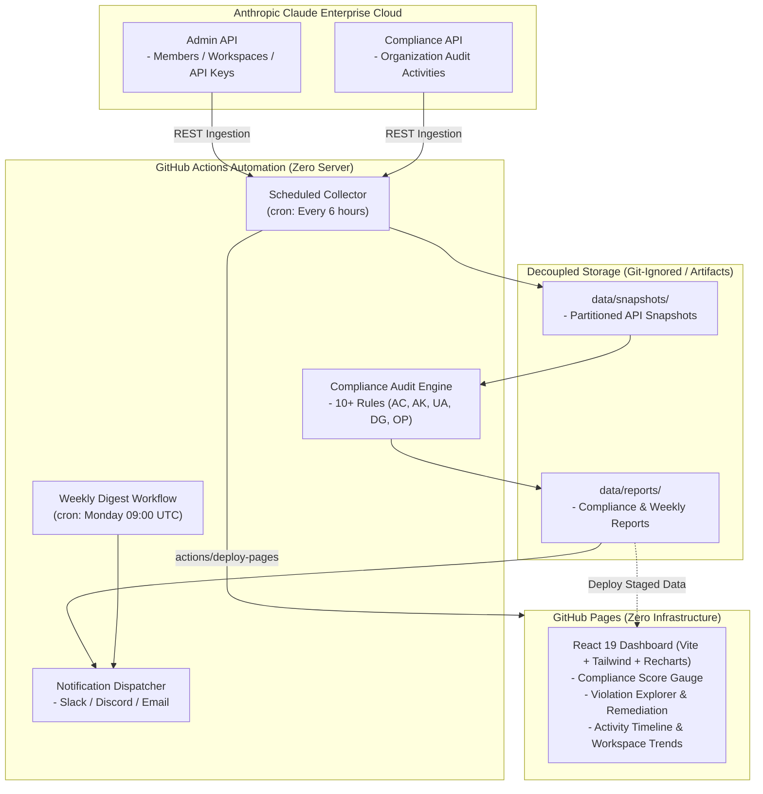

[English](README.md) | [日本語](README.ja.md)

---

# claude-audit-dashboard (2026.09 LTS)

[](https://github.com/sun-flat-yamada/claude-audit-dashboard/actions/workflows/ci.yml)
[](https://www.typescriptlang.org/)
[](https://reactjs.org/)
[](https://tailwindcss.com/)
[](LICENSE)
[](docs/BLUEPRINT.md)
[](https://docs.anthropic.com)
[-emerald?style=flat-square>)](https://pages.github.com)

[](https://buymeacoffee.com/sun.flat.yamada)

An enterprise-grade **Claude Enterprise Organization Audit, Compliance Checking & Analytics Platform** fully compliant with the latest Anthropic specifications as of September 2026 (Compliance API, Admin API, Workspace Hygiene, and Token Cost Monitoring).

Continuously ingests organization audit activities, verifies 10+ built-in compliance rules across 5 security domains, and delivers real-time notifications (Slack, Discord, Email) alongside an auto-updating **GitHub Pages** dashboard.

> [!IMPORTANT]
> **Project status: Phase 1 (Foundation) complete — implementation in progress.**
> The specification ([BLUEPRINT](docs/BLUEPRINT.md)), shared type definitions, CI/CD workflows, fork-safe data layout and synthetic sample data are in place.
> The collector (Phase 2), full dashboard (Phase 3) and notifications (Phase 4) are **not implemented yet**; the dashboard currently ships a preview page backed by sample data.
> Scheduled workflows are opt-in (`ENABLE_SCHEDULED_JOBS` repository variable) so they do not run before API secrets are configured. See the [roadmap](docs/BLUEPRINT.md#17-development-roadmap).

---

## 🌟 Key Features

### 1. Automated Audit Ingestion & Event Stream Tracking

- **Anthropic Compliance API**: Scheduled collection of Organization audit events (`/v1/compliance/activities`) with cursor-based pagination and automatic rate-limit backoff.
- **Anthropic Admin API**: Full synchronization of members, workspaces, API key inventories, and workspace assignments.

### 2. 10+ Built-in Compliance Rules & Posture Scoring

- Continuously audits organizational risks across **5 Security Domains**: Access Control (`AC-*`), API Key Management (`AK-*`), Usage Anomalies (`UA-*`), Data Governance (`DG-*`), and Operational Health (`OP-*`).
- Computes overall Organization Compliance Score (0–100) with category-level breakdowns and severity tagging (`critical`, `high`, `medium`, `low`, `info`).

### 3. Usage Anomaly Detection & Cost Budget Monitoring

- Identifies sudden token consumption spikes (>3x trailing average) and warns on monthly cost budget thresholds.
- Provides daily, monthly, and scope-based activity aggregation across organizations and workspaces.

### 4. Interactive GitHub Pages Dashboard (React 19 + Tailwind + Recharts)

- Zero-server static Single Page Application (SPA) deployed automatically via GitHub Actions.
- Visual compliance score gauge, interactive activity timeline charts, workspace breakdown tables, and dark/light mode support.

### 5. Multi-Channel Alert & Digest Dispatching

- **Slack**: Rich Block Kit notifications with severity color bands, score metrics, and quick remediation links.
- **Discord**: Color-coded embed cards.
- **Email**: Responsive HTML executive reports via SMTP (Nodemailer).
- **Weekly Executive Digest**: Automated Monday morning compliance digests summarizing 7-day risk trends.

### 6. Defense-in-Depth Secret & PII Leak Prevention

- **OWASP / GitGuardian Compliant `.gitignore`**: Strictly excludes private keys, `.env*`, and live snapshot dumps.
- **AI Agent Guardrails (`.agents/rules/`, `GEMINI.md`, `AGENTS.md`)**: Continuously prevents AI coding assistants from hardcoding tokens or employee identities.
- **Agent Audit Skill (`.agents/skills/secret-guard/`) & Scanner (`npm run secret-scan`)**: Autonomous pre-commit self-checks.
- **CI/CD Automated Inspection (`.github/workflows/secret-scan.yml`)**: Gitleaks and built-in secret scanners enforcing zero-leakage branch protection.

### 7. Fork-Safe Storage Architecture & Maintenance Platform

- Zero production data files committed to `main`; all snapshots and compliance reports remain decoupled and gitignored.
- Guaranteed conflict-free `Sync Fork` and Pull Request operations when forks are deployed across internal enterprise teams.
- Equipped with **Fork Health Verification Tool (`npm run fork:verify`)** and automated synchronization skill (`.agents/skills/fork-sync-ops/`).

### 8. Worktree-Isolated Multi-Agent Change Lifecycle

- Supports concurrent multi-agent development using sibling git worktrees (`../claude-audit-dashboard-worktrees/<branch>`) to prevent file collisions.
- Built-in management scripts (`npm run worktree:add`, `npm run worktree:list`, `npm run worktree:clean`) and comprehensive change skills (`.agents/skills/change-workflow/`).

---

## 🏛️ System Architecture



---

## 📁 Directory Structure

```text
claude-audit-dashboard/
├── .agents/                   # AI agent specifications & behavioral directives
│   ├── rules/                 # Always-on rules (workflow, zero leakage, storage routing, rule sync)
│   ├── skills/                # Operational skills (audit-collector, billing-report, change-workflow,
│   │                          #   compliance-checker, fork-sync-ops, model-usage-analysis,
│   │                          #   report-generator, secret-guard)
│   └── *-agent.md             # Agent role definitions
├── .github/
│   ├── ISSUE_TEMPLATE/        # GitHub Issue Forms (Bug Report, Feature Request, Config)
│   ├── workflows/             # CI, Pages deploy, audit collection, weekly/monthly reports, secret scan
│   ├── CODEOWNERS
│   ├── dependabot.yml         # Dependency update configuration (npm & Actions)
│   └── PULL_REQUEST_TEMPLATE.md
├── config/
│   ├── default.json           # Default collection, compliance, notification & dashboard settings
│   └── custom-rules.json      # User-defined compliance rules
├── data/
│   └── sample/                # Public synthetic mock data (committed for demo & local dev)
│                              # Runtime data (snapshots/, reports/, dashboard.json) is gitignored
│                              # and lives on the `data/audit` orphan branch
├── docs/
│   ├── BLUEPRINT.md           # System blueprint & architecture specification (source of truth)
│   ├── DASHBOARD-FEATURES.md  # Dashboard feature requirements (F-001 … F-015)
│   ├── DEPLOYMENT.md          # Private / internal deployment options
│   ├── PLUGIN-ARCHITECTURE.md # Compliance rule / alert / notifier plugin design
│   └── SETUP.md               # Setup & credentials guide
├── packages/                  # pnpm workspace packages
│   ├── shared/                # Shared TypeScript types, constants & utilities
│   ├── collector/             # API ingestion, compliance engine & notifier (Phase 2)
│   └── dashboard/             # React 19 SPA — Vite + Tailwind CSS 4 (Phase 3)
├── scripts/
│   ├── secret-scan.ts         # Built-in secret & PII scanner      (pnpm secret-scan)
│   ├── fork-verify.ts         # Fork-safety / data-isolation check (pnpm fork:verify)
│   └── worktree-manage.ts     # Sibling git worktree helper         (pnpm worktree:add|list|clean)
├── AGENTS.md / GEMINI.md      # Guidelines for AI coding agents
├── CHANGELOG.md
├── CODE_OF_CONDUCT.md         # Contributor Covenant v2.1
├── CONTRIBUTING.md            # Contribution workflow
├── LICENSE                    # MIT License
├── README.md / README.ja.md
├── SECURITY.md                # Security policy & vulnerability reporting
└── SUPPORT.md                 # Support channels & FAQ
```

---

## 🔍 Built-in Compliance Rules

| ID         | Domain          | Rule Title                    | Default Threshold            | Severity |
| :--------- | :-------------- | :---------------------------- | :--------------------------- | :------- |
| **AC-001** | Access Control  | Inactive Organization Members | 90+ days without login       | Medium   |
| **AC-002** | Access Control  | Excessive Admin Role Ratio    | > 20% of total members       | High     |
| **AC-003** | Access Control  | Primary Owner Verification    | Must be verified active      | Critical |
| **AK-001** | API Keys        | Inactive API Keys             | 30+ days without usage       | Medium   |
| **AK-002** | API Keys        | Unscoped API Keys             | Unrestricted workspace scope | High     |
| **AK-003** | API Keys        | API Key Age                   | 180+ days old                | Medium   |
| **UA-001** | Usage Anomaly   | Token Consumption Spike       | > 3x trailing 7-day average  | High     |
| **UA-002** | Usage Anomaly   | Monthly Cost Budget Threshold | > 100% monthly budget limit  | Critical |
| **DG-001** | Data Governance | Empty Workspaces              | 0 members or 0 projects      | Low      |
| **OP-001** | Operations      | Collection Freshness          | > 24 hours without sync      | High     |

---

## 🤖 Supported Models & Audit Scope

The platform is **model-agnostic**: usage, cost and activity are attributed to whatever model IDs the Anthropic Admin API reports for your organization, so newly released Claude models appear automatically without code changes.

- **Data sources**: Anthropic Admin API (members, workspaces, API keys, usage & cost reports) and Compliance API (organization audit activities).
- Model IDs in `data/sample/` are illustrative only.

---

## 🚀 Quick Start & Setup

Deploy your auto-updating audit dashboard to GitHub Pages in 4 steps:

### Step 1: Fork or Mirror the Repository

- Click **Fork** to copy this repository to your enterprise organization.

### Step 2: Configure GitHub Pages

1. Go to **Settings** > **Pages** in your repository.
2. Under **Build and deployment** > **Source**, select **"GitHub Actions"**.

### Step 3: Enable Actions Permissions

1. Navigate to **Settings** > **Actions** > **General**.
2. Under **Workflow permissions**, select **"Read and write permissions"** and check **"Allow GitHub Actions to create and approve pull requests"**.

### Step 4: Configure Credentials in Secrets

Register your configuration under **Settings** > **Secrets and variables** > **Actions**:

- **Secrets**:
  - `ANTHROPIC_ADMIN_API_KEY`: Organization Admin API Key (`sk-ant-admin...`).
  - `ANTHROPIC_COMPLIANCE_API_KEY`: Organization Compliance Access Key (`sk-ant-api...`).
  - `SLACK_WEBHOOK_URL`: _(Optional)_ Slack Incoming Webhook for instant alerts.
  - `DISCORD_WEBHOOK_URL`: _(Optional)_ Discord Webhook for alert notifications.
  - `SMTP_HOST` / `SMTP_PORT` / `SMTP_USER` / `SMTP_PASS` / `ALERT_EMAIL_TO`: _(Optional)_ SMTP credentials for email alerts.

> [!NOTE]
> For advanced setup options — including rule customization via `config/default.json`, private GitHub Pages configuration, and detailed API permissions — refer to the **[🚀 Complete Setup Guide (docs/SETUP.md)](docs/SETUP.md)**.

---

## 💻 Local Development & Testing

Full development, verification, and testing can be conducted locally using synthetic sample data without live Anthropic API keys:

```bash
# 1. Install dependencies
pnpm install

# 2. Pre-flight fork health & data decoupling audit
npm run fork:verify

# 3. TypeScript typecheck across all monorepo packages
pnpm typecheck

# 4. Run unit & integration tests
pnpm test

# 5. Run secret & PII leak audit scanner
npm run secret-scan

# 6. Execute local compliance checks on sample data
pnpm check:compliance

# 7. Start local dashboard development server (with HMR)
pnpm dev
# -> Opens interactive dashboard at http://localhost:5173/claude-audit-dashboard/

# 8. Production build verification
pnpm build
```

---

## 🤝 Contribution & Support

Contributions are welcome! If you find this tool useful, please consider supporting its development.

[](https://buymeacoffee.com/sun.flat.yamada)

Pull requests and issues are warmly welcomed!
Please review our community guidelines before contributing:

- [Contribution Guide (CONTRIBUTING.md)](CONTRIBUTING.md)
- [Code of Conduct (CODE_OF_CONDUCT.md)](CODE_OF_CONDUCT.md)
- [Security Policy (SECURITY.md)](SECURITY.md)
- [Support Guide (SUPPORT.md)](SUPPORT.md)

---

## 📄 License

This project is licensed under the [MIT License](LICENSE).
Copyright (c) 2026 @sun-flat-yamada (Youhei Yamada)
