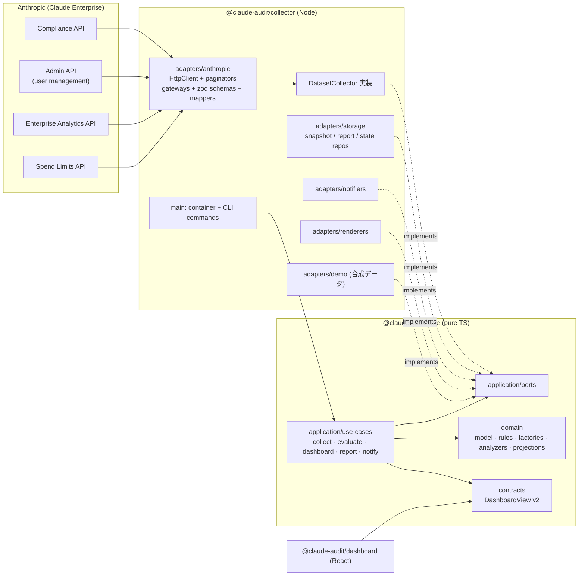

# Architecture — Clean Architecture for continuous API / audit / report change

> **Status:** Implemented in Phase A of [CHANGE-PLAN.md](CHANGE-PLAN.md) (2026-10-01). Extension recipes: §8 and [PLUGIN-ARCHITECTURE.md](PLUGIN-ARCHITECTURE.md)
> **目的:** Anthropic API の変更、監査ルール・分析・レポート方式の追加が続いても、既存コードの複雑度を増やさずに追加だけで対応できる構造にする。

---

## 1. 原則

| #   | 原則                     | 具体策                                                                                                                                                |
| --- | ------------------------ | ----------------------------------------------------------------------------------------------------------------------------------------------------- |
| 1   | 依存は内側へ一方向       | `domain` ← `application` ← `adapters` / `infrastructure` ← `main`。UI は公開契約 (`contracts`) だけに依存                                             |
| 2   | 外部の形は境界で止める   | Anthropic API のレスポンスは各アダプタの zod スキーマで検証し、写像関数でドメイン型へ変換する (腐敗防止層)                                            |
| 3   | 寛容な読み取り           | 使う項目だけ検証する。未知の項目・enum 値・activity type・actor type は通過させる。必須項目の欠落は「スキーマ差異」としてデータセット単位で失敗させる |
| 4   | 前提データを宣言する     | ルール・分析は `requires` でデータセットを宣言。エンジンが取得状況 (coverage) と照合し、欠けていれば理由付きで `skipped`                              |
| 5   | 追加は登録だけ           | すべての拡張点はレジストリ (`Registry<T>`) か配列への登録。種類ごとの switch / if 連鎖を書かない                                                      |
| 6   | データで振る舞いを増やす | 設定ベースライン・アクティビティ監視はデータ定義からルールを生成する                                                                                  |
| 7   | 小さな単位               | 1 ファイル 1 責務、関数は短く。ESLint `complexity` と `max-lines-per-function` で監視                                                                 |

---

## 2. 全体図



---

## 3. パッケージとディレクトリ

```text
packages/
├── core/                         @claude-audit/core — Node 型なし、IO なし (依存: zod のみ)
│   └── src/
│       ├── domain/
│       │   ├── model/            データセット型 (DatasetMap)、エンティティ、スナップショット、coverage
│       │   ├── compliance/       ルール定義 API、エンジン、スコア、組み込みルール、ルール生成器
│       │   │   ├── rules/        1 ファイル = 1 カテゴリ (小さな defineRule の集合)
│       │   │   └── factories/    setting-baseline (CF) / activity-watch (AM) と既定定義
│       │   ├── analysis/         Analyzer と組み込み分析
│       │   ├── projections/      スナップショット間で状態を持つ導出データ (例: キー最終利用)
│       │   ├── activity-window.ts  Activity Feed の取得窓と重複排除 (純粋関数)
│       │   └── util/             日付・金額・マスク・集計
│       ├── application/
│       │   ├── ports.ts          外側が実装するインターフェース
│       │   ├── registry.ts       Registry<T>
│       │   ├── state.ts          コレクタ状態 (カーソル、投影、通知記録と送信履歴) のスキーマ
│       │   ├── documents.ts      汎用レポート文書 (ReportDocument)
│       │   ├── use-cases/        collect-snapshot / check-compliance / reports / alerts
│       │   └── presenters/       DashboardView への変換 (PII マスク)
│       └── contracts/            UI 向け公開契約 (DashboardView v2 と zod スキーマ)
├── collector/                    @claude-audit/collector — Node 実行環境
│   └── src/
│       ├── adapters/
│       │   ├── anthropic/        http-client, paginate, compliance-api, admin-api, analytics-api, collectors
│       │   ├── storage/          file-store, repositories (決定的 JSON)
│       │   ├── notifiers/        channels (console, slack, discord), email, webhook (共通 POST)
│       │   ├── renderers/        markdown, html, csv, json
│       │   └── demo/             決定的な合成データソース (サンプル生成・テスト用)
│       ├── infrastructure/       env (環境変数)、config (設定ファイル)、runtime (clock、logger)
│       └── main/                 container (組み立て)、commands (CLI コマンド登録)、cli (入口)
└── dashboard/                    @claude-audit/dashboard — React SPA (contracts の型だけを使う)
```

### 3.1 依存規則の強制

| 規則                                                   | 強制手段                                                                                                             |
| ------------------------------------------------------ | -------------------------------------------------------------------------------------------------------------------- |
| core は Node API と外側のパッケージを使わない          | `packages/core/tsconfig.json` の `types: []` (Node 型が無いので `node:*` は型エラー)、ESLint `no-restricted-imports` |
| domain は application / contracts を参照しない         | ESLint (`packages/core/src/domain/**`)                                                                               |
| adapters / infrastructure は main を参照しない         | ESLint (`packages/collector/src/{adapters,infrastructure}/**`)                                                       |
| dashboard は `@claude-audit/core/contracts` だけを参照 | ESLint (`packages/dashboard/src/**`)                                                                                 |

---

## 4. ドメインモデル

### 4.1 データセット

スナップショットは「名前付きデータセットの束」と「各データセットの取得状況 (coverage)」で構成する。

```ts
interface DatasetMap {
  organizations: Organization[];
  members: Member[];
  memberActivity: MemberActivity[];
  invites: Invite[];
  groups: Group[];
  settings: OrgSettings[];
  credentials: Credential[];
  credentialUsage: CredentialUsage[]; // 投影 (projection) で導出
  activities: Activity[]; // 前回収集以降の差分
  usage: UsageRow[]; // 日次 × 次元 (total / product / model / group)
  cost: CostRow[];
  adoption: AdoptionDay[];
  spendLimits: SpendLimit[];
}

interface DatasetMeta {
  status: 'ok' | 'unavailable' | 'error';
  source?: string; // 実際にデータを供給したエンドポイント
  reason?: string; // unavailable / error の理由 (例: 403 のスコープ不足メッセージ)
  count?: number;
  window?: { from: string; to: string }; // 期間を持つデータの対象期間
  asOf?: string; // 例: Analytics の data_refreshed_at
}
```

任意アダプタ (B4) のデータセット (`consoleWorkspaces` / `consoleApiKeys` / `consoleUsage` / `consoleCost` / `claudeCodeActivity`) も `DatasetMap` に登録されるが、`OptionalDatasetMap` (`domain/model/optional-datasets.ts`) に分けて持ち、`DATASET_NAMES` は組み込み 13 件のまま。設定の `sources.<flag>.enabled` が真のときだけコレクタが登録されるため、無効の間は coverage に現れない (§8.3)。

`status` の意味:

- `ok` — 取得成功 (0 件を含む)。ルールは「0 件」を事実として扱ってよい。
- `unavailable` — 権限・機能無効・キー未設定などで取得できない (401/403/404、キー無し)。
- `error` — 一時障害やスキーマ差異で失敗。

### 4.2 エンティティ (抜粋)

外部 API の項目名はドメインに持ち込まない。例:

| ドメイン                                   | 由来 (外部)                                                                      |
| ------------------------------------------ | -------------------------------------------------------------------------------- |
| `Member.joinedAt`                          | Admin `added_at`                                                                 |
| `Activity.createdAt` / `organizationId`    | `created_at` / `organization_uuid` (無ければ `organization_id`)                  |
| `Activity.actor = { kind, id, email, ip }` | 判別共用体 `actor` を正規化 (`user_id` / `api_key_id` / `admin_api_key_id` など) |
| `Activity.attributes`                      | 種別固有のトップレベル項目 (未知の項目も保持)                                    |
| `CostRow.amount` + `currency`              | `amount` (セント小数文字列) ÷ 100                                                |
| `SpendLimit.limit = null`                  | 無制限                                                                           |

---

## 5. ユースケース

| ユースケース                                 | 入力                                             | 出力                                          | 主なポート                                                                         |
| -------------------------------------------- | ------------------------------------------------ | --------------------------------------------- | ---------------------------------------------------------------------------------- |
| `collectSnapshot`                            | コレクタ一覧、投影一覧、前回状態                 | スナップショット (+ 次回用カーソル・投影状態) | `DatasetCollector`, `Projection`, `SnapshotRepository`, `StateRepository`, `Clock` |
| `evaluateCompliance` / `checkLatestSnapshot` | ルール一覧、スナップショット、引数、無効化リスト | コンプライアンスレポート (保存は後者)         | — (純粋) / `SnapshotRepository`, `ComplianceReportRepository`                      |
| `runAnalyzers`                               | 分析一覧、スナップショット                       | Insight 一覧                                  | — (純粋)                                                                           |
| `buildDashboardView`                         | 最新スナップショット、レポート履歴、Insight      | `DashboardView` v2                            | — (純粋)                                                                           |
| `ReportDefinition.build`                     | `ReportContext` (期間、スナップショット、履歴)   | `ReportDocument`                              | `DocumentRenderer` で出力 (collector の `generateReport` が組み立て)               |
| `planComplianceAlert` / `dispatchAlert`      | レポート、ポリシー、前回送信記録                 | 送信する通知                                  | `Notifier`, `StateRepository`                                                      |

`collectSnapshot` はデータセット固有の処理を持たない。コレクタごとに

1. 前回のカーソル (`state.cursors[dataset]`) を渡して `collect` を呼ぶ
2. `DataUnavailableError` は `unavailable`、その他の例外は `error` として coverage に記録 (他のデータセットは継続)
3. 返されたカーソルを保存

を繰り返すだけである。Activity Feed の取得窓・重複排除のような状態はコレクタ自身が不透明なカーソルとして持つ。

---

## 6. ルールエンジン

```ts
export const inactiveMembers = defineRule({
  meta: {
    id: 'AC-001',
    name: 'Inactive Members',
    category: 'access-control',
    severity: 'medium',
    description: 'Members without counted activity for longer than the threshold',
    remediation: 'Review and remove members who no longer need access.',
  },
  requires: ['members', 'memberActivity'],
  params: z.object({ inactiveDays: z.number().int().positive().default(90) }),
  evaluate({ data, coverage, params, now }) {
    // ...判定だけを書く (IO なし)
    return pass('No inactive members');
  },
});
```

エンジンの責務:

1. 無効化されたルールを除外
2. `requires` のデータセットが `ok` でなければ `skipped` (理由に status と reason を含める)
3. `params` を zod で検証 (既定値 + `compliance.params.<id>`)。不正なら `error`
4. `evaluate` の例外を `error` に変換 (他のルールは継続)
5. 結果を集計しスコアを計算 (`fail` の重大度重みを減点)。表示は `formatScore` で評価済みルール数と併記する (skipped / error がある場合)

### 6.1 データ駆動のルール生成器

- **setting-baseline (CF-xxx)** — `{ id, name, severity, setting, expect: { kind, ... } }` から実効設定を検査するルールを生成。`expect.kind` は `equals` / `oneOf` / `max` / `nonEmpty` / `retentionAtMostDays` の期待値ストラテジで評価する (追加はストラテジの登録のみ)。
- **activity-watch (AM-xxx)** — `{ id, name, severity, match: [{ types, where? }], threshold }` から Activity 差分を検査するルールを生成。

既定定義はコード (`factories/defaults.ts`) にあり、`config/custom-rules.json` で追加できる。activity type は同梱の既知一覧 (`known-activity-types.ts`) と照合する。

---

## 7. アダプタ

### 7.1 Anthropic ゲートウェイ

| 部品            | 責務                                                                                                                                                                                                                                                            |
| --------------- | --------------------------------------------------------------------------------------------------------------------------------------------------------------------------------------------------------------------------------------------------------------- |
| `HttpClient`    | 認証ヘッダ、タイムアウト、リトライ契約 (429 `retry-after` 優先 / 1〜60 秒の指数バックオフ / 500・502・503・504・529 / `x-should-retry: false` は即失敗)、配列 (`key[]=v`) とドット記法 (`created_at.gte`) のクエリ直列化、`ApiError` (status, type, request-id) |
| `paginate`      | ID カーソル (`after_id` + `has_more`/`last_id`)、ページトークン (`page` + `next_page`、`has_more` の有無両対応)。410 (カーソル失効) は先頭から 1 回だけ再開                                                                                                     |
| `*-api.ts`      | エンドポイントごとの zod スキーマ (寛容) と写像関数。ゲートウェイは 1 メソッド = 1 エンドポイント                                                                                                                                                               |
| `collectors.ts` | ゲートウェイを `DatasetCollector` に適合させる。403/404 とキー未設定を `DataUnavailableError` に変換。`firstAvailable` で代替経路 (例: members の Admin → Compliance) を合成                                                                                    |

### 7.2 その他

| アダプタ  | 実装するポート                                                                          | 備考                                                                                                 |
| --------- | --------------------------------------------------------------------------------------- | ---------------------------------------------------------------------------------------------------- |
| storage   | `SnapshotRepository`, `ComplianceReportRepository`, `StateRepository`, `ArtifactWriter` | データセット単位ファイル、キー順固定の決定的 JSON、原子的書き込み、パス逸脱の拒否                    |
| notifiers | `Notifier`                                                                              | console / Slack Incoming Webhook / Discord Webhook / SMTP (nodemailer)。未設定のチャネルは登録しない |
| renderers | `DocumentRenderer`                                                                      | markdown / html / csv / json                                                                         |
| demo      | `DatasetCollector`                                                                      | 固定シード・固定時刻の合成データ。`pnpm demo` でサンプルデータを生成し、テストのフィクスチャにも使う |

---

## 8. 拡張レシピ

### 8.1 新しい監査ルールを追加する

1. `packages/core/src/domain/compliance/rules/<category>.ts` に `defineRule({...})` を追加し、カテゴリ配列に加える
2. 同ディレクトリのテストに pass / fail / skipped を追加
3. `docs/BLUEPRINT.md` §7.1 と `README.md` のルール表に 1 行追加 (テストが一致を強制)

エンジン・ユースケース・CLI は変更しない。

### 8.2 設定ベースライン / アクティビティ監視を追加する (コード不要)

`config/custom-rules.json`:

```json
{
  "settingBaselines": [
    {
      "id": "CF-101",
      "name": "Web Search Disabled",
      "severity": "low",
      "setting": "web_search_enabled",
      "expect": { "kind": "equals", "value": false },
      "remediation": "Disable web search in organization settings."
    }
  ],
  "activityWatches": [
    {
      "id": "AM-101",
      "name": "Bulk Organization Deletion",
      "severity": "high",
      "match": [{ "types": ["org_bulk_delete_initiated"] }],
      "threshold": 1
    }
  ]
}
```

### 8.3 新しい API エンドポイント / データセットを追加する

1. `DatasetMap` に 1 行 (`newThing: NewThing[]`)
2. ゲートウェイにメソッド + zod スキーマ + 写像
3. `collectors.ts` に `DatasetCollector` を 1 件登録
4. 利用するルール・分析は `requires: ['newThing']` を宣言

**任意 (opt-in) のデータセット** にする場合 (既存の利用者に `unavailable` → OP-002 の fail という回帰を起こさないため): 1 を `OptionalDatasetMap` と `OPTIONAL_SOURCES` (有効化する設定フラグ) に書き、3 を `createOptionalCollectors` に登録する。フラグが偽の間はコレクタを返さないので coverage に現れない。有効でキー未設定・401・403・404 は `unavailable`、スキーマ差異は `error`。B4 の Console Admin API / Claude Code Analytics がこの形 (`adapters/anthropic/optional-collectors.ts`)。

### 8.4 API の変更 (項目名・ページング・バージョン) に追随する

変更は該当ゲートウェイのスキーマと写像、または `paginate` の戦略選択だけに閉じる。ドメイン型が変わらない限り、ルール・分析・レポート・UI は無変更。スキーマ差異はデータセットの `error` として coverage と OP-002 に現れるため、黙って空振りすることはない。

### 8.5 分析・レポート・出力形式・通知チャネルを追加する

| 追加対象     | 実装                                                    | 登録先                                                            |
| ------------ | ------------------------------------------------------- | ----------------------------------------------------------------- |
| 分析         | `Analyzer` (`requires` + `analyze`)                     | `BUILTIN_ANALYZERS` (`domain/analysis/analyzers.ts`)              |
| 投影         | `Projection` (`requires` + `reduce`)                    | `BUILTIN_PROJECTIONS` (`domain/projections/index.ts`)             |
| レポート     | `ReportDefinition` (`build` が `ReportDocument` を返す) | `BUILTIN_REPORTS` (`application/use-cases/reports.ts`)            |
| 出力形式     | `DocumentRenderer`                                      | `BUILTIN_RENDERERS` (`collector/src/adapters/renderers/index.ts`) |
| 通知チャネル | `Notifier`                                              | `notifiers()` (`collector/src/main/container.ts`)                 |

レポートは汎用文書 (`kpis` / `table` / `list` / `text` セクション) を返すため、新しいレポートは既存のすべての出力形式・通知チャネルでそのまま使える。

---

## 9. エラー処理とデータ品質

| 事象                           | 扱い                                                                              | 可視化                          |
| ------------------------------ | --------------------------------------------------------------------------------- | ------------------------------- |
| キー未設定                     | コレクタが `DataUnavailableError`                                                 | coverage `unavailable` → OP-002 |
| 401 / 403 / 404                | `DataUnavailableError` (API のメッセージを理由に保持。403 は不足スコープ名を含む) | 同上                            |
| 429 / 5xx / 529 / タイムアウト | リトライ後に失敗したら `error`                                                    | coverage `error` → OP-002       |
| スキーマ差異 (必須項目欠落)    | zod 検証エラーをデータセットの `error` に                                         | 同上                            |
| ルールの前提欠落               | `skipped` (理由付き)                                                              | ダッシュボードの skipped 件数   |
| ルールの例外 / 引数不正        | そのルールだけ `error`                                                            | 結果一覧                        |

---

## 10. CLI とワークフロー

| npm script               | CLI                 | 内容                                                 | ワークフロー                     |
| ------------------------ | ------------------- | ---------------------------------------------------- | -------------------------------- |
| `pnpm collect`           | `collect`           | スナップショット取得                                 | —                                |
| `pnpm check:compliance`  | `check`             | 最新スナップショットを評価しレポート保存             | —                                |
| `pnpm build:data`        | `dashboard`         | `data/dashboard.json` を生成                         | —                                |
| `pnpm pipeline`          | `pipeline`          | collect → check → dashboard                          | `collect-audit.yml` (6 時間ごと) |
| `pnpm notify`            | `notify`            | アラートポリシーに従い通知                           | `collect-audit.yml`              |
| `pnpm archive`           | `archive`           | 保持期間超過のスナップショットを圧縮                 | `collect-audit.yml` (commit 前)  |
| `pnpm size`              | `size`              | `data/audit` のサイズ計測と `capacity.*` 閾値判定    | `collect-audit.yml` (非致命)     |
| `pnpm restore`           | `restore`           | `archive/*.json.gz` を `snapshots/<id>/` へ復元      | —                                |
| `pnpm report:compliance` | `report compliance` | 最新評価のレポート                                   | —                                |
| `pnpm report:weekly`     | `report weekly`     | 週次レポート生成・配信 (`--notify`)                  | `weekly-report.yml`              |
| `pnpm report:monthly`    | `report monthly`    | 月次コストレポート生成・配信 (`--month`, `--notify`) | `monthly-report.yml`             |
| `pnpm demo`              | `demo`              | 合成データで全処理を実行し `data/sample/` を再生成   | —                                |

ワークフローは共通セットアップ (`.github/actions/setup`) の後、`.github/scripts/data-branch.sh restore` で `data/audit` から復元し、コマンド実行後に `save` で書き戻す。書き込むワークフローは `concurrency: audit-data` で直列化し、API キーと通知用シークレットはそれを使うステップの `env` にだけ渡す。
