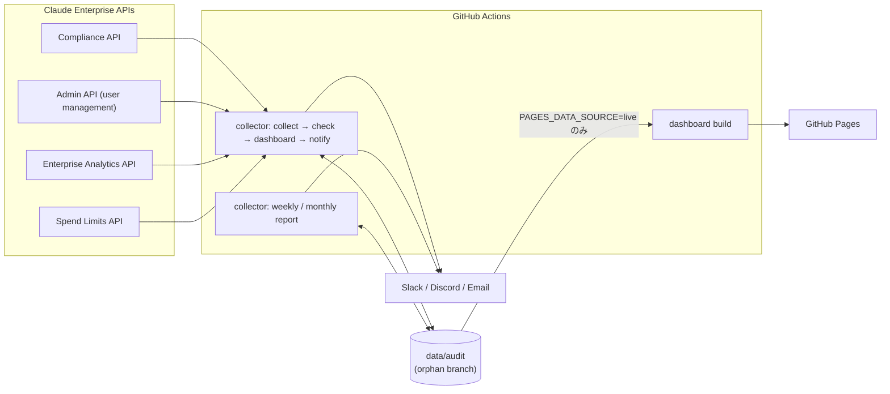

# Claude Enterprise Audit Dashboard — Blueprint

> **Version:** 0.3.0
> **Date:** 2026-10-01
> **Author:** @sun-flat-yamada (Youhei Yamada)
> **Status:** Draft — Phase A 実装済み、実テナント検証 (Phase B) 待ち
> **対象:** Claude Enterprise (claude.ai の Enterprise プラン。Compliance API / Admin API ユーザー管理 / Enterprise Analytics API / Spend Limits API)

本書は要求仕様の正本である。変更の経緯と判断理由は [CHANGE-PLAN.md](CHANGE-PLAN.md)、構造の詳細は [ARCHITECTURE.md](ARCHITECTURE.md)、エンドポイント単位の写像は [API-MAPPING.md](API-MAPPING.md)、出発点となった不一致の記録は [api-spec-mismatch-findings.md](api-spec-mismatch-findings.md) を参照する。

---

## 目次

1. [概要](#1-概要)
2. [ゴールと非ゴール](#2-ゴールと非ゴール)
3. [アーキテクチャ](#3-アーキテクチャ)
4. [Fork-Safe 設計とデータ分離](#4-fork-safe-設計とデータ分離)
5. [データソースと API 連携](#5-データソースと-api-連携)
6. [データモデルと長期保持](#6-データモデルと長期保持)
7. [コンプライアンス監査ルール](#7-コンプライアンス監査ルール)
8. [拡張アーキテクチャ](#8-拡張アーキテクチャ)
9. [ダッシュボード](#9-ダッシュボード)
10. [通知](#10-通知)
11. [レポートと分析](#11-レポートと分析)
12. [GitHub Actions](#12-github-actions)
13. [Private/Internal リポジトリとデプロイ](#13-privateinternal-リポジトリとデプロイ)
14. [セキュリティ](#14-セキュリティ)
15. [プロジェクト構成](#15-プロジェクト構成)
16. [技術スタック](#16-技術スタック)
17. [ロードマップ](#17-ロードマップ)
18. [開発プロセス](#18-開発プロセス)
19. [付録 A: 設定スキーマ](#付録-a-設定スキーマ)
20. [付録 B: 用語集](#付録-b-用語集)

---

## 1. 概要

**Claude Enterprise Audit Dashboard** は、Claude Enterprise テナントの監査データ (Activity Feed、ディレクトリ、実効設定、キー台帳、利用量・コスト、利用上限) を GitHub Actions で定期収集し、コンプライアンスルールで評価し、集計結果を GitHub Pages のダッシュボード・定期レポート・通知で届けるツールである。

Fork して自組織の Private / Internal リポジトリとして運用することを前提とし、コードと監査データを分離する (Fork-Safe)。

### コアバリュー

- **取りこぼしの無い監査ログ** — Activity Feed を時間窓 + ID 重複排除で収集し、Anthropic 側の保持期間 (6 年) を超えて保管できる
- **誤判定しない評価** — ルールは必要なデータセットを宣言し、取得できなかった場合は理由付きの `skipped`。「データが無いから準拠」とはしない
- **変化への耐性** — API・監査ルール・分析・レポート方式の追加と変更を、既存コードを複雑にせず「ファイル追加 + 登録 1 行」または設定だけで吸収する (Clean Architecture)
- **最小権限** — 読み取りスコープのみ。会話本文・ファイル本文は取得しない
- **ゼロインフラ** — GitHub Actions と GitHub Pages のみで動作
- **Fork-Safe** — ライブデータは orphan ブランチ `data/audit` にのみ保存。公開サンプルは合成テナントから自動生成

---

## 2. ゴールと非ゴール

### 2.1 ゴール

| #   | ゴール                                                                                                                | 優先度 |
| --- | --------------------------------------------------------------------------------------------------------------------- | ------ |
| G1  | Activity Feed を取りこぼし無く (at-least-once + 重複排除) 収集し、長期保持できる                                      | P0     |
| G2  | Enterprise のディレクトリ (リンク組織、メンバー、招待、RBAC グループ)、実効設定、キー台帳を収集する                   | P0     |
| G3  | データが揃ったときだけ判定するルールエンジン。欠けたら理由付き `skipped`、取得失敗は OP-002 で検出                    | P0     |
| G4  | 集計済みの `DashboardView` (契約 v2) を Pages で表示。PII は既定でマスク、ライブデータ公開は明示的オプトイン          | P0     |
| G5  | 任意の通知チャネル (Slack / Discord / Email / console)。アラートポリシー (状態・重大度・冷却時間) で制御              | P0     |
| G6  | 6 時間ごとの定期実行がレート制限内に収まる                                                                            | P0     |
| G7  | Fork-Safe。公開サンプルは合成データ生成器から自動生成し、契約との一致をテストで保証                                   | P0     |
| G8  | Private / Internal 運用前提。Pages の公開データ源は `PAGES_DATA_SOURCE` で明示的に選択                                | P0     |
| G9  | 週次ダイジェストを汎用レポート文書で生成し、Markdown / HTML / CSV / JSON で出力・配信                                 | P1     |
| G10 | 月次コストレポート: RBAC グループ別・プロダクト別・モデル別の配分。確定値は 30 日後に変わり得る旨を明記               | P1     |
| G11 | 分析 (モデル集中度、キャッシュ効率、グループ集中度、シート利用率) をプラグインとして追加できる                        | P1     |
| G12 | 利用異常の検知 (スパイク、月次予算、上限未設定、上限接近)                                                             | P1     |
| G13 | 拡張点 8 種 (データソース、投影、ルール、ルール生成器の期待値、分析、レポート、レンダラ、通知) を登録だけで追加できる | P1     |
| G14 | データセット単位スナップショットと CLI アーカイブ (gzip) による長期保持                                               | P1     |
| G15 | コード不要で設定ベースライン (CF) とアクティビティ監視 (AM) を `config/custom-rules.json` に追加できる                | P2     |
| G16 | 多言語ドキュメント (日本語 / 英語)                                                                                    | P2     |
| G17 | 最小権限: 本文閲覧・書き込み・削除スコープを要求しない                                                                | P0     |
| G18 | 外部 DTO の変更はアダプタ内のスキーマと写像だけで吸収。未知の activity type / actor / enum 値は通過させる             | P0     |

### 2.2 非ゴール

- プロンプト・応答・ファイル・セッション本文の取得と監査 (`read:compliance_user_data` を要するため対象外)
- 書き込み・削除操作 (メンバー削除、上限変更、コンテンツ削除など)
- リアルタイム監視 (バッチのみ)
- 複数テナントの一元管理
- Public リポジトリでの本番運用

---

## 3. アーキテクチャ



### 3.1 レイヤー

| パッケージ                | 役割                                                                            | 依存してよい先                      |
| ------------------------- | ------------------------------------------------------------------------------- | ----------------------------------- |
| `@claude-audit/core`      | domain (モデル、ルール、分析、投影) + application (ユースケース、ポート) + 契約 | zod のみ (Node API なし、IO なし)   |
| `@claude-audit/collector` | adapters (Anthropic、保存、通知、レンダラ、デモ) + infrastructure + main (CLI)  | core                                |
| `@claude-audit/dashboard` | React SPA                                                                       | `@claude-audit/core/contracts` だけ |

依存規則は tsconfig (core に Node 型を与えない) と ESLint `no-restricted-imports` で強制し、関数の大きさは ESLint (`complexity` 10、`max-depth` 3、`max-params` 5、`max-lines-per-function` 60) で監視する。詳細は [ARCHITECTURE.md](ARCHITECTURE.md)。

### 3.2 データフロー (6 時間ごと)

1. **Restore** — `data/audit` から前回のデータ (スナップショット、レポート、状態) を復元
2. **Collect** — 各データセットを収集。取得状況を coverage (`ok` / `unavailable` / `error`) として記録
3. **Project** — 収集データから導出データを作る (例: Activity Feed の API 呼び出しからキーの最終利用)
4. **Check** — ルールエンジンで評価し、コンプライアンスレポートを保存
5. **Dashboard** — 集計済み・マスク済みの `dashboard.json` (契約 v2) を生成
6. **Archive** — 保持期間を過ぎたスナップショットを gzip に移動
7. **Notify** — アラートポリシーに合致する新しい結果を通知 (冷却時間付き)
8. **Save** — `data/audit` に保存 (main には触れない)
9. **Deploy** — `PAGES_DATA_SOURCE=live` の場合だけライブデータで Pages を再構築

---

## 4. Fork-Safe 設計とデータ分離

### 4.1 ブランチ

```text
main          コードと合成サンプルのみ。監査データなし
data/audit    orphan ブランチ。ライブのスナップショット・レポート・状態 (Fork ごと)
```

### 4.2 データの保存場所

| データ                   | パス                                                   | ブランチ     | main にコミット |
| ------------------------ | ------------------------------------------------------ | ------------ | --------------- |
| ソースコード             | `packages/`                                            | `main`       | する            |
| 合成サンプル             | `data/sample/` (`pnpm demo` が生成)                    | `main`       | する            |
| スナップショット         | `data/snapshots/<id>/<dataset>.json` + `manifest.json` | `data/audit` | しない          |
| コンプライアンスレポート | `data/reports/compliance/<snapshot id>.json`           | `data/audit` | しない          |
| 週次・月次レポート       | `data/reports/{weekly,monthly}/`                       | `data/audit` | しない          |
| ダッシュボード JSON      | `data/dashboard.json`                                  | `data/audit` | しない          |
| コレクタ状態             | `data/state.json` (カーソル、投影状態、通知記録)       | `data/audit` | しない          |
| アーカイブ               | `data/archive/<year>/<id>.json.gz`                     | `data/audit` | しない          |

`data/audit` への読み書きは `.github/scripts/data-branch.sh` (`restore` / `save`) に集約する。`save` は直前の `restore` を必須とし、アーカイブによる削除も反映する。サンプルと `.gitkeep` は保存しない。書き込むワークフローは同じ `concurrency` グループ (`audit-data`) で直列化する。

### 4.3 サンプルとライブの分離

|                | サンプル (`data/sample/`)                        | ライブ (`data/audit`)               |
| -------------- | ------------------------------------------------ | ----------------------------------- |
| 生成           | `pnpm demo` (固定シード・固定時刻の合成テナント) | `pnpm pipeline` (実 API)            |
| 内容           | 架空の組織・`example.com` のメールアドレス       | 実データ                            |
| 保証           | 生成結果との完全一致をテスト (ゴールデンテスト)  | —                                   |
| Pages での利用 | 既定                                             | `PAGES_DATA_SOURCE=live` のときのみ |

### 4.4 fork:verify

`pnpm fork:verify` は次を検証する。

1. ライブデータのパス (`data/snapshots`、`data/reports`、`data/archive`、`data/dashboard.json`、`data/state.json`) が git で追跡されていない
2. `data/sample/dashboard.json` が公開契約 (`dashboardViewSchema`) に一致し、`source` が `demo` である
3. `data/sample/` のメールアドレスが `example.*` ドメインだけである
4. 追跡ファイルにシークレットのパターンが無い
5. `.gitignore` に必須パターンがある / `.env` が無い / `.env.example` に実値が無い

---

## 5. データソースと API 連携

### 5.1 キーとスコープ

主キーは claude.ai の **Organization settings > API** で primary owner が作成する Enterprise キー (`sk-ant-api01-...`) 1 本で、次のスコープだけを付与する。

| スコープ                     | 用途                                                  |
| ---------------------------- | ----------------------------------------------------- |
| `read:compliance_activities` | Activity Feed                                         |
| `read:compliance_org_data`   | リンク組織、実効設定、キー台帳、(代替経路の) グループ |
| `read:members`               | メンバー、招待                                        |
| `read:rbac_groups`           | RBAC グループとメンバー                               |
| `read:analytics`             | 利用者別活動、DAU/WAU/MAU、利用量、コスト             |
| `read:spend_limits`          | メンバー別の実効上限と当期支出                        |

`read:compliance_user_data`・`read:org_audit`・`write:*`・`delete:*` は付与しない。API 系統ごとに別キーを使う場合は `ANTHROPIC_COMPLIANCE_API_KEY` / `ANTHROPIC_ANALYTICS_API_KEY` / `ANTHROPIC_ADMIN_API_KEY` で主キーを上書きできる。キーが無い系統のデータセットは `unavailable` になり、処理は継続する。

### 5.2 データセット

| データセット      | API                                                                      | 備考                                               |
| ----------------- | ------------------------------------------------------------------------ | -------------------------------------------------- |
| `organizations`   | Compliance `GET /v1/compliance/organizations`                            | リンク組織                                         |
| `members`         | Admin `GET /v1/organizations/users` (代替: Compliance 組織ユーザー)      | ロールを含む                                       |
| `memberActivity`  | Analytics `GET /v1/organizations/analytics/users`                        | 最終活動日。活動記録を無効にした組織では欠落し得る |
| `invites`         | Admin `GET /v1/organizations/invites`                                    | 保留中の招待                                       |
| `groups`          | Admin `GET /v1/organizations/rbac_groups` (+ members) (代替: Compliance) | 直接作成 / SCIM 由来を区別                         |
| `settings`        | Compliance `GET /v1/compliance/organizations/{uuid}/settings`            | 実効設定。行が無い = その組織では変更できない      |
| `credentials`     | 同上の `api_keys`                                                        | キー台帳 (値は含まない)                            |
| `credentialUsage` | 投影: Activity Feed の `api_actor` から導出                              | キーの最終利用                                     |
| `activities`      | Compliance `GET /v1/compliance/activities`                               | 前回以降の差分 (時間窓)                            |
| `usage` / `cost`  | Analytics `usage_report` / `cost_report`                                 | 日次 × (総計 / product / model / rbac_group)       |
| `adoption`        | Analytics `summaries`                                                    | DAU / WAU / MAU、シート、保留招待                  |
| `spendLimits`     | Spend Limits `GET /v1/organizations/spend_limits/effective`              | 実効上限 (null = 無制限) と当期支出                |

### 5.3 通信の契約

| 項目       | 仕様                                                                                                                                         |
| ---------- | -------------------------------------------------------------------------------------------------------------------------------------------- |
| リトライ   | 429 は `retry-after` を優先。500 / 502 / 503 / 504 / 529 は 1 秒から 60 秒上限の指数バックオフ。`x-should-retry: false` は再試行しない       |
| ページング | ID カーソル、ページトークン、`next_page` のみ、単一オブジェクトの 4 方式。Analytics の 410 (カーソル失効) は 1 回だけ先頭から再開            |
| Activity   | `created_at.gte/lt` の時間窓 (並び順は既定の新しい順。順序に依存しない)、取得遅延 2 分、重複区間 10 分、ID で重複排除 (状態に直近 ID を保持) |
| 検証       | 使う項目だけを zod で検証 (寛容な読み取り)。必須項目の欠落はデータセット単位の `error`                                                       |
| 失敗の扱い | キー未設定・401・403・404 は `unavailable`、その他は `error`。どちらも他のデータセットの収集を止めない                                       |

---

## 6. データモデルと長期保持

### 6.1 スナップショット

スナップショットは「名前付きデータセットの束」と「データセットごとの取得状況 (coverage)」である。

```ts
interface DatasetMeta {
  status: 'ok' | 'unavailable' | 'error';
  source?: string; // データを供給したエンドポイント (または projection:<name>)
  reason?: string; // unavailable / error の理由
  count?: number;
  window?: { from: string; to: string }; // 期間を持つデータの対象期間
  asOf?: string; // Analytics の集計時刻など
}
```

保存は `snapshots/<id>/` にデータセットごとの JSON と `manifest.json` (最後に書く = 完了の印) で行い、項目順・要素順を固定した決定的 JSON にする (変化が無ければ差分ゼロ)。

### 6.2 状態

`state.json` は Activity Feed のカーソル (時間窓の終端と直近 ID)、投影の状態 (キー最終利用)、通知の送信記録 (冷却時間判定) を持つ。

### 6.3 保持

| 対象                     | 既定                                          | 設定                     |
| ------------------------ | --------------------------------------------- | ------------------------ |
| スナップショット         | 365 日を過ぎたら `archive/<year>/` へ gzip    | `retention.snapshotDays` |
| コンプライアンスレポート | 保持 (履歴はダッシュボードのスコア推移に使用) | —                        |
| Activity                 | スナップショットに差分として保持              | —                        |

---

## 7. コンプライアンス監査ルール

### 7.1 組み込みルール

結果の状態は `pass` / `fail` / `warning` (要確認) / `skipped` (前提データなし) / `error` (引数不正・例外) の 5 種。閾値は `config/default.json` の `compliance.params.<ID>` で変更でき、`compliance.disabledRules` で無効化できる。

| ID     | ルール                                 | カテゴリ            | 重大度   | 前提データ                   | 判定 (既定値)                                                                                                                                                                               |
| ------ | -------------------------------------- | ------------------- | -------- | ---------------------------- | ------------------------------------------------------------------------------------------------------------------------------------------------------------------------------------------- |
| AC-001 | Inactive Members                       | access-control      | Medium   | members, memberActivity      | 最終活動が `inactiveDays` (90) 日より前、または記録なしのメンバー → fail                                                                                                                    |
| AC-002 | Excessive Administrative Roles         | access-control      | High     | members                      | 組織ごとの管理系ロール比率が `maxAdminPercentage` (20%) 超 → fail                                                                                                                           |
| AC-003 | Single Primary Owner                   | access-control      | Critical | members                      | primary owner がちょうど 1 名でない組織 → fail                                                                                                                                              |
| AC-004 | Stale Pending Invites                  | access-control      | Low      | invites                      | `maxPendingDays` (30) 日を超えた保留中の招待 → fail                                                                                                                                         |
| AK-001 | Unused API Keys                        | api-key-management  | Medium   | credentials, credentialUsage | Compliance スコープを持つ有効キーが `unusedDays` (30) 日 API 呼び出しに現れない → fail                                                                                                      |
| AK-002 | Over-privileged API Keys               | api-key-management  | High     | credentials                  | `flaggedScopes` (書き込み・削除系) を持つ有効キー → fail                                                                                                                                    |
| AK-003 | API Key Age                            | api-key-management  | Medium   | credentials                  | 作成から `maxAgeDays` (180) 日を超えた有効キー → fail                                                                                                                                       |
| UA-001 | Usage Spike Detection                  | usage-anomaly       | High     | usage                        | 直近の完了日のトークン量が直前 `baselineDays` (7) 日平均の `spikeMultiplier` (3) 倍超 → fail                                                                                                |
| UA-002 | Cost Budget Threshold                  | usage-anomaly       | Critical | cost                         | 当月コストが `monthlyBudget` 超 → fail、月末予測が超過 → warning                                                                                                                            |
| UA-003 | Members Without Spend Limit            | usage-anomaly       | Medium   | spendLimits                  | すべての期間で実効上限が無制限のメンバー → fail                                                                                                                                             |
| UA-004 | Spend Limit Nearly Exhausted           | usage-anomaly       | Low      | spendLimits                  | 当期支出が上限の `thresholdPercent` (90%) 以上のメンバー → warning                                                                                                                          |
| DG-001 | Empty Groups                           | data-governance     | Low      | groups                       | メンバー 0 の直接作成 RBAC グループ → fail                                                                                                                                                  |
| OP-001 | Collection Freshness                   | operational         | High     | —                            | 評価したスナップショットが `maxStaleHours` (24) 時間より古い → fail                                                                                                                         |
| OP-002 | Data Source Coverage                   | operational         | High     | —                            | 取得できなかったデータセットがある → fail (`ignore` で除外可)                                                                                                                               |
| CF-001 | SSO Enforced for claude.ai             | configuration       | High     | settings                     | `sso_claude_ai_enforced = true`                                                                                                                                                             |
| CF-002 | SCIM Provisioning                      | configuration       | Medium   | settings                     | `sso_provisioning_mode` が `scim_advanced` / `scim_permissive`                                                                                                                              |
| CF-003 | IP Allowlist Enabled                   | configuration       | Medium   | settings                     | `ip_allowlist_enabled = true`                                                                                                                                                               |
| CF-004 | Session Duration Limited               | configuration       | Low      | settings                     | `account_session_duration_seconds <= 604800` (7 日)                                                                                                                                         |
| CF-005 | Finite Data Retention                  | configuration       | Medium   | settings                     | `data_retention_periods <= 365` 日                                                                                                                                                          |
| CF-006 | Public Projects Disabled               | configuration       | Medium   | settings                     | `public_projects_enabled = false`                                                                                                                                                           |
| CF-007 | Code Execution Egress Restricted       | configuration       | Medium   | settings                     | `code_execution_network_egress_enabled = false`                                                                                                                                             |
| CF-008 | Claude Code Permission Bypass Disabled | configuration       | High     | settings                     | `claude_code_desktop_bypass_permissions_enabled = false`                                                                                                                                    |
| CF-009 | Invite Domains Restricted              | configuration       | Low      | settings                     | `allowed_invite_domains` が空でない                                                                                                                                                         |
| AM-001 | Privileged Role Changes                | activity-monitoring | High     | activities                   | `primary_owner_transferred`、`rbac_role_assigned`、`rbac_role_permission_added`、`role_assignment_granted`、`claude_user_role_updated`                                                      |
| AM-002 | Identity Provider Changes              | activity-monitoring | High     | activities                   | `org_sso_toggled`、`org_sso_connection_deactivated`、`org_sso_connection_deleted`、`org_sso_provisioning_mode_changed`、`org_sso_group_role_mappings_updated`、`org_directory_sync_deleted` |
| AM-003 | Network Restriction Changes            | activity-monitoring | Medium   | activities                   | `org_ip_restriction_created`、`org_ip_restriction_updated`、`org_ip_restriction_deleted`                                                                                                    |
| AM-004 | API Key Lifecycle                      | activity-monitoring | Medium   | activities                   | `api_key_created`、`admin_api_key_*`、`scoped_api_key_*`、`org_compliance_api_settings_updated`、`org_analytics_api_capability_updated`                                                     |
| AM-005 | Data Export Events                     | activity-monitoring | Medium   | activities                   | `org_data_export_*`、`org_members_exported`、`audit_log_export_*`                                                                                                                           |
| AM-006 | Authentication Failure Burst           | activity-monitoring | Medium   | activities                   | `sso_login_failed`、`magic_link_login_failed`、`step_up_authentication_failed` が 1 回の収集で 20 件以上                                                                                    |
| AM-007 | Data Protection Changes                | activity-monitoring | High     | activities                   | `org_claude_code_zero_data_retention_disabled`、`org_data_residency_updated`、`platform_workspace_inference_data_retention_disabled`                                                        |

- CF-xxx (設定ベースライン) は、その設定行を持つ組織だけを評価する。どの組織でも変更できない設定は `skipped`。
- AM-xxx (アクティビティ監視) は前回収集以降の差分を対象に、件数が閾値 (既定 1、AM-006 は 20) 以上なら `warning` とし、該当イベントを証跡に載せる。
- AM の activity type は公式リファレンスの既知一覧 (516 種、2026-09-30 時点) と照合し、未知の type を参照する定義は実行時に警告する。

### 7.2 スコア

```text
Score = max(0, 100 − Σ 重み(fail の重大度))      重み: Critical 10 / High 5 / Medium 3 / Low 1 / Info 0
```

- `warning` と `skipped` は減点しない (`skipped` は「判定できない」であって「準拠」ではない)。
- `skipped` または `error` が 1 件でもある場合、スコアは**評価済みルール数と常にセットで表示する** (例: `95/100 (2 of 30 rules assessed)`)。ダッシュボード・通知・レポートは同じ書式関数 (`formatScore`) を使い、データ欠落による高スコアが単独で伝わらないようにする。データ欠落そのものは OP-002 (High) が fail として検出する。

### 7.3 カスタムルール (コード不要)

`config/custom-rules.json` に設定ベースラインとアクティビティ監視を追加できる。既定の定義と同じ ID を書くと上書きになる。

```json
{
  "settingBaselines": [
    {
      "id": "CF-101",
      "name": "Web Search Disabled",
      "severity": "low",
      "setting": "web_search_enabled",
      "expect": { "kind": "equals", "value": false }
    }
  ],
  "activityWatches": [
    {
      "id": "AM-101",
      "name": "Organization Deletion",
      "severity": "high",
      "match": [{ "types": ["org_deletion_requested"] }],
      "threshold": 1
    }
  ]
}
```

期待値の種類 (`expect.kind`): `equals` / `oneOf` / `max` / `nonEmpty` / `retentionAtMostDays`。コードによるルール追加は [ARCHITECTURE.md §8.1](ARCHITECTURE.md) の手順に従う。

---

## 8. 拡張アーキテクチャ

すべての拡張は「実装を 1 つ追加して登録する」だけで行い、既存の分岐を増やさない。

| 拡張対象                 | 実装するもの                                      | 登録先                                                     |
| ------------------------ | ------------------------------------------------- | ---------------------------------------------------------- |
| データソース             | `DatasetCollector` (+ ゲートウェイのメソッド)     | `collector/src/adapters/anthropic/collectors.ts`           |
| 導出データ               | `Projection`                                      | `core/src/domain/projections/`                             |
| 監査ルール               | `defineRule({...})`                               | `core/src/domain/compliance/rules/<category>.ts`           |
| 設定ベースラインの期待値 | 期待値ストラテジ                                  | `core/src/domain/compliance/factories/setting-baseline.ts` |
| 分析                     | `Analyzer`                                        | `core/src/domain/analysis/analyzers.ts`                    |
| レポート                 | `ReportDefinition` (汎用 `ReportDocument` を返す) | `core/src/application/use-cases/reports.ts`                |
| 出力形式                 | `DocumentRenderer`                                | `collector/src/adapters/renderers/index.ts`                |
| 通知チャネル             | `Notifier`                                        | `collector/src/adapters/notifiers/channels.ts`             |
| CLI コマンド             | `Command`                                         | `collector/src/main/commands.ts`                           |

API の項目名・ページング方式の変更は該当ゲートウェイのスキーマと写像に閉じる (ドメイン型が変わらない限り、ルール・分析・レポート・UI は無変更)。プラグインの詳細は [PLUGIN-ARCHITECTURE.md](PLUGIN-ARCHITECTURE.md)。

---

## 9. ダッシュボード

### 9.1 公開契約

UI は `@claude-audit/core/contracts` の `DashboardView` (schemaVersion 2、zod スキーマ付き) だけを読む。collector が書き込み時に検証し、UI は schemaVersion を確認して不一致なら再生成を促す。内容は集計値のみで、メールアドレスは既定でマスクする (`dashboard.maskPii`)。

### 9.2 画面構成 (単一ページ)

| セクション       | 内容                                                                                               |
| ---------------- | -------------------------------------------------------------------------------------------------- |
| ヘッダー         | タイトル、組織、収集時刻、デモデータ表示                                                           |
| KPI              | スコア (ヒーロー表示、評価済みルール数の注記)、未解決件数、メンバー、MAU、シート利用率、当月コスト |
| Insights         | 分析結果                                                                                           |
| コンプライアンス | 状態フィルタ付きの結果一覧 (失敗優先、展開で対処と証跡)、カテゴリ別の失敗数、スコア推移            |
| コスト・トークン | 日次推移 (表の切替あり)                                                                            |
| 内訳             | プロダクト別・モデル別・グループ別                                                                 |
| 採用状況         | DAU / WAU / MAU の推移                                                                             |
| Activity         | 件数上位の type、監視ルールに一致したイベント                                                      |
| Data coverage    | データセットごとの取得状況・件数・取得元・理由                                                     |

詳細と今後の画面 (Phase B) は [DASHBOARD-FEATURES.md](DASHBOARD-FEATURES.md)。

### 9.3 表示要件

- 色だけで状態を伝えない (状態はアイコン + ラベル + 色)。系列色はカテゴリ順で固定し、2 系列以上は凡例を出す
- すべてのグラフに表形式の切替を付ける。二軸グラフは使わない
- ライト / ダーク両対応 (`prefers-color-scheme`)、幅 390px でも横スクロールしない
- 依存は React 19、Recharts 3、Tailwind CSS 4 のみ (ルーターなし)

---

## 10. 通知

| 項目     | 仕様                                                                                                       |
| -------- | ---------------------------------------------------------------------------------------------------------- |
| チャネル | console (常時)、Slack Incoming Webhook、Discord Webhook、SMTP (nodemailer)。設定されたものだけ登録         |
| 対象     | 最新レポートの結果のうち `notifications.statuses` (既定 fail, warning) かつ `minSeverity` (既定 high) 以上 |
| 重複抑止 | 同じ結果集合は `cooldownMinutes` (既定 360 分) 内に再送しない                                              |
| 収集失敗 | ワークフローの収集ステップが失敗したら `notify --collect-status failure` で別途通知                        |
| レポート | `report <id> --notify` で文書の要約を同じチャネルに送る                                                    |
| 書式     | タイトルにスコア (評価済みルール数付き)、本文に重大度順の結果一覧、ダッシュボード URL (`DASHBOARD_URL`)    |

---

## 11. レポートと分析

### 11.1 レポート

| レポート     | 期間                     | 主な内容                                                                   | 生成                              |
| ------------ | ------------------------ | -------------------------------------------------------------------------- | --------------------------------- |
| `compliance` | 最新評価                 | スコア、件数、未解決の結果                                                 | `pnpm report:compliance`          |
| `weekly`     | 直近 7 日                | スコアと変化、未解決の結果、Activity 上位、7 日コスト、Insights            | `pnpm report:weekly` (毎週月曜)   |
| `monthly`    | 前月 (`--month YYYY-MM`) | コスト総額、プロダクト / モデル / グループ別、日次内訳、生データ、Insights | `pnpm report:monthly` (毎月 1 日) |

レポートは汎用文書 (`kpis` / `table` / `list` / `text` セクション) として作り、Markdown / HTML / CSV (表ごと) / JSON で `data/reports/<id>/` に出力する。月次レポートは対象月の利用量・コストを Analytics API から取り直す (Analytics の値は最大 30 日後まで更新され得る)。

### 11.2 分析 (Insights)

| ID                    | 内容                                                     |
| --------------------- | -------------------------------------------------------- |
| `model-concentration` | 支出が特定モデルに偏っている場合に小型モデルの利用を提案 |
| `cache-efficiency`    | 入力トークンに占めるキャッシュ読み取りが低い場合に提案   |
| `group-concentration` | 支出が特定グループに偏っている場合に通知                 |
| `seat-utilization`    | 月間アクティブ率が低い場合にシートの見直しを提案         |

---

## 12. GitHub Actions

### 12.1 ワークフロー

| ワークフロー         | トリガー                                         | 内容                                                                                     |
| -------------------- | ------------------------------------------------ | ---------------------------------------------------------------------------------------- |
| `ci.yml`             | push / PR (main)                                 | fork:verify、lint、typecheck、format:check、test、build、`pnpm audit --audit-level=high` |
| `collect-audit.yml`  | 6 時間ごと (要 `ENABLE_SCHEDULED_JOBS`) / 手動   | restore → pipeline → archive → notify → save                                             |
| `weekly-report.yml`  | 毎週月曜 09:00 UTC (同上) / 手動                 | restore → `report:weekly --notify` → save                                                |
| `monthly-report.yml` | 毎月 1 日 03:00 UTC (同上) / 手動 (対象月指定可) | restore → `report:monthly --notify` → save                                               |
| `deploy-pages.yml`   | main への push、収集完了 (live 時のみ)、手動     | サンプルまたはライブデータでダッシュボードをビルドしデプロイ                             |
| `secret-scan.yml`    | push / PR                                        | 独自スキャナと gitleaks                                                                  |

共通のセットアップは複合アクション `.github/actions/setup` に集約し、Dependabot の更新対象に含める。

### 12.2 Secrets と Variables

| 名前                                                                                          | 種別     | 必須 | 内容                                                  |
| --------------------------------------------------------------------------------------------- | -------- | ---- | ----------------------------------------------------- |
| `ANTHROPIC_ENTERPRISE_API_KEY`                                                                | Secret   | 必須 | §5.1 の Enterprise キー                               |
| `ANTHROPIC_COMPLIANCE_API_KEY` / `ANTHROPIC_ANALYTICS_API_KEY` / `ANTHROPIC_ADMIN_API_KEY`    | Secret   | 任意 | 系統ごとの上書き                                      |
| `SLACK_WEBHOOK_URL` / `DISCORD_WEBHOOK_URL`                                                   | Secret   | 任意 | 通知先                                                |
| `SMTP_HOST` / `SMTP_PORT` / `SMTP_USER` / `SMTP_PASS` / `ALERT_EMAIL_FROM` / `ALERT_EMAIL_TO` | Secret   | 任意 | メール通知                                            |
| `ENABLE_SCHEDULED_JOBS`                                                                       | Variable | 任意 | `true` で定期実行を有効化 (既定は手動のみ)            |
| `PAGES_DATA_SOURCE`                                                                           | Variable | 任意 | `live` でライブデータを Pages に公開 (既定はサンプル) |
| `DASHBOARD_URL`                                                                               | Variable | 任意 | 通知に載せるダッシュボードの URL                      |

---

## 13. Private/Internal リポジトリとデプロイ

| 可視性   | Pages                                          | 推奨                                     |
| -------- | ---------------------------------------------- | ---------------------------------------- |
| Internal | Enterprise Cloud ならアクセス制限付き Pages 可 | `PAGES_DATA_SOURCE=live` を検討してよい  |
| Private  | Pages は既定で公開                             | サンプルのみ公開、ライブはローカルで閲覧 |
| Public   | 公開                                           | 本番運用しない                           |

Private リポジトリの Pages は既定で公開されるため、アクセス制限付き Pages を使えない場合は `PAGES_DATA_SOURCE` を設定しない。ライブデータはローカルで `data-branch.sh restore` 後に `pnpm dev` で閲覧する。詳細は [DEPLOYMENT.md](DEPLOYMENT.md)。

---

## 14. セキュリティ

| 領域         | 対策                                                                                                                       |
| ------------ | -------------------------------------------------------------------------------------------------------------------------- |
| シークレット | GitHub Secrets のみ。秘密情報は使うステップの `env` にだけ渡す。`.env` は gitignore、`pnpm secret-scan` と gitleaks で検査 |
| 最小権限     | §5.1 の読み取りスコープのみ。キーのローテーションは 180 日以内 (AK-003 が検出)                                             |
| PII          | ダッシュボードは集計値のみ、メールアドレスはマスク。サンプルは `example.com` のみ (fork:verify が検査)                     |
| データ分離   | ライブデータは `data/audit` のみ。main へのコミットを fork:verify と CI で阻止                                             |
| ワークフロー | `inputs` や PR 由来の値を `run:` に直接埋め込まない (環境変数経由)。書き込み権限は data/audit を更新するジョブだけ         |
| 依存関係     | Dependabot (グループ化) と CI の `pnpm audit --audit-level=high`                                                           |
| API 呼び出し | タイムアウト、リトライ上限、レート制限の尊重                                                                               |

---

## 15. プロジェクト構成

```text
claude-audit-dashboard/
├── .github/
│   ├── actions/setup/            共通セットアップ (pnpm + Node 22 + install + build)
│   ├── scripts/data-branch.sh    data/audit の restore / save
│   └── workflows/                ci / collect-audit / weekly-report / monthly-report / deploy-pages / secret-scan
├── config/
│   ├── default.json              アプリ設定 (付録 A)
│   └── custom-rules.json         カスタムルール (§7.3)
├── data/
│   └── sample/                   合成サンプル (`pnpm demo` が生成)
├── docs/                         BLUEPRINT / CHANGE-PLAN / ARCHITECTURE / API-MAPPING / SETUP / DEPLOYMENT ほか
├── packages/
│   ├── core/                     @claude-audit/core (domain / application / contracts)
│   ├── collector/                @claude-audit/collector (adapters / infrastructure / main)
│   └── dashboard/                @claude-audit/dashboard (React SPA)
└── scripts/                      fork-verify / secret-scan / worktree-manage
```

パッケージ内部の構成は [ARCHITECTURE.md §3](ARCHITECTURE.md)。

---

## 16. 技術スタック

| 領域      | 採用                                                                |
| --------- | ------------------------------------------------------------------- |
| 言語      | TypeScript 5 (strict、`exactOptionalPropertyTypes`)                 |
| 実行環境  | Node.js 22.13 以上、pnpm 9 (workspace)                              |
| 検証      | zod 4                                                               |
| collector | Node 標準 API (fetch、fs、zlib)、nodemailer                         |
| dashboard | React 19、Vite 8 (Rolldown)、Tailwind CSS 4、Recharts 3             |
| テスト    | Vitest 5 (core / collector / dashboard)                             |
| 品質      | ESLint 10 (typescript-eslint)、Prettier 3、secret-scan、fork:verify |
| CI/CD     | GitHub Actions、GitHub Pages                                        |

---

## 17. ロードマップ

| フェーズ | 内容                                                                                                                     | 状態     |
| -------- | ------------------------------------------------------------------------------------------------------------------------ | -------- |
| Phase A  | Enterprise API への全面移行、Clean Architecture 再構成、ルール 30 種、レポート・通知・ダッシュボード v2、Dependabot 全件 | 実装済み |
| Phase B  | 実テナントでの検証 (CHANGE-PLAN §10 の仮定 V1〜V7)、詳細画面、長期運用の検証、任意アダプタ、E2E                          | 次       |
| Phase C  | v1.0.0 リリース                                                                                                          | —        |

WBS と受け入れ基準は [CHANGE-PLAN.md §7](CHANGE-PLAN.md)。

---

## 18. 開発プロセス

### 18.1 流れ

`Issue → 実装計画(ユーザー承認) → 兄弟 worktree → 実装 + テスト → 品質ゲート → walkthrough → PR → Rebase Merge` (詳細は `.agents/rules/development-workflow.md` と `.agents/skills/change-dev/SKILL.md`)。計画・タスク・walkthrough は `.devs/changes/yyyy-mm-dd_<ChangeTitle>/` に置き、変更と一緒にコミットする(秘密情報・個人情報・絶対パスを含めない。`pnpm secret-scan` の対象)。

### 18.2 品質ゲート

```bash
pnpm fork:verify && pnpm typecheck && pnpm test && pnpm secret-scan && pnpm build
pnpm lint && pnpm format:check && pnpm audit:deps
```

### 18.3 テスト戦略

| レベル           | 対象                                                                                       |
| ---------------- | ------------------------------------------------------------------------------------------ |
| ルール           | 全ルールの pass / fail / skipped (core)                                                    |
| アダプタ         | 公式ドキュメントのレスポンス例によるスキーマ・写像、リトライ、4 種のページング (collector) |
| ユースケース     | 収集 (coverage、カーソル)、レポート、通知ポリシー                                          |
| ゴールデン       | `pnpm demo` の出力と `data/sample/` の完全一致                                             |
| ドキュメント同期 | 本書 §7.1 と README のルール表が実装のルール一覧と一致 (AGENTS.md 規則 8)                  |
| UI               | 表示用の純粋関数とデータ読み込み (dashboard)                                               |

### 18.4 コミット規約

[Conventional Commits](https://www.conventionalcommits.org/) に従う (例: `feat(core): add UA-004 spend limit rule`)。

---

## 付録 A: 設定スキーマ

`config/default.json` (すべて省略可、zod で検証。不正値は起動時にエラー):

| キー                                      | 既定                                | 内容                                          |
| ----------------------------------------- | ----------------------------------- | --------------------------------------------- |
| `dashboard.title`                         | `Claude Enterprise Audit Dashboard` | 表示名                                        |
| `dashboard.maskPii`                       | `true`                              | ダッシュボードのメールアドレスをマスク        |
| `sources.disabled`                        | `[]`                                | 収集しないデータセット                        |
| `sources.members.provider`                | `admin`                             | `admin` / `compliance`                        |
| `sources.memberActivity.lookbackDays`     | `90`                                | 最終活動を探す期間 (1〜366)                   |
| `sources.groups.maxMemberRequests`        | `200`                               | グループメンバー取得の上限リクエスト数        |
| `sources.activities.initialLookbackHours` | `168`                               | 初回の取得期間                                |
| `sources.activities.overlapMinutes`       | `10`                                | 時間窓の重複                                  |
| `sources.activities.lagMinutes`           | `2`                                 | 取得遅延                                      |
| `sources.activities.pageSize`             | `5000`                              | 1 ページの件数 (最大 5000)                    |
| `sources.activities.includeTypes`         | `[]`                                | 取得する type (空 = すべて)                   |
| `sources.activities.excludeTypes`         | 閲覧系 8 種                         | 除外する type                                 |
| `compliance.disabledRules`                | `[]`                                | 無効にするルール ID                           |
| `compliance.params.<ID>`                  | `{}`                                | ルールごとの引数 (例: `UA-002.monthlyBudget`) |
| `notifications.statuses`                  | `["fail", "warning"]`               | 通知する状態                                  |
| `notifications.minSeverity`               | `high`                              | 通知する最低重大度                            |
| `notifications.cooldownMinutes`           | `360`                               | 同じ内容を再送しない時間                      |
| `retention.snapshotDays`                  | `365`                               | アーカイブまでの日数                          |

環境変数: `ANTHROPIC_ENTERPRISE_API_KEY` ほか §12.2、`ANTHROPIC_BASE_URL` (テスト用)、`DATA_DIR` (既定 `data`)、`CONFIG_DIR` (既定 `config`)、`DASHBOARD_URL`、`SMTP_SECURE`。相対パスは pnpm を起動したディレクトリ基準で解決する。

---

## 付録 B: 用語集

| 用語               | 説明                                                                                 |
| ------------------ | ------------------------------------------------------------------------------------ |
| Enterprise キー    | claude.ai の Organization settings > API で primary owner が作成するスコープ付きキー |
| Activity Feed      | Compliance API の監査イベント (`/v1/compliance/activities`)                          |
| リンク組織         | Enterprise の親組織に属する組織。Compliance API の対象単位                           |
| データセット       | スナップショットを構成する名前付きのデータ (例: `members`)                           |
| coverage           | データセットごとの取得状況 (`ok` / `unavailable` / `error`) と理由                   |
| 投影 (projection)  | 収集データから導出し、スナップショット間で状態を持つデータ                           |
| 設定ベースライン   | 実効設定の期待値から生成するルール (CF)                                              |
| アクティビティ監視 | Activity type の一致件数から生成するルール (AM)                                      |
| DashboardView      | collector と UI の公開契約 (schemaVersion 2)                                         |
| 評価済みルール     | `skipped` / `error` 以外の結果になったルール。スコアと一緒に表示する                 |
