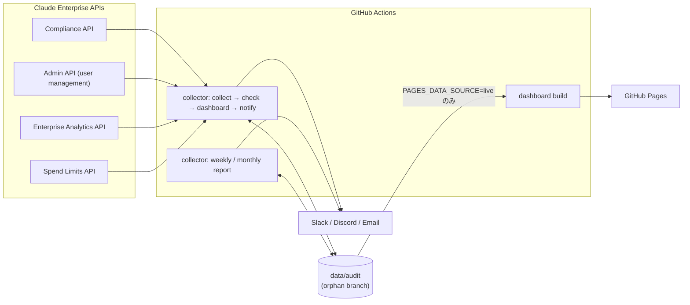

# Claude Enterprise Audit Dashboard — Blueprint

> **Version:** 0.3.0
> **Date:** 2026-10-01
> **Author:** @sun-flat-yamada (Youhei Yamada)
> **Status:** Draft — Phase A 実装済み、実テナント検証 (Phase B) 待ち
> **対象:** Claude Enterprise (claude.ai の Enterprise プラン。Compliance API / Admin API ユーザー管理 / Enterprise Analytics API / Spend Limits API)

本書は要求仕様の正本である。変更の経緯と判断理由は [CHANGE-PLAN.md](CHANGE-PLAN.md)、構造の詳細は [ARCHITECTURE.md](ARCHITECTURE.md)、エンドポイント単位の写像は [API-MAPPING.md](API-MAPPING.md)、出発点となった不一致の記録は [api-spec-mismatch-findings.md](api-spec-mismatch-findings.md) を参照する。

---

## 目次

1. [概要](#1-概要)
2. [ゴールと非ゴール](#2-ゴールと非ゴール)
3. [アーキテクチャ](#3-アーキテクチャ)
4. [Fork-Safe 設計とデータ分離](#4-fork-safe-設計とデータ分離)
5. [データソースと API 連携](#5-データソースと-api-連携)
6. [データモデルと長期保持](#6-データモデルと長期保持)
7. [コンプライアンス監査ルール](#7-コンプライアンス監査ルール)
8. [拡張アーキテクチャ](#8-拡張アーキテクチャ)
9. [ダッシュボード](#9-ダッシュボード)
10. [通知](#10-通知)
11. [レポートと分析](#11-レポートと分析)
12. [GitHub Actions](#12-github-actions)
13. [Private/Internal リポジトリとデプロイ](#13-privateinternal-リポジトリとデプロイ)
14. [セキュリティ](#14-セキュリティ)
15. [プロジェクト構成](#15-プロジェクト構成)
16. [技術スタック](#16-技術スタック)
17. [ロードマップ](#17-ロードマップ)
18. [開発プロセス](#18-開発プロセス)
19. [付録 A: 設定スキーマ](#付録-a-設定スキーマ)
20. [付録 B: 用語集](#付録-b-用語集)

---

## 1. 概要

**Claude Enterprise Audit Dashboard** は、Claude Enterprise テナントの監査データ (Activity Feed、ディレクトリ、実効設定、キー台帳、利用量・コスト、利用上限) を GitHub Actions で定期収集し、コンプライアンスルールで評価し、集計結果を GitHub Pages のダッシュボード・定期レポート・通知で届けるツールである。

Fork して自組織の Private / Internal リポジトリとして運用することを前提とし、コードと監査データを分離する (Fork-Safe)。

### コアバリュー

- **取りこぼしの無い監査ログ** — Activity Feed を時間窓 + ID 重複排除で収集し、Anthropic 側の保持期間 (6 年) を超えて保管できる
- **誤判定しない評価** — ルールは必要なデータセットを宣言し、取得できなかった場合は理由付きの `skipped`。「データが無いから準拠」とはしない
- **変化への耐性** — API・監査ルール・分析・レポート方式の追加と変更を、既存コードを複雑にせず「ファイル追加 + 登録 1 行」または設定だけで吸収する (Clean Architecture)
- **最小権限** — 読み取りスコープのみ。会話本文・ファイル本文は取得しない
- **ゼロインフラ** — GitHub Actions と GitHub Pages のみで動作
- **Fork-Safe** — ライブデータは orphan ブランチ `data/audit` にのみ保存。公開サンプルは合成テナントから自動生成

---

## 2. ゴールと非ゴール

### 2.1 ゴール

| #   | ゴール                                                                                                                | 優先度 |
| --- | --------------------------------------------------------------------------------------------------------------------- | ------ |
| G1  | Activity Feed を取りこぼし無く (at-least-once + 重複排除) 収集し、長期保持できる                                      | P0     |
| G2  | Enterprise のディレクトリ (リンク組織、メンバー、招待、RBAC グループ)、実効設定、キー台帳を収集する                   | P0     |
| G3  | データが揃ったときだけ判定するルールエンジン。欠けたら理由付き `skipped`、取得失敗は OP-002 で検出                    | P0     |
| G4  | 集計済みの `DashboardView` (契約 v3) を Pages で表示。PII は既定でマスク、ライブデータ公開は明示的オプトイン          | P0     |
| G5  | 任意の通知チャネル (Slack / Discord / Email / console)。アラートポリシー (状態・重大度・冷却時間) で制御              | P0     |
| G6  | 6 時間ごとの定期実行がレート制限内に収まる                                                                            | P0     |
| G7  | Fork-Safe。公開サンプルは合成データ生成器から自動生成し、契約との一致をテストで保証                                   | P0     |
| G8  | Private / Internal 運用前提。Pages の公開データ源は `PAGES_DATA_SOURCE` で明示的に選択                                | P0     |
| G9  | 週次ダイジェストを汎用レポート文書で生成し、Markdown / HTML / CSV / JSON で出力・配信                                 | P1     |
| G10 | 月次コストレポート: RBAC グループ別・プロダクト別・モデル別の配分。確定値は 30 日後に変わり得る旨を明記               | P1     |
| G11 | 分析 (モデル集中度、キャッシュ効率、グループ集中度、シート利用率) をプラグインとして追加できる                        | P1     |
| G12 | 利用異常の検知 (スパイク、月次予算、上限未設定、上限接近)                                                             | P1     |
| G13 | 拡張点 8 種 (データソース、投影、ルール、ルール生成器の期待値、分析、レポート、レンダラ、通知) を登録だけで追加できる | P1     |
| G14 | データセット単位スナップショットと CLI アーカイブ (gzip) による長期保持                                               | P1     |
| G15 | コード不要で設定ベースライン (CF) とアクティビティ監視 (AM) を `config/custom-rules.json` に追加できる                | P2     |
| G16 | 多言語ドキュメント (日本語 / 英語)                                                                                    | P2     |
| G17 | 最小権限: 本文閲覧・書き込み・削除スコープを要求しない                                                                | P0     |
| G18 | 外部 DTO の変更はアダプタ内のスキーマと写像だけで吸収。未知の activity type / actor / enum 値は通過させる             | P0     |

### 2.2 非ゴール

- プロンプト・応答・ファイル・セッション本文の取得と監査 (`read:compliance_user_data` を要するため対象外)
- 書き込み・削除操作 (メンバー削除、上限変更、コンテンツ削除など)
- リアルタイム監視 (バッチのみ)
- 複数テナントの一元管理
- Public リポジトリでの本番運用

---

## 3. アーキテクチャ



### 3.1 レイヤー

| パッケージ                | 役割                                                                            | 依存してよい先                      |
| ------------------------- | ------------------------------------------------------------------------------- | ----------------------------------- |
| `@claude-audit/core`      | domain (モデル、ルール、分析、投影) + application (ユースケース、ポート) + 契約 | zod のみ (Node API なし、IO なし)   |
| `@claude-audit/collector` | adapters (Anthropic、保存、通知、レンダラ、デモ) + infrastructure + main (CLI)  | core                                |
| `@claude-audit/dashboard` | React SPA                                                                       | `@claude-audit/core/contracts` だけ |

依存規則は tsconfig (core に Node 型を与えない) と ESLint `no-restricted-imports` で強制し、関数の大きさは ESLint (`complexity` 10、`max-depth` 3、`max-params` 5、`max-lines-per-function` 60) で監視する。詳細は [ARCHITECTURE.md](ARCHITECTURE.md)。

### 3.2 データフロー (6 時間ごと)

1. **Restore** — `data/audit` から前回のデータ (スナップショット、レポート、状態) を復元
2. **Collect** — 各データセットを収集。取得状況を coverage (`ok` / `unavailable` / `error`) として記録
3. **Project** — 収集データから導出データを作る (例: Activity Feed の API 呼び出しからキーの最終利用)
4. **Check** — ルールエンジンで評価し、コンプライアンスレポートを保存
5. **Dashboard** — 集計済み・マスク済みの `dashboard.json` (契約 v3) を生成
6. **Archive** — 保持期間を過ぎたスナップショットを gzip に移動
7. **Notify** — アラートポリシーに合致する新しい結果を通知 (冷却時間付き)
8. **Save** — `data/audit` に保存 (main には触れない)
9. **Deploy** — `PAGES_DATA_SOURCE=live` の場合だけライブデータで Pages を再構築

---

## 4. Fork-Safe 設計とデータ分離

### 4.1 ブランチ

```text
main          コードと合成サンプルのみ。監査データなし
data/audit    orphan ブランチ。ライブのスナップショット・レポート・状態 (Fork ごと)
```

### 4.2 データの保存場所

| データ                   | パス                                                                                                                                                                                                                                                                          | ブランチ     | main にコミット |
| ------------------------ | ----------------------------------------------------------------------------------------------------------------------------------------------------------------------------------------------------------------------------------------------------------------------------- | ------------ | --------------- |
| ソースコード             | `packages/`                                                                                                                                                                                                                                                                   | `main`       | する            |
| 合成サンプル             | `data/sample/` (`pnpm demo` が生成)                                                                                                                                                                                                                                           | `main`       | する            |
| スナップショット         | `data/snapshots/<id>/<dataset>.json` + `manifest.json`                                                                                                                                                                                                                        | `data/audit` | しない          |
| コンプライアンスレポート | `data/reports/compliance/<snapshot id>.json`                                                                                                                                                                                                                                  | `data/audit` | しない          |
| 週次・月次レポート       | `data/reports/{weekly,monthly}/`                                                                                                                                                                                                                                              | `data/audit` | しない          |
| ダッシュボード JSON      | `data/dashboard.json`                                                                                                                                                                                                                                                         | `data/audit` | しない          |
| 詳細データ (個人単位)    | `data/detail/{index,members,api-keys,org-groups}.json`, `activity-<yyyy-mm>.json`                                                                                                                                                                                             | `data/audit` | しない          |
| 実効設定 (許可リスト)    | `data/detail/config.json` (シークレット・URL・メール・パスを含まない。`pnpm build:detail` が生成)                                                                                                                                                                             | `data/audit` | しない          |
| 月次コスト公開データ     | `data/detail/monthly/{index,<id>}.json` (個人単位データなし。`report monthly` が生成)                                                                                                                                                                                         | `data/audit` | しない          |
| コレクタ状態             | `data/state.json` (カーソル、投影状態、通知記録と送信履歴)                                                                                                                                                                                                                    | `data/audit` | しない          |
| アーカイブ               | `data/archive/<year>/<id>.json.gz`                                                                                                                                                                                                                                            | `data/audit` | しない          |
| アラート履歴             | `data/detail/alerts.json` (ID・送信時刻・重大度・チャンネル種別・ルール ID・伏せ字処理済みタイトル・確認者ラベルのみ。`pnpm build:detail` が生成)                                                                                                                             | `data/audit` | しない          |
| 時点サマリー (F-015)     | `data/summaries/<snapshot id>.json` (判定したスナップショットごとのスコア・評価済み件数・ルールとデータセットごとのステータス・KPI 値のみ。証跡・ラベル・個人単位データなし。`pnpm check` がレポートの隣に書き、スナップショットのアーカイブ後も残る。Pages には直接出さない) | `data/audit` | しない          |
| 比較ファイル (F-015)     | `data/detail/compare/index.json` と `compare/<snapshot id>.json` (新しい 90 件のサマリーを `pnpm build:detail` がコピー。他の詳細データと同じ `PAGES_DETAIL_DATA` の公開条件)                                                                                                 | `data/audit` | しない          |
| アラート確認応答         | `data/alerts/ack.json` (`pnpm alerts ack` / `Acknowledge Alert` ワークフローが書き込む。Pages には出さない)                                                                                                                                                                   | `data/audit` | しない          |
| モデル×グループ収集入力  | `data/usage-matrix/input.json` (`usage-matrix` ステップが書く月次集計。Pages には出さない)                                                                                                                                                                                    | `data/audit` | しない          |
| アーカイブ在庫           | `data/detail/archive.json` (年別の件数・圧縮サイズ・最古/最新 ID のみ。`pnpm build:detail` が生成)                                                                                                                                                                            | `data/audit` | しない          |

`data/audit` への読み書きは `.github/scripts/data-branch.sh` (`restore` / `save`) に集約する。`save` は直前の `restore` を必須とし、アーカイブによる削除も反映する。サンプルと `.gitkeep` は保存しない。書き込むワークフローは同じ `concurrency` グループ (`audit-data`) で直列化する。

### 4.3 サンプルとライブの分離

|                | サンプル (`data/sample/`)                        | ライブ (`data/audit`)               |
| -------------- | ------------------------------------------------ | ----------------------------------- |
| 生成           | `pnpm demo` (固定シード・固定時刻の合成テナント) | `pnpm pipeline` (実 API)            |
| 内容           | 架空の組織・`example.com` のメールアドレス       | 実データ                            |
| 保証           | 生成結果との完全一致をテスト (ゴールデンテスト)  | —                                   |
| Pages での利用 | 既定                                             | `PAGES_DATA_SOURCE=live` のときのみ |

### 4.4 fork:verify

`pnpm fork:verify` は次を検証する。

1. ライブデータのパス (`data/snapshots`、`data/reports`、`data/archive`、`data/dashboard.json`、`data/detail`、`data/state.json`) が git で追跡されていない
2. `data/sample/dashboard.json` (と、存在すれば gitignored の `data/sample-optional-sources/`。`pnpm demo --profile optional-sources` の出力) が公開契約 (`dashboardViewSchema`) に一致し、`source` が `demo` である。先行時点の `history/<snapshot id>/dashboard.json` も同じ契約で検査する。`data/sample/detail/` は詳細データ契約 (§9.1) に一致し、`example.*` 以外のメールと未マスクの識別子を含まない
3. `data/sample/` のメールアドレスが `example.*` ドメインだけである
4. 追跡ファイルにシークレットのパターンが無い
5. `.gitignore` に必須パターンがある / `.env` が無い / `.env.example` に実値が無い

---

## 5. データソースと API 連携

### 5.1 キーとスコープ

主キーは claude.ai の **Organization settings > API** で primary owner が作成する Enterprise キー (`sk-ant-api01-...`) 1 本で、次のスコープだけを付与する。

| スコープ                     | 用途                                                  |
| ---------------------------- | ----------------------------------------------------- |
| `read:compliance_activities` | Activity Feed                                         |
| `read:compliance_org_data`   | リンク組織、実効設定、キー台帳、(代替経路の) グループ |
| `read:members`               | メンバー、招待                                        |
| `read:rbac_groups`           | RBAC グループとメンバー                               |
| `read:analytics`             | 利用者別活動、DAU/WAU/MAU、利用量、コスト             |
| `read:spend_limits`          | メンバー別の実効上限と当期支出                        |

`read:compliance_user_data`・`read:org_audit`・`write:*`・`delete:*` は付与しない。API 系統ごとに別キーを使う場合は `ANTHROPIC_COMPLIANCE_API_KEY` / `ANTHROPIC_ANALYTICS_API_KEY` / `ANTHROPIC_ADMIN_API_KEY` で主キーを上書きできる。キーが無い系統のデータセットは `unavailable` になり、処理は継続する。

任意アダプタ (§5.4、既定オフ) には **Console 組織の Admin API キー** (`sk-ant-admin...`) を別の環境変数 `ANTHROPIC_CONSOLE_ADMIN_API_KEY` で渡す。Enterprise キーや `ANTHROPIC_ADMIN_API_KEY` (Enterprise の Admin 系統の上書き) にはフォールバックしない。

### 5.2 データセット

| データセット      | API                                                                      | 備考                                                                               |
| ----------------- | ------------------------------------------------------------------------ | ---------------------------------------------------------------------------------- |
| `organizations`   | Compliance `GET /v1/compliance/organizations`                            | リンク組織                                                                         |
| `members`         | Admin `GET /v1/organizations/users` (代替: Compliance 組織ユーザー)      | ロールを含む                                                                       |
| `memberActivity`  | Analytics `GET /v1/organizations/analytics/users`                        | 最終活動日 (活動記録を無効にした組織では欠落し得る)、製品別エンゲージメント (AN-3) |
| `invites`         | Admin `GET /v1/organizations/invites`                                    | 保留中の招待                                                                       |
| `groups`          | Admin `GET /v1/organizations/rbac_groups` (+ members) (代替: Compliance) | 直接作成 / SCIM 由来を区別                                                         |
| `settings`        | Compliance `GET /v1/compliance/organizations/{uuid}/settings`            | 実効設定。行が無い = その組織では変更できない                                      |
| `credentials`     | 同上の `api_keys`                                                        | キー台帳 (値は含まない)                                                            |
| `credentialUsage` | 投影: Activity Feed の `api_actor` から導出                              | キーの最終利用                                                                     |
| `activities`      | Compliance `GET /v1/compliance/activities`                               | 前回以降の差分 (時間窓)                                                            |
| `usage` / `cost`  | Analytics `usage_report` / `cost_report`                                 | 日次 × (総計 / product / model / rbac_group)                                       |
| `adoption`        | Analytics `summaries`                                                    | DAU / WAU / MAU、シート、保留招待、製品別アクティブ                                |
| `spendLimits`     | Spend Limits `GET /v1/organizations/spend_limits/effective`              | 実効上限 (null = 無制限) と当期支出                                                |

任意アダプタのデータセットは §5.4 を参照 (有効にしたときだけ登録され、既定では上表の 13 件のまま)。

### 5.3 通信の契約

| 項目       | 仕様                                                                                                                                         |
| ---------- | -------------------------------------------------------------------------------------------------------------------------------------------- |
| リトライ   | 429 は `retry-after` を優先。500 / 502 / 503 / 504 / 529 は 1 秒から 60 秒上限の指数バックオフ。`x-should-retry: false` は再試行しない       |
| ページング | ID カーソル、ページトークン、`next_page` のみ、単一オブジェクトの 4 方式。Analytics の 410 (カーソル失効) は 1 回だけ先頭から再開            |
| Activity   | `created_at.gte/lt` の時間窓 (並び順は既定の新しい順。順序に依存しない)、取得遅延 2 分、重複区間 10 分、ID で重複排除 (状態に直近 ID を保持) |
| 検証       | 使う項目だけを zod で検証 (寛容な読み取り)。必須項目の欠落はデータセット単位の `error`                                                       |
| 失敗の扱い | キー未設定・401・403・404 は `unavailable`、その他は `error`。どちらも他のデータセットの収集を止めない                                       |

### 5.4 任意アダプタ (Phase B4)

Claude Enterprise 以外の関連データソースを、既存のドメイン・ルールエンジン・オーケストレーターを変えずに追加できることの実証。**設定で有効にしたときだけデータセットを登録する** (`sources.disabled` と同じ「登録しない」方式)。無効の間は coverage に現れないため、既存の 13 データセットの coverage、OP-002 の判定、スコアは変わらない。

| 設定                         | データセット                                                            | API (`docs/API-MAPPING.md` §6)                                                                        | 備考                                                                           |
| ---------------------------- | ----------------------------------------------------------------------- | ----------------------------------------------------------------------------------------------------- | ------------------------------------------------------------------------------ |
| `sources.console.enabled`    | `consoleWorkspaces` / `consoleApiKeys` / `consoleUsage` / `consoleCost` | Admin `workspaces` / `api_keys` / `usage_report/messages` / `cost_report` (リンクされた Console 組織) | 日次 × (workspace, model)。キー台帳はキー本体・ヒントを保存しない              |
| `sources.claudeCode.enabled` | `claudeCodeActivity`                                                    | Claude Code Analytics `GET /v1/organizations/usage_report/claude_code` (日ごとに取得)                 | ユーザー (メール) / API キー名 × 日。**個人データのため公開しない (集計のみ)** |

- キー: `ANTHROPIC_CONSOLE_ADMIN_API_KEY` (§5.1)。有効でキー未設定・401・403・404 は `unavailable` (理由にキー名を含む。OP-002 が失敗して設定漏れを知らせる)、スキーマ差異は `error`。他のデータセットは収集を続ける。
- 公開: `dashboard.json` と詳細ファイルには個人単位の行を出さない。画面に現れるのは Data coverage の行 (状態・件数・理由) と `#/config` の Data sources のみ。 `claudeCodeActivity` は個人を含まない集計 (`DashboardView.claudeCode`、AN-4) だけを `#/claude-code` に表示する。 Console の 4 データセットは集計 (`DashboardView.console`、AN-5、API キーは状態ごとの件数のみ) を `#/console` に表示する。
- 確認: 実テナントでの疎通は未確認 (人手)。サンプルは `pnpm demo --profile optional-sources` (合成、`example.com` のみ、gitignored の `data/sample-optional-sources/`)、フィクスチャは `pnpm fixture --optional-sources`。既定の `pnpm demo` の `data/sample/` は変わらない。

---

## 6. データモデルと長期保持

### 6.1 スナップショット

スナップショットは「名前付きデータセットの束」と「データセットごとの取得状況 (coverage)」である。

```ts
interface DatasetMeta {
  status: 'ok' | 'unavailable' | 'error';
  source?: string; // データを供給したエンドポイント (または projection:<name>)
  reason?: string; // unavailable / error の理由
  count?: number;
  window?: { from: string; to: string }; // 期間を持つデータの対象期間
  asOf?: string; // Analytics の集計時刻など
}
```

保存は `snapshots/<id>/` にデータセットごとの JSON と `manifest.json` (最後に書く = 完了の印) で行い、項目順・要素順を固定した決定的 JSON にする (変化が無ければ差分ゼロ)。

### 6.2 状態

`state.json` は Activity Feed のカーソル (時間窓の終端と直近 ID)、投影の状態 (キー最終利用)、通知の送信記録 (冷却時間判定) を持つ。

### 6.3 保持

| 対象                     | 既定                                                                          | 設定                     |
| ------------------------ | ----------------------------------------------------------------------------- | ------------------------ |
| スナップショット         | 365 日を過ぎたら `archive/<year>/` へ gzip (在庫は `detail/archive.json`、§9) | `retention.snapshotDays` |
| コンプライアンスレポート | 保持 (履歴はダッシュボードのスコア推移に使用)                                 | —                        |
| Activity                 | スナップショットに差分として保持                                              | —                        |
| `data/audit` のサイズ    | 総量 1,024 MiB・30 日あたり増分 50 MiB を超える前 (80%) で警告 (§6.4)         | `capacity.*`             |

### 6.4 長期運用: 容量計測・復元・ローテーション

`data/audit` は git ブランチなので、**アーカイブは作業ツリーを小さくするがリポジトリ (履歴) は小さくしない**: 圧縮した元のスナップショットの blob は履歴に残り、`archive/<year>/<id>.json.gz` が追加される (gzip は他のアーカイブと重複排除・差分圧縮されない)。履歴の再編 (年次の orphan ブランチのローテーション、旧履歴のタグ / Release アセット / 外部ストレージへの退避) の手順は `docs/DEPLOYMENT.md`、容量の目安 (合成履歴での計測値。実データで再検証する) は `docs/CHANGE-PLAN.md` §9.4。

- **計測** (`pnpm size [--repo <dir>] [--ref <ref>] [--notify] [--warn-only] [--json]`): 対象は git リポジトリのディレクトリ (引数)。`git count-objects -v` (パックとルーズのバイト数)、`rev-list --objects --disk-usage` (参照から到達できる全体のサイズ)、コミット数と期間、直近 `capacity.windowDays` 日の増分 (その時点のコミットとの差。履歴が短ければ全体を期間で按分)、データセット別の重複排除後の blob 数とサイズ、先端ツリーのアーカイブ在庫を、件数とサイズだけで返す (`adapters/storage/git-size.ts`、`git` は `execFile` で起動し ref・パスは検証する)。アーカイブ在庫は F-013 と同じ純粋な集計 `summarizeArchiveEntries()` を共用し、画面の表示値と実測値が一致することをテストで保証する。
- **判定** (純粋関数 `judgeCapacity()`、`core/domain/capacity/capacity.ts`): 総量と 30 日あたり増分を `capacity.maxTotalMiB` / `maxMonthlyGrowthMiB` と比べ、`limit * warnRatio` 以上で警告、超過で `exceeded`。0 でその判定を無効化。通知は既存の経路 (`capacityAlert()` → `dispatchAlert`、キー `capacity:<level>`、`notifications.cooldownMinutes` の冷却) で、新しいコンプライアンスルールは追加しない。計測や通知の失敗は警告として扱い (`--warn-only`、ワークフローのステップは `continue-on-error`)、収集を失敗させない。
- **復元** (`pnpm cli restore <id|year> [--out <dir>]`): `archive/<year>/<id>.json.gz` を展開・検証し (id がファイル名と一致、スキーマ v2)、収集時と同じライタで `snapshots/<id>/` に書く (全データセットがバイト単位で一致)。既存のスナップショットは上書きせず、アーカイブも変更しない。`pnpm build:data --snapshot <id>` / `pnpm build:detail --snapshot <id>` が復元したスナップショットから `dashboard.json` と詳細ファイルを再生成する (保存済みレポートが無ければその時点でルールをメモリ上で評価)。
- **検証手段**: テストは `src/__tests__/synthetic-history.ts` が固定クロックでデモ合成テナントから任意日数 × 6 時間間隔の履歴を作り (データセットごとに変化頻度が異なる)、一時 git リポジトリにコミットごとに記録する (`git fast-import`)。`collect-audit.yml` の手動実行には `retention_days` (保持日数の上書き) と `dry_run` (通知・保存なし) があり、環境変数経由で厳格に検証する。

---

## 7. コンプライアンス監査ルール

### 7.1 組み込みルール

結果の状態は `pass` / `fail` / `warning` (要確認) / `skipped` (前提データなし) / `error` (引数不正・例外) の 5 種。閾値は `config/default.json` の `compliance.params.<ID>` で変更でき、`compliance.disabledRules` で無効化できる。

| ID     | ルール                                 | カテゴリ            | 重大度   | 前提データ                   | 判定 (既定値)                                                                                                                                                                               |
| ------ | -------------------------------------- | ------------------- | -------- | ---------------------------- | ------------------------------------------------------------------------------------------------------------------------------------------------------------------------------------------- |
| AC-001 | Inactive Members                       | access-control      | Medium   | members, memberActivity      | 最終活動が `inactiveDays` (90) 日より前、または記録なしのメンバー → fail                                                                                                                    |
| AC-002 | Excessive Administrative Roles         | access-control      | High     | members                      | 組織ごとの管理系ロール比率が `maxAdminPercentage` (20%) 超 → fail                                                                                                                           |
| AC-003 | Single Primary Owner                   | access-control      | Critical | members                      | primary owner がちょうど 1 名でない組織 → fail                                                                                                                                              |
| AC-004 | Stale Pending Invites                  | access-control      | Low      | invites                      | `maxPendingDays` (30) 日を超えた保留中の招待 → fail                                                                                                                                         |
| AK-001 | Unused API Keys                        | api-key-management  | Medium   | credentials, credentialUsage | Compliance スコープを持つ有効キーが `unusedDays` (30) 日 API 呼び出しに現れない → fail                                                                                                      |
| AK-002 | Over-privileged API Keys               | api-key-management  | High     | credentials                  | `flaggedScopes` (書き込み・削除系) を持つ有効キー → fail                                                                                                                                    |
| AK-003 | API Key Age                            | api-key-management  | Medium   | credentials                  | 作成から `maxAgeDays` (180) 日を超えた有効キー → fail                                                                                                                                       |
| UA-001 | Usage Spike Detection                  | usage-anomaly       | High     | usage                        | 直近の完了日のトークン量が直前 `baselineDays` (7) 日平均の `spikeMultiplier` (3) 倍超 → fail                                                                                                |
| UA-002 | Cost Budget Threshold                  | usage-anomaly       | Critical | cost                         | 当月コストが `monthlyBudget` 超 → fail、月末予測が超過 → warning                                                                                                                            |
| UA-003 | Members Without Spend Limit            | usage-anomaly       | Medium   | spendLimits                  | すべての期間で実効上限が無制限のメンバー → fail                                                                                                                                             |
| UA-004 | Spend Limit Nearly Exhausted           | usage-anomaly       | Low      | spendLimits                  | 当期支出が上限の `thresholdPercent` (90%) 以上のメンバー → warning                                                                                                                          |
| DG-001 | Empty Groups                           | data-governance     | Low      | groups                       | メンバー 0 の直接作成 RBAC グループ → fail                                                                                                                                                  |
| OP-001 | Collection Freshness                   | operational         | High     | —                            | 評価したスナップショットが `maxStaleHours` (24) 時間より古い → fail                                                                                                                         |
| OP-002 | Data Source Coverage                   | operational         | High     | —                            | 取得できなかったデータセットがある → fail (`ignore` で除外可)                                                                                                                               |
| CF-001 | SSO Enforced for claude.ai             | configuration       | High     | settings                     | `sso_claude_ai_enforced = true`                                                                                                                                                             |
| CF-002 | SCIM Provisioning                      | configuration       | Medium   | settings                     | `sso_provisioning_mode` が `scim_advanced` / `scim_permissive`                                                                                                                              |
| CF-003 | IP Allowlist Enabled                   | configuration       | Medium   | settings                     | `ip_allowlist_enabled = true`                                                                                                                                                               |
| CF-004 | Session Duration Limited               | configuration       | Low      | settings                     | `account_session_duration_seconds <= 604800` (7 日)                                                                                                                                         |
| CF-005 | Finite Data Retention                  | configuration       | Medium   | settings                     | `data_retention_periods <= 365` 日                                                                                                                                                          |
| CF-006 | Public Projects Disabled               | configuration       | Medium   | settings                     | `public_projects_enabled = false`                                                                                                                                                           |
| CF-007 | Code Execution Egress Restricted       | configuration       | Medium   | settings                     | `code_execution_network_egress_enabled = false`                                                                                                                                             |
| CF-008 | Claude Code Permission Bypass Disabled | configuration       | High     | settings                     | `claude_code_desktop_bypass_permissions_enabled = false`                                                                                                                                    |
| CF-009 | Invite Domains Restricted              | configuration       | Low      | settings                     | `allowed_invite_domains` が空でない                                                                                                                                                         |
| AM-001 | Privileged Role Changes                | activity-monitoring | High     | activities                   | `primary_owner_transferred`、`rbac_role_assigned`、`rbac_role_permission_added`、`role_assignment_granted`、`claude_user_role_updated`                                                      |
| AM-002 | Identity Provider Changes              | activity-monitoring | High     | activities                   | `org_sso_toggled`、`org_sso_connection_deactivated`、`org_sso_connection_deleted`、`org_sso_provisioning_mode_changed`、`org_sso_group_role_mappings_updated`、`org_directory_sync_deleted` |
| AM-003 | Network Restriction Changes            | activity-monitoring | Medium   | activities                   | `org_ip_restriction_created`、`org_ip_restriction_updated`、`org_ip_restriction_deleted`                                                                                                    |
| AM-004 | API Key Lifecycle                      | activity-monitoring | Medium   | activities                   | `api_key_created`、`admin_api_key_*`、`scoped_api_key_*`、`org_compliance_api_settings_updated`、`org_analytics_api_capability_updated`                                                     |
| AM-005 | Data Export Events                     | activity-monitoring | Medium   | activities                   | `org_data_export_*`、`org_members_exported`、`audit_log_export_*`                                                                                                                           |
| AM-006 | Authentication Failure Burst           | activity-monitoring | Medium   | activities                   | `sso_login_failed`、`magic_link_login_failed`、`step_up_authentication_failed` が 1 回の収集で 20 件以上                                                                                    |
| AM-007 | Data Protection Changes                | activity-monitoring | High     | activities                   | `org_claude_code_zero_data_retention_disabled`、`org_data_residency_updated`、`platform_workspace_inference_data_retention_disabled`                                                        |

- CF-xxx (設定ベースライン) は、その設定行を持つ組織だけを評価する。どの組織でも変更できない設定は `skipped`。
- AM-xxx (アクティビティ監視) は前回収集以降の差分を対象に、件数が閾値 (既定 1、AM-006 は 20) 以上なら `warning` とし、該当イベントを証跡に載せる。
- AM の activity type は公式リファレンスの既知一覧 (516 種、2026-09-30 時点) と照合し、未知の type を参照する定義は実行時に警告する。

### 7.2 スコア

```text
Score = max(0, 100 − Σ 重み(fail の重大度))      重み: Critical 10 / High 5 / Medium 3 / Low 1 / Info 0
```

- `warning` と `skipped` は減点しない (`skipped` は「判定できない」であって「準拠」ではない)。
- `skipped` または `error` が 1 件でもある場合、スコアは**評価済みルール数と常にセットで表示する** (例: `95/100 (2 of 30 rules assessed)`)。ダッシュボード・通知・レポートは同じ書式関数 (`formatScore`) を使い、データ欠落による高スコアが単独で伝わらないようにする。データ欠落そのものは OP-002 (High) が fail として検出する。

### 7.3 カスタムルール (コード不要)

`config/custom-rules.json` に設定ベースラインとアクティビティ監視を追加できる。既定の定義と同じ ID を書くと上書きになる。

```json
{
  "settingBaselines": [
    {
      "id": "CF-101",
      "name": "Web Search Disabled",
      "severity": "low",
      "setting": "web_search_enabled",
      "expect": { "kind": "equals", "value": false }
    }
  ],
  "activityWatches": [
    {
      "id": "AM-101",
      "name": "Organization Deletion",
      "severity": "high",
      "match": [{ "types": ["org_deletion_requested"] }],
      "threshold": 1
    }
  ]
}
```

期待値の種類 (`expect.kind`): `equals` / `oneOf` / `max` / `nonEmpty` / `retentionAtMostDays`。コードによるルール追加は [ARCHITECTURE.md §8.1](ARCHITECTURE.md) の手順に従う。

---

## 8. 拡張アーキテクチャ

すべての拡張は「実装を 1 つ追加して登録する」だけで行い、既存の分岐を増やさない。

| 拡張対象                 | 実装するもの                                      | 登録先                                                     |
| ------------------------ | ------------------------------------------------- | ---------------------------------------------------------- |
| データソース             | `DatasetCollector` (+ ゲートウェイのメソッド)     | `collector/src/adapters/anthropic/collectors.ts`           |
| 導出データ               | `Projection`                                      | `core/src/domain/projections/`                             |
| 監査ルール               | `defineRule({...})`                               | `core/src/domain/compliance/rules/<category>.ts`           |
| 設定ベースラインの期待値 | 期待値ストラテジ                                  | `core/src/domain/compliance/factories/setting-baseline.ts` |
| 分析                     | `Analyzer`                                        | `core/src/domain/analysis/analyzers.ts`                    |
| レポート                 | `ReportDefinition` (汎用 `ReportDocument` を返す) | `core/src/application/use-cases/reports.ts`                |
| 出力形式                 | `DocumentRenderer`                                | `collector/src/adapters/renderers/index.ts`                |
| 通知チャネル             | `Notifier`                                        | `collector/src/adapters/notifiers/channels.ts`             |
| CLI コマンド             | `Command`                                         | `collector/src/main/commands.ts`                           |

API の項目名・ページング方式の変更は該当ゲートウェイのスキーマと写像に閉じる (ドメイン型が変わらない限り、ルール・分析・レポート・UI は無変更)。プラグインの詳細は [PLUGIN-ARCHITECTURE.md](PLUGIN-ARCHITECTURE.md)。

---

## 9. ダッシュボード

### 9.1 公開契約

UI は `@claude-audit/core/contracts` の `DashboardView` (schemaVersion 3、zod スキーマ付き) だけを読む。collector が書き込み時に検証し、UI は schemaVersion を確認して不一致なら再生成を促す。内容は集計値のみで、メールアドレスは既定でマスクする (`dashboard.maskPii`)。

`usage.daily` の各日は `inputTokens` (全入力 = 未キャッシュ + キャッシュ読み取り + キャッシュ書き込み) と `outputTokens` に加え、入力の内訳 `uncachedInputTokens` / `cacheReadInputTokens` / `cacheCreationInputTokens` (内訳の合計 = `inputTokens`) を持ち、`usage.cacheHitRate` は収集期間のキャッシュヒット率 (キャッシュ読み取り ÷ 全入力、% 小数 1 桁。`cache-efficiency` アナライザと同じ定義、入力 0 なら `null`) を持つ (AN-1)。これらは追加の任意フィールドなので schemaVersion は 2 のままで、追加前の `dashboard.json` も検証を通り、UI は内訳が無ければ入力 / 出力の 2 系列で表示する。

`adoption` は製品別アクティブユーザー (AN-2) として、最新日の `byProduct` (`{ product, label, dau, wau, mau }[]`、WAU 降順、同数はカタログ順: Chat / Claude Code / Cowork / Claude Design / Claude in Office / Claude Science) と製品別 WAU の推移 `productWeekly` (`{ date, wau: { <product>: number } }[]`) を持つ。どの日にも製品別の値が無ければ両方とも省略する。任意フィールドなので schemaVersion は 2 のままで、追加前の `dashboard.json` も検証を通る。UI は Overview の Active users カードに製品別の表 (DAU / WAU / MAU と共通スケールの WAU スパークライン、「View as table」付き) を表示する。製品数がカテゴリ色の検証済みスロット数を超えるため、多系列の折れ線にはしない。

`engagement` (AN-3、任意) は Analytics `users` の期間ロールアップ (`sources.memberActivity.lookbackDays`、既定 90 日) から作る製品別エンゲージメントの集計で、個人単位の値は持たない: `window` (メンバー活動の収集期間)、`members` (活動行のあるメンバー数)、`products` (`{ product, label, activeMembers, messages, sessions, counters: { key, label, value }[] }[]`、`activeMembers` はその製品のカウンタが 1 つでも正のメンバー数、他はメンバー合計。報告が無ければ `null`。`activeMembers` 降順、同数はカタログ順)、`claudeCode` (`addedLines` / `removedLines` / `commits` / `pullRequests` / `sessions` と、Edit / MultiEdit / Write / NotebookEdit ごとの `accepted` / `rejected` / `acceptRate` (採用 ÷ (採用 + 却下)、% 小数 1 桁、0 件なら `null`) とその合計。Claude Code の報告が無ければ `null`)、`webSearches`。distinct 系 (セッション・会話) は期間内の概算値をメンバーで合計したもの。メトリクスを持つ行が無いか `memberActivity` が未収集なら省略する。任意フィールドなので schemaVersion は 3 のままで、追加前の v3 `dashboard.json` も検証を通る。UI は Overview の「Product engagement (N days)」カードに製品別の表 (活動メンバー数 / メッセージ / セッション / 主なカウンタ) と Claude Code パネル (追加 / 削除行、コミット、PR、セッション、提案採用率、ツール別採用率の単一色バー (0〜100% 固定スケール) と「View as table」) を表示する。メンバー単位のエンゲージメントはスナップショット (`data/audit`) にだけ保存し、詳細データファイルには載せない。

`claudeCode` (AN-4、任意) は任意データセット `claudeCodeActivity` (`sources.claudeCode.enabled`) の集計で、個人単位の値は持たない (アクターのメールアドレス・API キー名は数えるだけで公開しない): `window` (収集期間)、`currency` (推定コストの通貨、API の推定値は USD)、`users` / `apiKeys` (期間内に活動した distinct なユーザー / API キー数)、`daily` (`{ date, actors, sessions, addedLines, removedLines, commits, pullRequests, accepted, rejected }[]`、`actors` はその日の distinct なユーザーと API キーの数、日付昇順)、`totals` (同じ合計と `acceptRate` = 採用 ÷ (採用 + 却下)、% 小数 1 桁、0 件なら `null`)、`byTerminal` (`{ terminal, sessions, percent }[]`、セッション降順、端末不明は `(unknown)`)、`byModel` (`{ model, inputTokens, outputTokens, cacheReadTokens, cacheCreationTokens, estimatedCost }[]`、推定コスト降順、推定値が無ければ `null`)、`estimatedCost`、`cacheReadShare` (キャッシュ読み取り ÷ 全入力 (未キャッシュ + 読み取り + 書き込み)、入力が無ければ `null`)。データセットが収集済み (`ok`) のときだけ付け、行が 0 件でも空の集計を出す。未収集・無効なら省略する。任意フィールドなので schemaVersion は 3 のままで、追加前の v3 `dashboard.json` も検証を通る。UI は `#/claude-code` (§9.2)。

`console` (AN-5、任意) は任意データセット `consoleUsage` / `consoleCost` / `consoleWorkspaces` / `consoleApiKeys` (`sources.console.enabled`) の集計: `window` (`consoleCost`、無ければ `consoleUsage` の収集期間)、`currency` (コスト行で最も多い通貨。他の通貨の行は合算しない、行が無ければ `USD`)、`totalCost` (期間の支出、主通貨単位)、`daily` (`{ date, cost, uncachedInputTokens, cacheReadInputTokens, cacheCreationInputTokens, outputTokens }[]`、日付昇順)、`byModel` / `byWorkspace` / `byCostType` (`{ key, label, value, percent }[]`、支出降順。値の無い行は `(unattributed)`。ワークスペースは `consoleWorkspaces` で名前を解決し、`workspaceId` が `null` の行は `key: default` / `Default workspace`、名前が分からない ID はそのまま)、`tokens` (`{ uncachedInput, cacheRead, cacheWrite, output }`)、`cacheReadShare` (キャッシュ読み取り ÷ 全入力、`usage.cacheHitRate` と同じ定義、入力が無ければ `null`)、`webSearchRequests`、`workspaces` (`{ active, archived }`、既定ワークスペースは数えない。`consoleWorkspaces` 未収集なら `null`)、`apiKeys` (`{ status, count }[]`、件数降順。`consoleApiKeys` 未収集なら `null`)。API キーの名前・ID・作成者は公開しない。`consoleUsage` か `consoleCost` が収集済み (`ok`) のときだけ付け (行が 0 件でも空の集計)、どちらも未収集なら省略する。任意フィールドなので schemaVersion は 3 のまま。UI は `#/console` (§9.2)。

個人単位のデータ (メンバー、API キー、アクティビティ検索、組織/グループ) は `dashboard.json` に入れず、別の**詳細データファイル**で配る (`DETAIL_SCHEMA_VERSION = 2`、`contracts/detail-view.ts`)。`detail/index.json` (マニフェスト: `maskPii`・`source`・各ファイルの `kind`/`path`/`status`/`count`) と、`members.json`・`api-keys.json`・`activity-<yyyy-mm>.json` (月ごと、新しい順、最大 2000 行。`total`/`truncated` で実数を示す)・`org-groups.json` から成り、各ファイルが自前の `schemaVersion` を持つ (`DashboardView` は v3、モデル×グループ集計は `dashboard.json` に載る)。`maskPii=true` では、メールは `j***@example.com`、氏名はイニシャル、IP は除去、ユーザー/キー/招待 ID は `u_`/`k_`/`i_` + 12 桁 hex の安定ハッシュ (ファイル間で結合可能) にする。`maskPii=false` では生値になりマニフェストに記録される。生成は純粋なプレゼンタ (`core/application/presenters/detail-*.ts`) と `collector/src/main/detail.ts` (`pnpm build:detail`、`pnpm pipeline` に含む。書き込み時に zod 検証)。`checkDetailBundle()` (`contracts/detail-bundle.ts`) がマニフェストとファイルの整合・`example.*`・マスクを検査し、`fork:verify` がサンプルに適用する。

モデル×グループ支出 (F-010) は `dashboard.json` の `modelMatrix` に載る (`DashboardView` v3、決定 D6 (a)。旧 `detail/usage-matrix.json` と manifest の `kind: usage-matrix` は廃止し、`DETAIL_SCHEMA_VERSION` を 2 にした)。`null` = 任意収集 `sources.usageMatrix.enabled` が無効、`{ status: 'unavailable' | 'error', reason }` = 有効だが収集できなかった、`{ status: 'ok', ... }` = 月 × モデル × RBAC グループのコスト (`cells`)、グループ非分割のモデル別コスト (`mix`、加算可能) と月合計 (`monthTotals`)、モデル別合計、グループ名 (グループ一覧から。不明な ID は ID のまま、グループ無しは「No group」)。集計値とグループ名だけで個人単位データを含まず、グループ名とグループ別コストは `usage.byGroup` として元々 `dashboard.json` に載っているため、公開条件は `dashboard.json` と同じ (詳細ファイルの `PAGES_DETAIL_DATA` 条件は適用しない)。zod スキーマが参照整合 (セルとミックスが一覧にあるモデル・グループ・月だけを指す、キーの重複なし) を検証する。純粋なプレゼンタ `core/application/presenters/usage-matrix-view.ts` の `aggregateMatrixRows()` (日次 → 月次、入力順に依存しない)、`buildUsageMatrixView()` (モデル 12・グループ 30 まで、超過分は件数のみ)、`buildModelMatrix()` が作る。グループのセルは所属重複で重なり合う (CHANGE-PLAN §10 V7) ため、モデル合計とモデル構成比は常にグループ非分割の値で、グループのセルを足した値はどこにも出さない。 **API の裏付け (スパイク結果):** `group_by[]` が配列パラメータであること (Admin Usage / Cost API リファレンス、`api-spec-mismatch-findings.md` 4.1) はリポジトリの資料で確認済みだが、Enterprise **Analytics** の `cost_report` が `model` + `rbac_group_id` の 2 値を同時に受け付けるかは**未確認 (推定)**で、実レスポンスの取得例が無い。そのため収集は任意 (`sources.usageMatrix.enabled`、既定 `false`、`lookbackDays` 既定 90) で、スナップショットのデータセットにはしない (13 データセット・coverage・OP-002・スコアは有効 / 無効のどちらでも変わらない)。`AnalyticsApi.costMatrix()` が `group_by[]=model&group_by[]=rbac_group_id` と `group_by[]=model` の 2 系列を取得し (寛容な zod 読み取り)、`usage-matrix` コマンド (`pnpm pipeline` では `collect` の直後) が `usage-matrix/input.json` に保存する。拒否 (HTTP 400 / 401 / 403 / 404 / 422) は `unavailable`、その他は `error` として短い理由つきで保存し、パイプラインは止まらない。`writeDashboard` (`pnpm build:data`) が保存された入力を読み込み (読めない場合は `error`「could not be read」)、無効時は `modelMatrix: null` になる (`dashboard.json` は v2 から `schemaVersion: 3` と `modelMatrix: null` が増えるだけ)。`pnpm pipeline` の順序は `collect` → `usage-matrix` → `check` → `dashboard` → `detail` で、`dashboard` が入力を読む時点で収集は済んでいる。コストのみで、トークンのマトリクスは無い。実テナントでの 2 値 `group_by` の確認は人手の作業 (`--capture-raw` で取得 → サニタイズ → フィクスチャテナント)。`pnpm demo` は決定的な合成 3 か月 (2026-06〜08、支配的なモデルの比率が下がる、ゼロのセル、グループ無し、重なるグループ) を作り、旧 `data/sample/detail/usage-matrix.json` は削除され、詳細ファイルは `schemaVersion` が 2 になる。

アーカイブ在庫 (F-013) は `detail/archive.json` (`ARCHIVE_VIEW_SCHEMA_VERSION = 1`、`contracts/archive-view.ts`、マニフェストの `kind: archive`、件数 = アーカイブ済みスナップショット数) で、純粋な集計 `core/application/presenters/archive-view.ts` の `summarizeArchiveEntries()` (入力順に依存せず、同じ ID は 1 件として数える。B3 #38 の容量計測でも再利用する) が年別の件数・圧縮サイズ・最古/最新のスナップショット ID と合計を出し、`buildArchiveView()` が保持設定 `retention.snapshotDays` を添える。含められるのはスナップショット ID (形式を検証)・年・件数・バイト数だけで、ファイル名・パス・内容は格納できず、`<id>.json.gz` 形式でないエントリは無視して件数だけを数える。コレクタは `ArchiveListing` ポート (`list` / `size`、`FileStore` が実装) 越しに `archive/<year>/*` を列挙し (`adapters/storage/archive-inventory.ts`)、`detail.ts` が zod 検証して書き込む。列挙に失敗した場合はマニフェストを `unavailable` (固定の理由) にする。`checkDetailBundle()` は合計と年別行の整合も検査する。`pnpm demo` は決定的な合成アーカイブ (2023〜2025 年、84 件) を使う。実アーカイブでの検証は B3 (#38)。

アラート履歴 (F-008) は `detail/alerts.json` (`ALERTS_VIEW_SCHEMA_VERSION = 1`、`contracts/alerts-view.ts`、マニフェストの `kind: alerts`、件数 = 一覧のアラート数) で、送信記録と確認応答を純粋なプレゼンタ `core/application/presenters/alerts-view.ts` の `buildAlertsView()` が結合する (新しい順、最大 200 件)。送信記録は `state.json` の `notifications.history` (`notify` と `report --notify` が追記する。キー・送信時刻・重大度・配信できたチャンネル ID・タイトル。`STATE_SCHEMA_VERSION` は 2 のまま、省略可能な追加フィールドなので旧 state は `parseState()` でリセットされず、記録単位で検証する) と、履歴が無い旧来の `lastSent` エントリ (重大度 `unknown`・チャンネル「記録なし」) から作る。アラート ID は `al_` + キーと送信時刻の安定ハッシュ 12 桁 hex (`alertId()`)。確認応答は `data/audit` ブランチの `alerts/ack.json` (`ACK_STORE_SCHEMA_VERSION = 1`、`state.json` には入れない。`parseState()` が未知の形を初期化するため) に `{alertId, at, by}` で保存し、読み込みは寛容 (欠落・破損・未知の版は空として扱う)、書き込みは `FileStore` のアトミックで決定的な書き込み。更新は `applyAck()` (純粋: 未知の ID は拒否、二重確認応答は最初の記録を保持) を使う `pnpm alerts ack <alert-id> [--by <label>]` と、`workflow_dispatch` の `Acknowledge Alert` ワークフロー (`.github/workflows/ack-alert.yml`: 入力は環境変数経由 + 厳格な正規表現で検証、`data-branch.sh restore` → `alerts ack` → `build:detail` → `save` で `data/audit` のみにコミット、`audit-data` 同時実行グループ、`contents: write` のみ。誰が確認応答できるかは「リポジトリへの書き込み権限」で決める、決定 D3)。静的 SPA は書き込めないので、ページは確認応答の状態を**表示するだけ**で、方法 (コマンドとワークフロー名) を案内する。公開ファイルに入るのは ID・時刻・重大度・チャンネル種別・ルール ID と状態・伏せ字処理済みタイトル・確認応答の時刻とラベルだけで、Webhook URL・宛先・SMTP・シークレット・パス・所見のメッセージは格納できない。タイトルと確認者ラベル (自由入力) は実効設定 (F-014) と同じ許可リスト方式の `looksSensitive` を通し、メールアドレス・URL・トークン・パスに見えるものは `[hidden]` にする (ラベルは最大 40 文字)。`checkDetailBundle()` (と `pnpm fork:verify`) は契約・件数・合計・確認応答フィールドの整合・ID の重複・文字列の漏えいを検査する。`pnpm demo` は合成の送信履歴 6 件 (4 チャンネル・重大度の混在) と 3 件の確認応答を作る (サンプルの他のファイルは変わらない)。

実効設定 (F-014) は `detail/config.json` (`CONFIG_VIEW_SCHEMA_VERSION = 1`、`contracts/config-view.ts`、マニフェストの `kind: config`、エントリの `schemaVersion` はファイル自身の版) で、純粋なプレゼンタ `core/application/presenters/config-view.ts` の `buildConfigView()` が**許可リスト**から生成する (読み込んだ設定の丸ごとのダンプはしない)。ルール (有効/無効・由来・実効パラメータとその既定値・必要なデータセット)、カスタムルール、通知ポリシー (チャンネルは種別 `console`/`slack`/`discord`/`email` と `enabled` のみ)、データソースの有効/無効、保持期間、`maskPii` を含む。API キー・Webhook URL・SMTP ホスト/認証情報・宛先メール・パスを格納できるフィールドは契約に無く、ルール名・カスタムルールの設定・パラメータ値は `looksSensitive()` に該当すると `[hidden]` になり、ルールが宣言しないパラメータは捨てる。`checkDetailBundle()` (`fork:verify` 経由) は設定ファイル内の URL・`@`・キー/トークン形状・絶対パスを拒否する。コレクタは `collector/src/main/config-view.ts` が許可フィールドだけをプレゼンタへ渡し (`Container.customRules` を保持)、`detail.ts` が zod 検証して書き込む。収集データに依存しないため、全データセットが未収集でも出力される。`pnpm demo` のサンプル設定は例示用 (無効ルール・上書きパラメータ・カスタムルール・通知ポリシー) で、サンプルの他ファイルには適用しない。

月次コストレポートの公開データ (F-009) は `detail/monthly/index.json` (月の一覧、新しい順) と `detail/monthly/<id>.json` (`MONTHLY_REPORT_SCHEMA_VERSION = 1`、`contracts/monthly-report.ts`) で、コレクタの月次レポート (`ReportDocument`) から純粋なプレゼンタ (`core/application/presenters/monthly-report-view.ts`) が小さな公開スキーマへ写像する (レポート文書そのものは契約に含めない)。組織の総額は未グルーピングの値で、グループ別の行は所属の重複により合計が総額を超え得るため合算しない。個人単位データは含まないがコストは機密のため、`detail/` 配下に置いて同じ公開条件に従う。`report monthly` が `collector/src/main/monthly-report.ts` で書き込み (zod 検証、インデックスは読み込み・マージ・書き込み)、`checkDetailBundle()` が `detail/monthly/` も検査する。

公開条件: サンプル配備では `data/sample/detail/` を配る。`PAGES_DATA_SOURCE=live` でも、リポジトリ変数 `PAGES_DETAIL_DATA=true` (Private Pages であることの明示的な宣言。既定オフ) が無ければ詳細データは Pages に載せず、UI は「未公開」を表示する ([DEPLOYMENT.md](DEPLOYMENT.md) Option 1)。

### 9.2 画面構成 (単一ページ)

| セクション             | 内容                                                                                                                                                                                                                                                                                                                                                                                                                                                                                                                                                                                                                                                                                                                                             |
| ---------------------- | ------------------------------------------------------------------------------------------------------------------------------------------------------------------------------------------------------------------------------------------------------------------------------------------------------------------------------------------------------------------------------------------------------------------------------------------------------------------------------------------------------------------------------------------------------------------------------------------------------------------------------------------------------------------------------------------------------------------------------------------------ |
| ヘッダー               | タイトル、組織、収集時刻、デモデータ表示                                                                                                                                                                                                                                                                                                                                                                                                                                                                                                                                                                                                                                                                                                         |
| KPI                    | スコア (ヒーロー表示、評価済みルール数の注記)、未解決件数、メンバー、MAU、シート利用率、当月コスト                                                                                                                                                                                                                                                                                                                                                                                                                                                                                                                                                                                                                                               |
| Insights               | 分析結果                                                                                                                                                                                                                                                                                                                                                                                                                                                                                                                                                                                                                                                                                                                                         |
| コンプライアンス       | 状態フィルタ付きの結果一覧 (失敗優先、展開で対処と証跡、`#/compliance` でも表示)、CSV / JSON エクスポート、カテゴリ別の失敗数、スコア推移                                                                                                                                                                                                                                                                                                                                                                                                                                                                                                                                                                                                        |
| コスト・トークン       | 日次推移 (表の切替あり)。トークンは種類別 (未キャッシュ入力 / キャッシュ読み取り / キャッシュ書き込み / 出力) とキャッシュヒット率                                                                                                                                                                                                                                                                                                                                                                                                                                                                                                                                                                                                               |
| 内訳                   | プロダクト別・モデル別・グループ別                                                                                                                                                                                                                                                                                                                                                                                                                                                                                                                                                                                                                                                                                                               |
| 採用状況               | DAU / WAU / MAU の推移                                                                                                                                                                                                                                                                                                                                                                                                                                                                                                                                                                                                                                                                                                                           |
| 製品別エンゲージメント | 期間ロールアップの製品別の活動メンバー数と合計カウンタ (表)、Claude Code の行数・コミット・PR・セッション・ツール別の提案採用率 (バーと表)                                                                                                                                                                                                                                                                                                                                                                                                                                                                                                                                                                                                       |
| メンバー               | `#/members`: 役割・最終アクティビティ日・状態 (アクティブ / 非アクティブ / 不明) の一覧。非アクティブ (AC-001、しきい値は `detail/members.json` の `inactiveDays`) は行の強調とアイコン + ラベルで示す。検索・役割 / 状態フィルタ・並べ替え、保留中の招待。未公開 / 未収集 / 空の各状態を表示                                                                                                                                                                                                                                                                                                                                                                                                                                                    |
| API キー               | `#/keys`: スコープ・経過日数・有効期限・最終使用・ローテーション推奨 (ローテーション AK-003 / 未使用 AK-001 / 書き込みスコープ AK-002 / まもなくローテーション / 使用状況不明 / 問題なし / 無効化済み) をアイコン + ラベルで示す。しきい値と基準時刻は `detail/api-keys.json` の値 (`maxAgeDays`・`unusedDays`・`generatedAt`) を使い、キー本体は収集・表示しない。検索・推奨フィルタ・並べ替え。未公開 / 未収集 / 空の各状態を表示                                                                                                                                                                                                                                                                                                              |
| アクティビティ         | `#/activity`: マニフェストから月を選び (新しい順)、選んだ月の `detail/activity-<yyyy-mm>.json` だけを取得する。検索 (type・アクター ID / メール / IP・組織)・type / アクター種別・日付範囲 (月内、UTC 日) の絞り込み、新しい順のタイムライン (50 件ごとのページ送り)。アクター種別はアイコン + ラベル + 色。識別子・メール・IP は公開値のまま表示し (`maskPii` に従いマスク済み)、月ファイルが上限で切り詰められている (`truncated`) 場合は総件数と保持件数を注記する。未公開 / 未収集 / 空 / 該当なしの各状態を表示                                                                                                                                                                                                                             |
| 月次コスト             | `#/reports/monthly` / `#/reports/monthly/<id>` (`<id>` = `monthly-yyyy-mm`): `detail/monthly/index.json` から月を選び、その月の `detail/monthly/<id>.json` だけを取得する。組織の総額 (未グルーピング)、RBAC グループ別チャージバック表 (金額と総額比)、モデル別・プロダクト別。グループの所属重複で合計が総額を超え得る旨の注記 (CHANGE-PLAN §10 V7) を常に表示し、超過時は強調する。グループ金額は合算しない。検索。未公開 / 未収集 (理由つき) / エラー / 空 / 該当なし / 不明な月の各状態を表示                                                                                                                                                                                                                                               |
| 実効設定               | `#/config`: `detail/config.json`。ルール一覧 (有効 / 無効をアイコン + ラベル + 色、由来、必要データセット、状態フィルタ)、ルールパラメータ (実効値と既定値、上書き / 既定 / 無効)、カスタムルール、通知ポリシー (チャンネルは種別と有効 / 無効のみ)、データソースの有効 / 無効と収集設定、その他 (保持期間、`maskPii`)。全セクションを検索で絞り込み。読み取り専用。未公開 / 未収集 (理由つき) / エラー / 空 / 該当なしの各状態を表示                                                                                                                                                                                                                                                                                                            |
| モデル                 | `#/models`: `dashboard.json` の `modelMatrix`。概要画面にも最新月のモデル別支出カード (表ビューと `#/models` へのリンク付き。無効時は非表示)。モデル (行) × RBAC グループ (列) のヒートマップ (単一色相の連続スケール、0 から最大値までの線形、凡例に最小・中間・最大)、全セルに値を表示 (色だけに頼らない)、ホバー / フォーカスで正確な値と「そのモデルのグループ非分割支出に占める割合」を表示、矢印キーで移動、グリッドはコンテナ内でスクロール。期間 (全期間 / 月) と検索。月別モデル構成比 (グループ非分割の 100% 積み上げバー、上位 3 モデル + その他)。「View as table」で両方を表に切替 (同じ数値)。グループ重複の注記を常に表示し、行・列の合計は出さない。無効 (有効化の案内つき) / 未収集 (理由つき) / エラー / 空 / 該当なしの各状態 |
| Claude Code            | `#/claude-code`: `dashboard.json` の `claudeCode` (AN-4)。期間の指標タイル (アクティブユーザー、API キー、セッション、追加 / 削除行、コミット、PR、提案採用率、推定コスト)、日別のユーザー・セッション数と追加 / 削除行 (2 系列の折れ線)、日別の提案採用率 (0〜100% 固定)、ターミナル別セッション (単一色バー)、モデル別トークンと推定コストの表とキャッシュ読み取り率。各チャートに「View as table」。個人・キー名は表示しない。未収集時は有効化手順 (`ANTHROPIC_CONSOLE_ADMIN_API_KEY` と `sources.claudeCode.enabled`) を案内し、有効だが未取得なら coverage の理由を表示する。Overview の Claude Code エンゲージメントパネルからデータがあるときだけリンクする                                                                               |
| Console API            | `#/console`: `dashboard.json` の `console` (AN-5)。期間の指標タイル (支出、キャッシュ読み取り率、アクティブなワークスペース数・API キー数、Web 検索リクエスト数)、日別支出 (単一系列) と日別トークン種類 (4 系列の折れ線)、モデル別・ワークスペース別・コスト種別の支出 (単一色バー)、トークン種類別の表。各チャートに「View as table」。API キー名は表示しない。未収集時は有効化手順 (`ANTHROPIC_CONSOLE_ADMIN_API_KEY` と `sources.console.enabled`) を案内し、有効だが未取得のデータセットは coverage の理由を表示する                                                                                                                                                                                                                        |
| アーカイブ             | `#/archive`: `detail/archive.json`。合計 (件数・圧縮サイズ・年数・最古/最新・保持設定) と年別の表 (件数・圧縮サイズ・割合・最古/最新)。状態 (アーカイブ済み / まだなし / 認識できないファイルあり) はアイコン + ラベル + 色。年で検索。未公開 / 未収集 (理由つき) / エラー / 空 (アーカイブなし) / 該当なしの各状態を表示                                                                                                                                                                                                                                                                                                                                                                                                                        |
| アラート               | `#/alerts`: `detail/alerts.json`。合計 (送信数・確認済み・未確認) と履歴表 (送信時刻・重大度・ルール ID・チャンネル種別・タイトルと ID・確認状態)。確認状態はアイコン + ラベル + 色 (確認済み / 未確認、確認済みは確認者ラベルと時刻つき)。検索と確認状態フィルタ (件数つき)。確認方法 (コマンド `pnpm alerts ack <alert-id> [--by <label>]` と `Acknowledge Alert` ワークフロー) を案内する (SPA は読み取り専用)。未公開 / 未収集 (理由つき) / エラー / 空 (「No alerts sent」) / 一致なしの各状態。                                                                                                                                                                                                                                            |
| 組織・グループ         | `#/orgs` (一覧) / `#/orgs/<id>` / `#/groups/<id>`: `detail/org-groups.json` (組織ページは `detail/members.json` も参照)。組織ごとの設定乖離 (CF-xxx、重大度・状態はアイコン + ラベル + 色) とメンバー (`organizationId` で結合)、グループごとの種別・メンバー数・当月支出 (グループは重複するため合算しない)。証拠 ID が組織に一致しない乖離 (`organizationId: null`) は「Unattributed」に集約する。グループは `memberCount` のみ (メンバー一覧は契約に無く結合しない)。未公開 / 未収集 / エラー / 空 / 該当なし / 不明 ID の各状態を表示                                                                                                                                                                                                        |
| Activity (概要)        | 件数上位の type、監視ルールに一致したイベント                                                                                                                                                                                                                                                                                                                                                                                                                                                                                                                                                                                                                                                                                                    |
| Data coverage          | データセットごとの取得状況・件数・取得元・理由                                                                                                                                                                                                                                                                                                                                                                                                                                                                                                                                                                                                                                                                                                   |

詳細と今後の画面 (Phase B) は [DASHBOARD-FEATURES.md](DASHBOARD-FEATURES.md)。

**F-015 (スナップショット比較、進行中)**: 比較用に `pnpm demo` が合成テナントを固定クロックの 3 時点 (最新の 28 日前、14 日前、最新) で同じストアに順に収集・判定する (実運用でレポートが蓄積するのと同じ)。最新時点のルート `data/sample/` の各ファイルは従来と同一だが、`dashboard.json` の `compliance.history` は 3 点 (T1 / T2 / T3、トレンドチャートが 3 点で描画される) になる。先行 2 時点は `data/sample/history/<snapshot id>/` (`dashboard.json` と `compliance-report.json`、既存契約) にも書く。時点間にステータス遷移 (`pass→fail`、`fail→pass`、`warning→pass`、`pass→skipped`、`error→pass`)、ルールの追加 / 削除 (`disabledRules`)、データセットの `ok` / `unavailable` / `error` の変化、メンバー・MAU・コストの増減を含める。`DashboardView` (v3) の契約は変えない。過去時点は時点ごとのサマリーファイルとして配る: `detail/compare/index.json` (選択できる時点、新しい順、最大 90 件、`COMPARE_SCHEMA_VERSION = 1`) と `detail/compare/<snapshot id>.json` (`TIME_POINT_SUMMARY_SCHEMA_VERSION = 1`、`contracts/time-point-summary.ts`: スコアと評価済みルール数・ルールごとのステータス・無効化ルール・データセットごとのステータスと件数・KPI。証跡・ラベル・個人データなし。契約は strict)。マニフェストの `kind: compare` (件数 = 時点数、サマリーが無いときは `unavailable`) は `index.json` だけを指し、時点ファイルはインデックスと整合検査 (`checkDetailBundle` と `fork:verify`: スキーマ、インデックスとファイルの対応、合計・評価済み件数の整合、`example.*` のみ、機微な文字列なし) で守る。永続の元データは `data/summaries/<snapshot id>.json` (`pnpm check` が判定したスナップショットごとに書き、スナップショットのアーカイブ後も残る。`pnpm build:detail` が、レポートがありスナップショットが手元にあるのにサマリーが無い時点を補完し、`--snapshot <id>` で戻した時点のサマリーも書く)。公開は `PAGES_DETAIL_DATA` の条件に従う (結果とコストは機密)。差分は `@claude-audit/core` の純粋関数で計算し、SPA が `@claude-audit/core/contracts` 経由で使う: `buildTimePointSummary()` (collector 側)、`diffTimePoints(base, target)` (ルールの変化を `regressed` / `improved` / `unchanged` / `added` / `removed` / `assessed` / `unassessed` に分類、5 × 5 の遷移表、データセット coverage の変化、KPI の差、評価済み件数の変化つきのスコア差)、Markdown / CSV / JSON の差分エクスポート (`timePointDiffExport()`、CSV は B2-1 と共通の `escapeCsvCell()` で RFC 4180 と数式インジェクション対策)。`pass < warning < fail` は評価済み、`skipped` / `error` は未評価で、`skipped→error` は `regressed`、`error→skipped` は `improved` とする。アーカイブ済みでサマリーの無い時点を `archived` として並べる処理と、比較画面 (`#/compare?base=&target=`)・アーカイブ統合テスト・E2E は後続 PR (#42)。

### 9.3 表示要件

- 色だけで状態を伝えない (状態はアイコン + ラベル + 色)。系列色はカテゴリ順で固定し、2 系列以上は凡例を出す
- すべてのグラフに表形式の切替を付ける。二軸グラフは使わない
- ライト / ダーク両対応 (`prefers-color-scheme`)、幅 390px でも横スクロールしない。ナビゲーションにライト / ダーク / システムの切替 (グループ名 `Theme`、`aria-pressed` のボタン) を置き、選択は `localStorage` に保存して `<html data-theme>` に反映する (`システム` は属性を外して `prefers-color-scheme` に従う)。`index.html` のインラインスクリプトが初回描画前に適用する。ストレージが使えない場合 (例外) も既定テーマで描画し、そのセッション中は切り替えられる
- 依存は React 19、Recharts 3、Tailwind CSS 4 のみ。ルーティングは自前のハッシュルーター (`#/members` 形式、約 60 行、新規依存なし)。`VITE_BASE_PATH` 配下の静的ホスティング (GitHub Pages) で各画面へディープリンクでき、ブラウザの戻る / 進むが機能する。未知のルートは「ページが見つかりません」を表示する。ナビゲーションは `nav` ランドマーク (名前 `Primary`)、現在ページは `aria-current="page"`、スキップリンクを備える
- コンプライアンス結果のエクスポートはブラウザ内で生成する (アップロードしない)。フィルタ後の行 (`Export CSV (Fail)` など) と全件 (`Export all CSV` / `Export all JSON`) を選べ、ファイル名は `compliance-results-<収集日 yyyymmdd>[-<状態>].csv|json` で決定的。先頭 5 列 (`Rule, Name, Severity, Status, Message`) は `@claude-audit/core/contracts` の `COMPLIANCE_EXPORT_COLUMNS` で、`pnpm report:compliance` の CSV と共有する (パリティテストあり)。CSV は RFC 4180 に従い、`=` `+` `-` `@`・タブ・CR で始まるセルは先頭に `'` を付ける (数式インジェクション対策)
- 画面要素は role とアクセシブルネームで特定できること。テスト・E2E のセレクタは `getByRole(role, { name })` を使い、`data-testid` に頼らない (`CONTRIBUTING.md`)
- 開発・ビルド時のデータ源は `DASHBOARD_DATA_SOURCE` で指定する (`packages/dashboard/scripts/stage-data.mjs`)。未指定は従来どおり (`data/dashboard.json` があればそれ、無ければ `data/sample/dashboard.json`)。`sample` は `data/sample/`、`fixtures` は `pnpm fixture` が書く gitignore 済みの `data/fixture/`、`live` は `data/dashboard.json` (無ければ失敗)。テストと E2E は `sample` または `fixtures` のみを使い、`live` は使わない (`fork:verify` が検査)

---

## 10. 通知

| 項目     | 仕様                                                                                                                                             |
| -------- | ------------------------------------------------------------------------------------------------------------------------------------------------ |
| チャネル | console (常時)、Slack Incoming Webhook、Discord Webhook、SMTP (nodemailer)。設定されたものだけ登録                                               |
| 対象     | 最新レポートの結果のうち `notifications.statuses` (既定 fail, warning) かつ `minSeverity` (既定 high) 以上                                       |
| 重複抑止 | 同じ結果集合は `cooldownMinutes` (既定 360 分) 内に再送しない                                                                                    |
| 収集失敗 | ワークフローの収集ステップが失敗したら `notify --collect-status failure` で別途通知                                                              |
| レポート | `report <id> --notify` で文書の要約を同じチャネルに送る                                                                                          |
| 履歴     | 送信ごとに `state.json` の `notifications.history` へ記録 (最大 200 件)。ダッシュボードの `#/alerts` (§9) が表示し、確認応答は `alerts/ack.json` |
| 書式     | タイトルにスコア (評価済みルール数付き)、本文に重大度順の結果一覧、ダッシュボード URL (`DASHBOARD_URL`)                                          |

---

## 11. レポートと分析

### 11.1 レポート

| レポート     | 期間                     | 主な内容                                                                   | 生成                              |
| ------------ | ------------------------ | -------------------------------------------------------------------------- | --------------------------------- |
| `compliance` | 最新評価                 | スコア、件数、未解決の結果                                                 | `pnpm report:compliance`          |
| `weekly`     | 直近 7 日                | スコアと変化、未解決の結果、Activity 上位、7 日コスト、Insights            | `pnpm report:weekly` (毎週月曜)   |
| `monthly`    | 前月 (`--month YYYY-MM`) | コスト総額、プロダクト / モデル / グループ別、日次内訳、生データ、Insights | `pnpm report:monthly` (毎月 1 日) |

レポートは汎用文書 (`kpis` / `table` / `list` / `text` セクション) として作り、Markdown / HTML / CSV (表ごと) / JSON で `data/reports/<id>/` に出力する。月次レポートは対象月の利用量・コストを Analytics API から取り直す (Analytics の値は最大 30 日後まで更新され得る)。

### 11.2 分析 (Insights)

| ID                    | 内容                                                     |
| --------------------- | -------------------------------------------------------- |
| `model-concentration` | 支出が特定モデルに偏っている場合に小型モデルの利用を提案 |
| `cache-efficiency`    | 入力トークンに占めるキャッシュ読み取りが低い場合に提案   |
| `group-concentration` | 支出が特定グループに偏っている場合に通知                 |
| `seat-utilization`    | 月間アクティブ率が低い場合にシートの見直しを提案         |

---

## 12. GitHub Actions

### 12.1 ワークフロー

| ワークフロー         | トリガー                                                                     | 内容                                                                                     |
| -------------------- | ---------------------------------------------------------------------------- | ---------------------------------------------------------------------------------------- |
| `ci.yml`             | push / PR (main)                                                             | fork:verify、lint、typecheck、format:check、test、build、`pnpm audit --audit-level=high` |
| `collect-audit.yml`  | 6 時間ごと (要 `ENABLE_SCHEDULED_JOBS`) / 手動 (`retention_days`, `dry_run`) | restore → pipeline → archive → notify → size (非致命) → save                             |
| `weekly-report.yml`  | 毎週月曜 09:00 UTC (同上) / 手動                                             | restore → `report:weekly --notify` → save                                                |
| `monthly-report.yml` | 毎月 1 日 03:00 UTC (同上) / 手動 (対象月指定可)                             | restore → `report:monthly --notify` → save                                               |
| `deploy-pages.yml`   | main への push、収集完了 (live 時のみ)、手動                                 | サンプルまたはライブデータでダッシュボードをビルドしデプロイ                             |
| `secret-scan.yml`    | push / PR                                                                    | 独自スキャナと gitleaks                                                                  |

共通のセットアップは複合アクション `.github/actions/setup` に集約し、Dependabot の更新対象に含める。

### 12.2 Secrets と Variables

| 名前                                                                                          | 種別     | 必須 | 内容                                                                                             |
| --------------------------------------------------------------------------------------------- | -------- | ---- | ------------------------------------------------------------------------------------------------ |
| `ANTHROPIC_ENTERPRISE_API_KEY`                                                                | Secret   | 必須 | §5.1 の Enterprise キー                                                                          |
| `ANTHROPIC_COMPLIANCE_API_KEY` / `ANTHROPIC_ANALYTICS_API_KEY` / `ANTHROPIC_ADMIN_API_KEY`    | Secret   | 任意 | 系統ごとの上書き                                                                                 |
| `ANTHROPIC_CONSOLE_ADMIN_API_KEY`                                                             | Secret   | 任意 | 任意アダプタ (§5.4) 用の Console 組織 Admin キー。他のキーにはフォールバックしない               |
| `SLACK_WEBHOOK_URL` / `DISCORD_WEBHOOK_URL`                                                   | Secret   | 任意 | 通知先                                                                                           |
| `SMTP_HOST` / `SMTP_PORT` / `SMTP_USER` / `SMTP_PASS` / `ALERT_EMAIL_FROM` / `ALERT_EMAIL_TO` | Secret   | 任意 | メール通知                                                                                       |
| `ENABLE_SCHEDULED_JOBS`                                                                       | Variable | 任意 | `true` で定期実行を有効化 (既定は手動のみ)                                                       |
| `PAGES_DATA_SOURCE`                                                                           | Variable | 任意 | `live` でライブデータを Pages に公開 (既定はサンプル)                                            |
| `PAGES_DETAIL_DATA`                                                                           | Variable | 任意 | `true` かつ `PAGES_DATA_SOURCE=live` で個人単位の詳細データも公開 (Private Pages のみ。既定オフ) |
| `DASHBOARD_URL`                                                                               | Variable | 任意 | 通知に載せるダッシュボードの URL                                                                 |

---

## 13. Private/Internal リポジトリとデプロイ

| 可視性   | Pages                                          | 推奨                                     |
| -------- | ---------------------------------------------- | ---------------------------------------- |
| Internal | Enterprise Cloud ならアクセス制限付き Pages 可 | `PAGES_DATA_SOURCE=live` を検討してよい  |
| Private  | Pages は既定で公開                             | サンプルのみ公開、ライブはローカルで閲覧 |
| Public   | 公開                                           | 本番運用しない                           |

Private リポジトリの Pages は既定で公開されるため、アクセス制限付き Pages を使えない場合は `PAGES_DATA_SOURCE` を設定しない。ライブデータはローカルで `data-branch.sh restore` 後に `pnpm dev` で閲覧する。詳細は [DEPLOYMENT.md](DEPLOYMENT.md)。

---

## 14. セキュリティ

| 領域         | 対策                                                                                                                       |
| ------------ | -------------------------------------------------------------------------------------------------------------------------- |
| シークレット | GitHub Secrets のみ。秘密情報は使うステップの `env` にだけ渡す。`.env` は gitignore、`pnpm secret-scan` と gitleaks で検査 |
| 最小権限     | §5.1 の読み取りスコープのみ。キーのローテーションは 180 日以内 (AK-003 が検出)                                             |
| PII          | ダッシュボードは集計値のみ、メールアドレスはマスク。サンプルは `example.com` のみ (fork:verify が検査)                     |
| データ分離   | ライブデータは `data/audit` のみ。main へのコミットを fork:verify と CI で阻止                                             |
| ワークフロー | `inputs` や PR 由来の値を `run:` に直接埋め込まない (環境変数経由)。書き込み権限は data/audit を更新するジョブだけ         |
| 依存関係     | Dependabot (グループ化) と CI の `pnpm audit --audit-level=high`                                                           |
| API 呼び出し | タイムアウト、リトライ上限、レート制限の尊重                                                                               |

---

## 15. プロジェクト構成

```text
claude-audit-dashboard/
├── .github/
│   ├── actions/setup/            共通セットアップ (pnpm + Node 22 + install + build)
│   ├── scripts/data-branch.sh    data/audit の restore / save
│   └── workflows/                ci / collect-audit / weekly-report / monthly-report / deploy-pages / secret-scan
├── config/
│   ├── default.json              アプリ設定 (付録 A)
│   └── custom-rules.json         カスタムルール (§7.3)
├── data/
│   └── sample/                   合成サンプル (`pnpm demo` が生成)
├── docs/                         BLUEPRINT / CHANGE-PLAN / ARCHITECTURE / API-MAPPING / SETUP / DEPLOYMENT ほか
├── packages/
│   ├── core/                     @claude-audit/core (domain / application / contracts)
│   ├── collector/                @claude-audit/collector (adapters / infrastructure / main)
│   └── dashboard/                @claude-audit/dashboard (React SPA)
└── scripts/                      fork-verify / secret-scan / worktree-manage
```

パッケージ内部の構成は [ARCHITECTURE.md §3](ARCHITECTURE.md)。

---

## 16. 技術スタック

| 領域      | 採用                                                                |
| --------- | ------------------------------------------------------------------- |
| 言語      | TypeScript 5 (strict、`exactOptionalPropertyTypes`)                 |
| 実行環境  | Node.js 22.13 以上、pnpm 9 (workspace)                              |
| 検証      | zod 4                                                               |
| collector | Node 標準 API (fetch、fs、zlib)、nodemailer                         |
| dashboard | React 19、Vite 8 (Rolldown)、Tailwind CSS 4、Recharts 3             |
| テスト    | Vitest 5 (core / collector / dashboard)                             |
| 品質      | ESLint 10 (typescript-eslint)、Prettier 3、secret-scan、fork:verify |
| CI/CD     | GitHub Actions、GitHub Pages                                        |

---

## 17. ロードマップ

| フェーズ | 内容                                                                                                                     | 状態     |
| -------- | ------------------------------------------------------------------------------------------------------------------------ | -------- |
| Phase A  | Enterprise API への全面移行、Clean Architecture 再構成、ルール 30 種、レポート・通知・ダッシュボード v2、Dependabot 全件 | 実装済み |
| Phase B  | 実テナントでの検証 (CHANGE-PLAN §10 の仮定 V1〜V7)、詳細画面、長期運用の検証、任意アダプタ、E2E                          | 次       |

> F-015 (スナップショット比較、#42) は Phase B の後・Phase C の前。第 1 弾 (#101) で多時点の合成データと設計を確定し、第 2 弾 (#106) でサマリー・差分コア・エクスポート・比較データファイルを実装した。比較画面・アーカイブ統合テスト・E2E は後続 PR。
> | Phase C | v1.0.0 リリース | — |

WBS と受け入れ基準は [CHANGE-PLAN.md §7](CHANGE-PLAN.md)。

---

## 18. 開発プロセス

### 18.1 流れ

`Issue → 実装計画(ユーザー承認) → 兄弟 worktree → 実装 + テスト → 品質ゲート → walkthrough → PR → Rebase Merge` (詳細は `.agents/rules/development-workflow.md` と `.agents/skills/change-dev/SKILL.md`)。計画・タスク・walkthrough は `.devs/changes/yyyy-mm-dd_<ChangeTitle>/` に置き、変更と一緒にコミットする(秘密情報・個人情報・絶対パスを含めない。`pnpm secret-scan` の対象)。

### 18.2 品質ゲート

```bash
pnpm fork:verify && pnpm typecheck && pnpm test && pnpm secret-scan && pnpm build
pnpm lint && pnpm format:check && pnpm audit:deps
```

ブラウザを使う E2E / アクセシビリティ検証は `pnpm test` に含めず、別コマンドで実行する (CI では `E2E and accessibility` ジョブ。必須チェックへの登録手順は `CONTRIBUTING.md`)。

```bash
pnpm test:e2e                      # collector をビルドし、データプロファイルを用意して Playwright を実行
pnpm test:e2e --repeat-each=5      # 安定性の確認 (リトライなしで全件パスすること)
```

### 18.3 テスト戦略

| レベル           | 対象                                                                                       |
| ---------------- | ------------------------------------------------------------------------------------------ |
| ルール           | 全ルールの pass / fail / skipped (core)                                                    |
| アダプタ         | 公式ドキュメントのレスポンス例によるスキーマ・写像、リトライ、4 種のページング (collector) |
| ユースケース     | 収集 (coverage、カーソル)、レポート、通知ポリシー                                          |
| ゴールデン       | `pnpm demo` の出力と `data/sample/` の完全一致                                             |
| ドキュメント同期 | 本書 §7.1 と README のルール表が実装のルール一覧と一致 (AGENTS.md 規則 8)                  |
| UI               | 表示用の純粋関数とデータ読み込み (dashboard)                                               |
| E2E / a11y       | Playwright + axe (`packages/dashboard/e2e`)。詳細は下記                                    |

**E2E / a11y (B5)**

- **構成**: `scripts/e2e-prepare.mjs` が SPA を Pages と同じ base path (`/claude-audit-dashboard/`) で 1 回ビルドし、データプロファイルごとに `data/` を差し替えたコピーを `packages/dashboard/.e2e/` (gitignore) に作る。`scripts/e2e-serve.mjs` が `vite preview` で各プロファイルを配信し、Playwright の project 1 つが 1 プロファイルに対応する。
- **プロファイル** (すべて合成データ): `sample` (`data/sample`、既定)、`fixtures` (`pnpm fixture`)、`optional-sources` (`pnpm demo --profile optional-sources`、B4 の 5 データセットが収集済み)、`optional-unavailable` (同じ構成で Console キーなし: 5 データセットが Unavailable と理由)、`unavailable` (詳細ファイルが 404)、`empty` (詳細ファイルは公開済みだが行なし)、`stale-detail` / `stale-dashboard` (`schemaVersion` 不一致)。派生プロファイルは公開契約のスキーマで検証してから作る。
- **ライブデータ禁止**: `DASHBOARD_DATA_SOURCE=live` など `sample` / `fixtures` 以外の指定、`source` が `demo` でない `dashboard.json` は即座に失敗する。`fork:verify` は `e2e/` のスペックが live データを参照していないことも検査する。
- **決定的な描画**: `reducedMotion: 'reduce'`、`en-US`、`UTC`、チャートのアニメーションなし、外部通信なし (ローカルのプレビューサーバー以外へのリクエストはテスト失敗)、`retries: 0`。
- **対象**: Phase A の全画面、B1 フィクスチャテナント、B2 (F-003 のダウンロード内容、F-005 から F-014)、B3 (アーカイブの件数・サイズ)、B4 (Data coverage の新データセットと Unavailable の理由、既定プロファイルは不変)、AN-4 (`#/claude-code` の集計表示と未収集時の案内)、AN-5 (`#/console` の集計表示と未収集時の案内)、空 / 未公開 / 不一致の表示、キーボードのみの操作、390px で横スクロールなし。
- **アクセシビリティ**: axe の `wcag2a` / `wcag2aa` を全ルート × ライト / ダークで実行し、critical / serious は 0 件。結果は各テストに JSON で添付する。

### 18.4 コミット規約

[Conventional Commits](https://www.conventionalcommits.org/) に従う (例: `feat(core): add UA-004 spend limit rule`)。

---

## 付録 A: 設定スキーマ

`config/default.json` (すべて省略可、zod で検証。不正値は起動時にエラー):

| キー                                      | 既定                                | 内容                                             |
| ----------------------------------------- | ----------------------------------- | ------------------------------------------------ |
| `dashboard.title`                         | `Claude Enterprise Audit Dashboard` | 表示名                                           |
| `dashboard.maskPii`                       | `true`                              | ダッシュボードのメールアドレスをマスク           |
| `sources.disabled`                        | `[]`                                | 収集しないデータセット                           |
| `sources.members.provider`                | `admin`                             | `admin` / `compliance`                           |
| `sources.memberActivity.lookbackDays`     | `90`                                | 最終活動を探す期間 (1〜366)                      |
| `sources.groups.maxMemberRequests`        | `200`                               | グループメンバー取得の上限リクエスト数           |
| `sources.console.enabled`                 | `false`                             | Console Admin API の 4 データセット (任意、§5.4) |
| `sources.console.lookbackDays`            | `30`                                | その収集期間 (1〜366)                            |
| `sources.claudeCode.enabled`              | `false`                             | Claude Code Analytics のデータセット (任意)      |
| `sources.claudeCode.lookbackDays`         | `7`                                 | その収集期間 (1〜31。1 日 1 系列のリクエスト)    |
| `sources.usageMatrix.enabled`             | `false`                             | モデル×グループのコスト収集 (任意、F-010)        |
| `sources.usageMatrix.lookbackDays`        | `90`                                | その収集期間 (1〜366)                            |
| `sources.activities.initialLookbackHours` | `168`                               | 初回の取得期間                                   |
| `sources.activities.overlapMinutes`       | `10`                                | 時間窓の重複                                     |
| `sources.activities.lagMinutes`           | `2`                                 | 取得遅延                                         |
| `sources.activities.pageSize`             | `5000`                              | 1 ページの件数 (最大 5000)                       |
| `sources.activities.includeTypes`         | `[]`                                | 取得する type (空 = すべて)                      |
| `sources.activities.excludeTypes`         | 閲覧系 8 種                         | 除外する type                                    |
| `compliance.disabledRules`                | `[]`                                | 無効にするルール ID                              |
| `compliance.params.<ID>`                  | `{}`                                | ルールごとの引数 (例: `UA-002.monthlyBudget`)    |
| `notifications.statuses`                  | `["fail", "warning"]`               | 通知する状態                                     |
| `notifications.minSeverity`               | `high`                              | 通知する最低重大度                               |
| `notifications.cooldownMinutes`           | `360`                               | 同じ内容を再送しない時間                         |
| `retention.snapshotDays`                  | `365`                               | アーカイブまでの日数                             |
| `capacity.maxTotalMiB`                    | `1024`                              | `data/audit` の総量の上限 MiB (0 = 判定しない)   |
| `capacity.maxMonthlyGrowthMiB`            | `50`                                | 30 日あたり増分の上限 MiB (0 = 判定しない)       |
| `capacity.warnRatio`                      | `0.8`                               | 上限のこの割合以上で警告 (0 より大きく 1 以下)   |
| `capacity.windowDays`                     | `30`                                | 増分を測る期間 (1〜366)                          |

環境変数: `ANTHROPIC_ENTERPRISE_API_KEY` ほか §12.2、`ANTHROPIC_BASE_URL` (テスト用)、`DATA_DIR` (既定 `data`)、`CONFIG_DIR` (既定 `config`)、`DASHBOARD_URL`、`SMTP_SECURE`。相対パスは pnpm を起動したディレクトリ基準で解決する。

---

## 付録 B: 用語集

| 用語               | 説明                                                                                 |
| ------------------ | ------------------------------------------------------------------------------------ |
| Enterprise キー    | claude.ai の Organization settings > API で primary owner が作成するスコープ付きキー |
| Activity Feed      | Compliance API の監査イベント (`/v1/compliance/activities`)                          |
| リンク組織         | Enterprise の親組織に属する組織。Compliance API の対象単位                           |
| データセット       | スナップショットを構成する名前付きのデータ (例: `members`)                           |
| coverage           | データセットごとの取得状況 (`ok` / `unavailable` / `error`) と理由                   |
| 投影 (projection)  | 収集データから導出し、スナップショット間で状態を持つデータ                           |
| 設定ベースライン   | 実効設定の期待値から生成するルール (CF)                                              |
| アクティビティ監視 | Activity type の一致件数から生成するルール (AM)                                      |
| DashboardView      | collector と UI の公開契約 (schemaVersion 3)                                         |
| 評価済みルール     | `skipped` / `error` 以外の結果になったルール。スコアと一緒に表示する                 |
